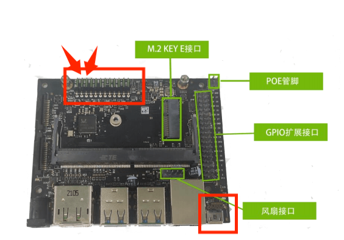
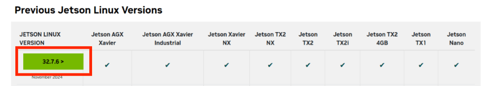
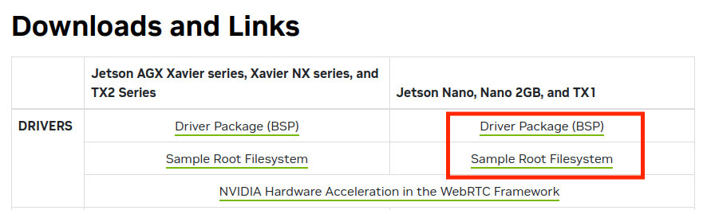
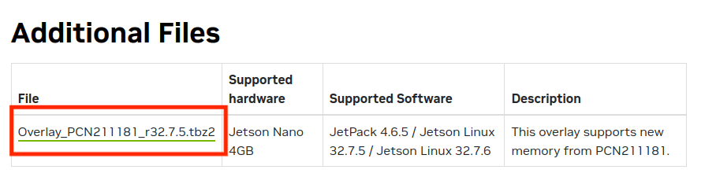
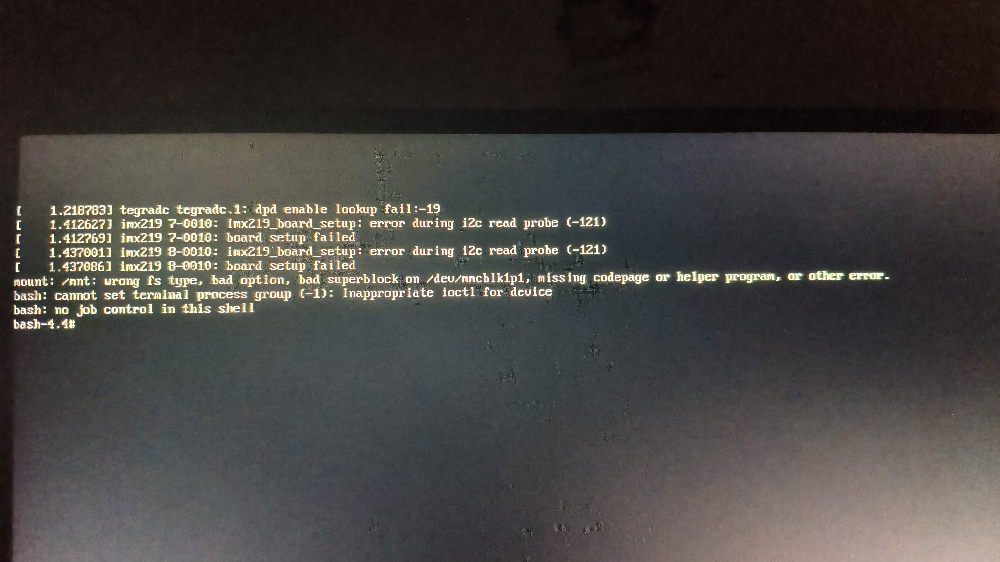
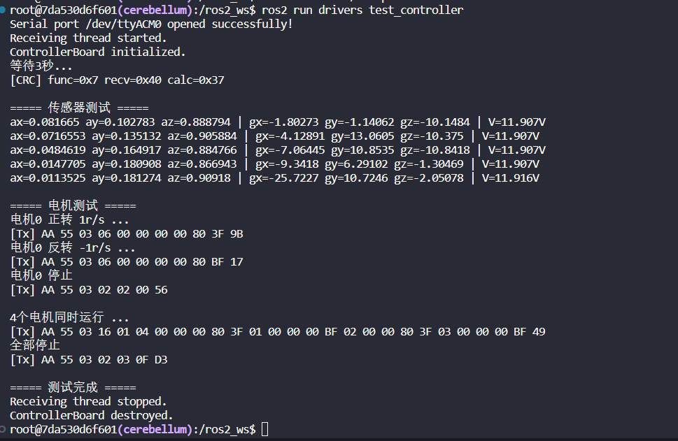
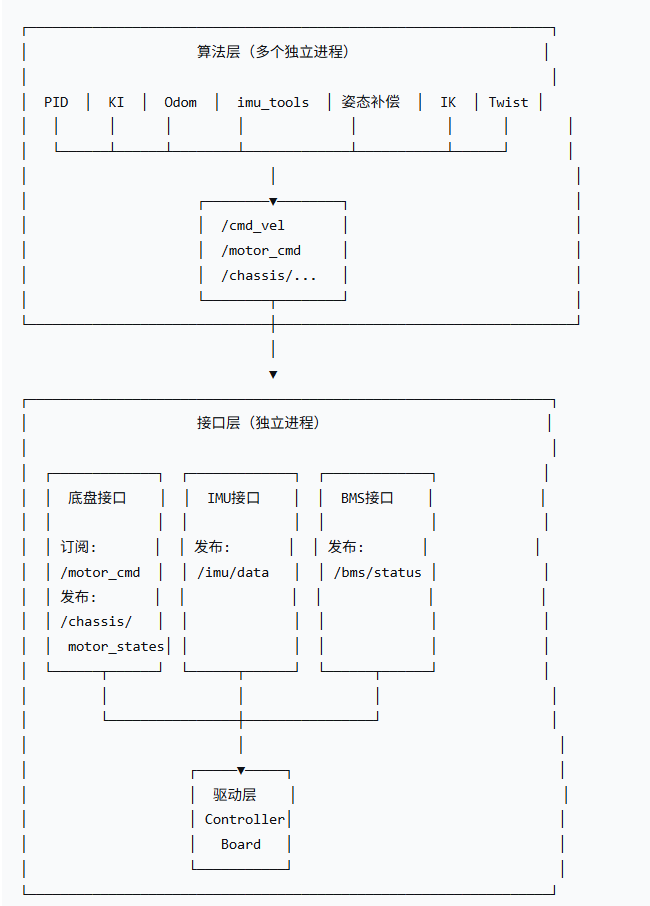

# 2026-6-29 - 2026-7-3：jetson引导+SD卡系统重装、设备树适配、关闭图形化界面、Jetpack安装、系统联网

重装jetson系统，经过n多波折，查找资料，解决了n个问题，有如下步骤：


阶段一：准备与烧录（在 Ubuntu 宿主机上）

1. 进入恢复模式：短接 GND 与 REC 引脚（通常是第2和第3脚），通过 Type-C 接口连接到 Ubuntu 18.04+宿主机，用 lsusb 确认识别到 NVIDIA Corp 设备。

      

      ```
      lsusb | grep -i nvidia
      如果看到类似输出，说明成功进入 Recovery：
      Bus 001 Device 012: ID 0955:7f21 NVidia Corp. Tegra 2 ACER A500
      ```

2. 下载并组合 L4T 工具包：从 NVIDIA 官网下载对应芯片的 Linux_for_Tegra (BSP)、根文件系统 (RootFS) 和硬件补丁。

      https://developer.nvidia.com/embedded/jetson-linux-archive

      选择支持板子最新的版本，我的是jetson nano

      

      下载板级支持包、根文件系统、硬件补丁（硬件补丁是4G nano独有的，其他参考可以不用管）

      

      

      创建文件夹并将压缩包都解压到对应位置

      ```
      #创建工作区，路径不能有中文（这里路径可能会和后面不一致，因为我后面移动了，自己看好路径，没啥大问题，这里我已经做好了是经验回顾）
      mkdir -p ~/nvidia_work
      cd ~/nvidia_work
      cp ~/Downloads/Jetson-210_Linux_R32.7.6_aarch64.tbz2 ./
      cp ~/Downloads/Tegra_Linux_Sample-Root-Filesystem_R32.7.6_aarch64.tbz2 ./
      cp ~/Downloads/overlay_32.7.5_PCN211181.tbz2 ./
      
      #解压出Linux_for_Tegra文件
      sudo tar xpf Jetson-210_Linux_R32.7.6_aarch64.tbz2 
      
      #文件系统解压到指定目录
      cd Linux_for_Tegra/rootfs/ 
      sudo tar xpf ../../Tegra_Linux_Sample-Root-Filesystem_R32.7.6_aarch64.tbz2 
      
      #用 rsync 命令合并补丁
      cd ~/nvidia_work
      sudo rsync -av --progress overlay_32.7.5_PCN211181/Linux_for_Tegra/ Linux_for_Tegra/
      
      #运行 apply_binaries.sh 完成最终组装
      cd Linux_for_Tegra
      sudo ./apply_binaries.sh
      ```

      踩坑指南

      ```
      执行./apply_binaries.sh可能会提示没有权限，也就是rootfs图标上有个锁
      gh@gh-virtual-machine:~/桌面/jetson-nano/Linux_for_Tegra$ sudo ./apply_binaries.sh
      [sudo] password for gh: 
      Using rootfs directory of: /home/gh/桌面/jetson-nano/Linux_for_Tegra/rootfs
      ||||||||||||||||||||||| ERROR |||||||||||||||||||||||
      -----------------------------------------------------
      1. The root filesystem, provided with this package,
         has to be extracted to this directory:
         /home/gh/桌面/jetson-nano/Linux_for_Tegra/rootfs
      -----------------------------------------------------
      2. The root filesystem, provided with this package,
         has to be extracted with 'sudo' to this directory:
         /home/gh/桌面/jetson-nano/Linux_for_Tegra/rootfs
      -----------------------------------------------------
      Consult the Development Guide for instructions on
      extracting and flashing your device.
      |||||||||||||||||||||||||||||||||||||||||||||||||||||
      
      执行下面的内容
      cd ~/nvidia_work/Linux_for_Tegra/
      sudo chown -R root:root rootfs/
      sudo ./apply_binaries.sh
      
      
      提示架构不匹配
      gh@gh-virtual-machine:~/桌面/jetson-nano/Linux_for_Tegra$ sudo ./apply_binaries.sh
      Using rootfs directory of: /home/gh/桌面/jetson-nano/Linux_for_Tegra/rootfs
      Installing extlinux.conf into /boot/extlinux in target rootfs
      /home/gh/桌面/jetson-nano/Linux_for_Tegra/nv_tegra/nv-apply-debs.sh
      Root file system directory is /home/gh/桌面/jetson-nano/Linux_for_Tegra/rootfs
      Copying public debian packages to rootfs
      Start L4T BSP package installation
      QEMU binary is not available, looking for QEMU from host system
      ERROR qemu not found! To install - please run:  "sudo apt-get install qemu-user-static"
      
      执行下面的内容
      sudo apt update
      sudo apt install qemu-user-static -y
      cd ~/桌面/jetson-nano/Linux_for_Tegra/
      sudo ./apply_binaries.sh
      
      ```

3. 修改设备树 (DTB)：安装 device-tree-compiler，反编译设备树文件 (.dtb 为 .dts)，修改 sdhci@700b0000 节点中 cd-gpios 为正确的卡检测引脚（例如 <0x5b 0xc0 0x0>），然后重新编译。

      ```
      #安装dtc软件
      sudo apt-get install device-tree-compiler
      
      #反编译dts文件
      cd ~/nvidia/Linux_for_Tegra/kernel/dtb 
      dtc -I dtb -O dts -o tegra210-p3448-0002-p3449-0000-b00.dts tegra210-p3448-0002-p3449-0000-b00.dtb 
      
      #修改设备树
      sudo vim tegra210-p3448-0002-p3449-0000-b00.dts
      ```

      改动内容如下，这一步是为了匹配硬件引脚，国产板子不改会识别不了SD卡，修改点为加粗字符。

      可能有同学会想这个引脚都不对了，其他的设备树需要改吗？其实不需要，这只是emmc上的引导系统，进入sd卡里的系统后，这个就没啥用了，用的也是sd卡系统里的设备树文件，按照nvidia的官方设计指南，像核心外设USB、M.2、网口之类的硬件引脚不会怎么修改，开发用这些也基本够了，有需求再找客服要嘛，或者从提供的镜像里拿。

      

      sdhci@700b0400 {

      compatible = "nvidia,tegra210-sdhci";

      reg = <0x0 0x700b0400 0x0 0x200> ;

      interrupts = <0x0 0x13 0x4> ;

      aux-device-name = "sdhci-tegra.2";

      iommus = <0x30 0x1b>;

      nvidia,runtime-pm-type = <0x0>;

      clocks = <0x26 0x45 0x26 0xf3 0x26 0x136 0x26 0xc1>;

      clock-names = "sdmmc", "pll_p", "pll_c4_out2", "sdmmc_legacy_tm";

      resets = <0x26 0x45>;

      reset-names = "sdhci";

      **status = "okay";**

      tap-delay = <0x3>;

      trim-delay = <0x3>;

      mmc-ocr-mask = <0x3>;

      max-clk-limit = <0xc28cb00>;

      ddr-clk-limit = <0x2dc6c00>;

      bus-width = <0x4>;

      calib-3v3-offsets = <0x7d>;

      calib-1v8-offsets = <0x7b7b>;

      compad-vref-3v3 = <0x7>;

      compad-vref-1v8 = <0x7>;

      pll_source = "pll_p", "pll_c4_out2";

      ignore-pm-notify;

      cap-mmc-highspeed;

      cap-sd-highspeed;

      nvidia,en-io-trim-volt;

      nvidia,en-periodic-calib;

      cd-inverted;

      wp-inverted;

      pwrdet-support;

      nvidia,min-tap-delay = <0x6a>;

      nvidia,max-tap-delay = <0xb9>;

      pinctrl-names = "sdmmc_schmitt_enable", "sdmmc_schmitt_disable", "sdmmc_clk_schmitt_enable", "sdmmc_clk_schmitt_disable", "sdmmc_drv_code", "sdmmc_default_drv_code", "sdmmc_e_33v_enable", "sdmmc_e_33v_disable";

      pinctrl-0 = <0x8c>;

      pinctrl-1 = <0x8d>

      pinctrl-2 = <0x8e>;

      pinctrl-3 = <0x8f>;

      pinctrl-4 = <0x90>;

      pinctrl-5 = <0x91>;

      pinctrl-6 = <0x92>;

      pinctrl-7 = <0x93>;

      vqmmc-supply = <0x3b>;

      vmmc-supply = <0x4c>;

      **cd-gpios = <0x5b 0xc0 0x0>;**

      **sd-uhs-sdr104;**

      **sd-uhs-sdr50;**

      **sd-uhs-sdr25;**

      **sd-uhs-sdr12;**

      mmc-ddr-1_8v;

      **no-sdio;**

      **no-mmc;**

      **uhs-mask = <0xc>;**

      linux,phandle = <0xba>;

      phandle = <0xba>;

      

      gpio组的引脚一定要对，可以查看引脚图，然后问AI怎么写，重点是SDMMC_CD检测引脚

      cd-gpios = <0x5b 0xc0 0x0>;

      

      

      

      

      ```
      #编译dtb文件。
      dtc -I dts -O dtb -o tegra210-p3448-0002-p3449-0000-b00.dtb tegra210-p3448-0002-p3449-0000-b00.dts
      ```

      

4. 烧录引导固件到 eMMC：在 Linux_for_Tegra 目录执行命令，将修改后的 U-Boot和设备树烧录到 eMMC

      ```
      #mmcblk1p1是sd卡，mmcblk0p1是内部emmc
      
      sudo CMDLINE="root=/dev/mmcblk1p1 rw rootwait rootfstype=ext4 console=ttyS0,115200 console=tty0" ./flash.sh jetson-nano-devkit-emmc mmcblk0p1
      
      ```

​      

阶段二：构建 SD 卡系统（在宿主机及急救模式）

5. 等待几分钟后，烧录完成重启，因 SD 卡暂无系统，Jetson Nano 会自动进入 bash4.4 急救模式 (initramfs)，这样就是成功了

 

5. 准备 SD 卡系统：将 SD 卡格式化为ext4文件系统并通过读卡器插入板子的USB口
6. 在bash 4.4下将/dev/mmcblk0p1挂载到/mnt，将/dev/sda1挂载到/mnt_sdroot（mkdir /mnt_sdroot）
7. 复制根文件系统  cp -ax /mnt/* /mnt_sdroot/
8. 修改启动项并增加sudo默认用户

```
chroot /mnt_sdroot /bin/bash
vim /boot/extlinux/extlinux.conf
#修改mmcblk1p1为mmcblk0p1，这里很关键，emmc里的引导系统必须为mmcblk1p1，sd卡里为mmcblk0p1。

#新建用户
useradd -m gh
passwd gh
usermod -aG sudo gh
exit

#卸载挂载系统
umount /mnt
umount /mnt_sdroot

#拔出读卡器，将sd卡放入卡槽后重启
```

```
#如果sudo还是用不了，退回到8，chroot /mnt_sdroot /bin/bash然后
# 1. 将 sudo 文件的所有者改为 root
chown root:root /usr/bin/sudo

# 2. 恢复 setuid 位和正确权限（4755 表示所有者有读/写/执行，其他人有读/执行，并设置 setuid）
chmod 4755 /usr/bin/sudo

# 3. 验证修复结果
ls -l /usr/bin/sudo
```

阶段三：首次启动与基础配置（在 Jetson Nano 上接入屏幕和键盘）

1. 从 SD 卡启动：将 SD 卡插入 Jetson Nano，上电启动。若图形界面啥都不显示，按 Ctrl+Alt+F2 进入 TTY2 终端，用刚创建的sudo用户登录（图形化界面会连接wifi，并且注册用户，但是很奇怪这里注册的用户不在sudo组）。

2. 关闭图形界面（看你自己，一般有x11服务就够了）：禁用 GDM3（或 LightDM），并将系统默认启动目标改为多用户模式（命令行）。
      sudo systemctl disable gdm3 && sudo systemctl set-default multi-user.target

3. 设置默认 Shell：将用户的默认 Shell 从 /bin/sh 改为 /bin/bash，以支持 bind、~/.inputrc 等高级功能。
      chsh -s /bin/bash

4. 扩容 SD 卡根分区：使用 sudo parted /dev/mmcblk1 的 resizepart 1 100% 命令，随后用 sudo resize2fs /dev/mmcblk1p1 扩展文件系统，充分利用 SD 卡全部空间。

5. 连接 WiFi：用 nmcli dev wifi connect "SSID" password "密码" 连接 WiFi，系统会自动保存配置，后续开机自动连接。

6. 更换软件源：将 /etc/apt/sources.list 更换为国内镜像源（如清华、中科大源），并执行 sudo apt update。

7. 安装 SSH 服务：sudo apt install openssh-server -y，确保服务已启动并设置开机自启。

   

阶段四：远程开发与完整功能（在 Windows ssh上连接jetson nano）

1. Windows 端安装 X11 服务器：在 Windows 上安装并运行 VcXsrv 或 Xming，启动时勾选 “Disable access control”。

2. SSH 远程连接：在 Windows 终端中使用 ssh -Y 用户名@IP地址 连接 Jetson Nano。

3. 验证 X11 转发：连接后运行 xeyes 或 gedit，若能弹出图形窗口，说明 X11 转发正常，远程开发环境已就绪。

4. 安装 JetPack 完整功能：执行 sudo apt install nvidia-jetpack -y，安装 CUDA、cuDNN、TensorRT 等全套 AI 开发库。安装完成后建议重启。

   

 阶段五：确认是否安装完成

**确认内核匹配，确保都是一样的，如4.9.337-tegra**

```
gh@ggh-desktop:~$ uname -r
4.9.337-tegra


gh@ggh-desktop:~$ ls /lib/modules/
4.9.337-tegra

gh@ggh-desktop:~$ apt-cache madison nvidia-l4t-kernel
nvidia-l4t-kernel | 4.9.337-tegra-32.7.6-20241104234540 | https://repo.download.nvidia.com/jetson/t210 r32.7/main arm64 Packages
nvidia-l4t-kernel | 4.9.337-tegra-32.7.5-20240611161210 | https://repo.download.nvidia.com/jetson/t210 r32.7/main arm64 Packages
nvidia-l4t-kernel | 4.9.337-tegra-32.7.4-20230608212426 | https://repo.download.nvidia.com/jetson/t210 r32.7/main arm64 Packages
nvidia-l4t-kernel | 4.9.299-tegra-32.7.3-20221122092935 | https://repo.download.nvidia.com/jetson/t210 r32.7/main arm64 Packages
nvidia-l4t-kernel | 4.9.253-tegra-32.7.2-20220420143418 | https://repo.download.nvidia.com/jetson/t210 r32.7/main arm64 Packages
nvidia-l4t-kernel | 4.9.253-tegra-32.7.1-20220219090432 | https://repo.download.nvidia.com/jetson/t210 r32.7/main arm64 Packages

gh@ggh-desktop:~$ apt-cache policy nvidia-l4t-kernel
nvidia-l4t-kernel:
  已安装：4.9.337-tegra-32.7.6-20241104234540
  候选： 4.9.337-tegra-32.7.6-20241104234540
  版本列表：
 *** 4.9.337-tegra-32.7.6-20241104234540 500
        500 https://repo.download.nvidia.com/jetson/t210 r32.7/main arm64 Packages
        100 /var/lib/dpkg/status
     4.9.337-tegra-32.7.5-20240611161210 500
        500 https://repo.download.nvidia.com/jetson/t210 r32.7/main arm64 Packages
     4.9.337-tegra-32.7.4-20230608212426 500
        500 https://repo.download.nvidia.com/jetson/t210 r32.7/main arm64 Packages
     4.9.299-tegra-32.7.3-20221122092935 500
        500 https://repo.download.nvidia.com/jetson/t210 r32.7/main arm64 Packages
     4.9.253-tegra-32.7.2-20220420143418 500
        500 https://repo.download.nvidia.com/jetson/t210 r32.7/main arm64 Packages
     4.9.253-tegra-32.7.1-20220219090432 500
        500 https://repo.download.nvidia.com/jetson/t210 r32.7/main arm64 Packages
```


**确认nvidia-jetpack安装成功，有时候查询没显示可能是环境变量没设置好**

gh@ggh-desktop:~$ echo 'export PATH=/usr/local/cuda/bin:$PATH' >> ~/.bashrc
gh@ggh-desktop:~$ echo 'export LD_LIBRARY_PATH=/usr/local/cuda/lib64:$LD_LIBRARY_PATH' >> ~/.bashrc
gh@ggh-desktop:~$ source ~/.bashrc

   ```
   gh@ggh-desktop:~$ nvcc --version
   nvcc: NVIDIA (R) Cuda compiler driver
   Copyright (c) 2005-2021 NVIDIA Corporation
   Built on Sun_Feb_28_22:34:44_PST_2021
   Cuda compilation tools, release 10.2, V10.2.300
   Build cuda_10.2_r440.TC440_70.29663091_0
   
   gh@ggh-desktop:~$ cat /usr/include/cudnn_version.h | grep CUDNN_MAJOR -A 2
   #define CUDNN_MAJOR 8
   #define CUDNN_MINOR 2
   #define CUDNN_PATCHLEVEL 1
   --
   #define CUDNN_VERSION (CUDNN_MAJOR * 1000 + CUDNN_MINOR * 100 + CUDNN_PATCHLEVEL)
   
   #endif /* CUDNN_VERSION_H */
   
   gh@ggh-desktop:~$ dpkg -l | grep libnvinfer8 | grep -v dev
   ii  libnvinfer8                                   8.2.1-1+cuda10.2                           arm64        TensorRT runtime libraries
   
   gh@ggh-desktop:~$ cat /etc/nv_tegra_release
   # R32 (release), REVISION: 7.6, GCID: 38171779, BOARD: t210ref, EABI: aarch64, DATE: Tue Nov  5 07:46:14 UTC 2024
   
   ```

   

**确认硬件工作正常**

脚本如下

```
cat > hardware_check.sh << 'EOF'
#!/bin/bash
echo "========== HARDWARE DIAGNOSTIC =========="
echo ""

echo "1. CPU Info:"
lscpu | grep -E "Model name|CPU\(s\)|Core|Thread"
echo ""

echo "2. Memory:"
free -h
echo ""

echo "3. GPU Temperature:"
cat /sys/class/thermal/thermal_zone*/temp | awk '{print $1/1000 "°C"}'
echo ""

echo "4. GPU Frequency:"
cat /sys/kernel/debug/clock/gbus/rate 2>/dev/null || echo "N/A"
echo ""

echo "5. Storage:"
df -h | grep -E "Filesystem|/dev/root|/dev/mmc"
echo ""

echo "6. Network Interfaces:"
ip link show | grep -E "eth0|wlan0" | awk '{print $2, $9}'
echo ""

echo "7. USB Devices:"
lsusb | wc -l "USB devices found"
echo ""

echo "8. Camera Devices:"
ls /dev/video* 2>/dev/null | wc -l "video devices found"
echo ""

echo "9. I2C Buses:"
ls -l /dev/i2c-* 2>/dev/null | wc -l "I2C buses found"
echo ""

echo "10. Running tegrastats (5 seconds)..."
timeout 5 tegrastats --interval 1 || echo "tegrastats not available"
echo ""
echo "========== DIAGNOSTIC COMPLETE =========="
EOF

chmod +x hardware_check.sh
./hardware_check.sh
```


```
gh@ggh-desktop:~$ cat > hardware_check.sh << 'EOF'
> #!/bin/bash
> echo "========== HARDWARE DIAGNOSTIC =========="
> echo ""
>
> echo "1. CPU Info:"
> lscpu | grep -E "Model name|CPU\(s\)|Core|Thread"
> echo ""
>
> echo "2. Memory:"
> free -h
> echo ""
>
> echo "3. GPU Temperature:"
> cat /sys/class/thermal/thermal_zone*/temp | awk '{print $1/1000 "°C"}'
> echo ""
>
> echo "4. GPU Frequency:"
> cat /sys/kernel/debug/clock/gbus/rate 2>/dev/null || echo "N/A"
> echo ""
>
> echo "5. Storage:"
> df -h | grep -E "Filesystem|/dev/root|/dev/mmc"
> echo ""
>
> echo "6. Network Interfaces:"
> ip link show | grep -E "eth0|wlan0" | awk '{print $2, $9}'
> echo ""
>
> echo "7. USB Devices:"
> lsusb | wc -l "USB devices found"
> echo ""
>
> echo "8. Camera Devices:"
> ls /dev/video* 2>/dev/null | wc -l "video devices found"
> echo ""
>
> echo "9. I2C Buses:"
> ls -l /dev/i2c-* 2>/dev/null | wc -l "I2C buses found"
> echo ""
>
> echo "10. Running tegrastats (5 seconds)..."
> timeout 5 tegrastats --interval 1 || echo "tegrastats not available"
> echo ""
> echo "========== DIAGNOSTIC COMPLETE =========="
> EOF
gh@ggh-desktop:~$
gh@ggh-desktop:~$ chmod +x hardware_check.sh
gh@ggh-desktop:~$ ./hardware_check.sh
========== HARDWARE DIAGNOSTIC ==========

1. CPU Info:
CPU(s):              4
On-line CPU(s) list: 0-3
Thread(s) per core:  1
Core(s) per socket:  4
Model name:          Cortex-A57

2. Memory:
              total        used        free      shared  buff/cache   available
Mem:           3.9G        237M        3.1G         13M        546M        3.5G
Swap:          1.9G          0B        1.9G

3. GPU Temperature:
48°C
42.5°C
40°C
38°C
50°C
41°C

4. GPU Frequency:
N/A

5. Storage:
Filesystem      Size  Used Avail Use% Mounted on
/dev/mmcblk1p1   58G   15G   40G  27% /

6. Network Interfaces:
eth0: DOWN
wlan0: UP

7. USB Devices:
wc: 'USB devices found': No such file or directory

8. Camera Devices:
wc: 'video devices found': No such file or directory

9. I2C Buses:
wc: 'I2C buses found': No such file or directory

10. Running tegrastats (5 seconds)...
RAM 300/3964MB (lfb 781x4MB) SWAP 0/1982MB (cached 0MB) CPU [0%@1479,0%@1479,0%@1479,0%@1479] EMC_FREQ 0% GR3D_FREQ 0% PLL@38C CPU@43C PMIC@50C GPU@40C AO@48.5C thermal@41C
RAM 300/3964MB (lfb 781x4MB) SWAP 0/1982MB (cached 0MB) CPU [0%@1479,0%@1479,0%@1479,0%@1479] EMC_FREQ 0% GR3D_FREQ 0% PLL@38C CPU@43C PMIC@50C GPU@40C AO@48C thermal@41C
RAM 300/3964MB (lfb 781x4MB) SWAP 0/1982MB (cached 0MB) CPU [0%@825,0%@825,0%@825,0%@825] EMC_FREQ 0% GR3D_FREQ 0% PLL@38C CPU@43C PMIC@50C GPU@40C AO@48.5C thermal@41C
RAM 300/3964MB (lfb 781x4MB) SWAP 0/1982MB (cached 0MB) CPU [0%@710,0%@710,0%@710,100%@710] EMC_FREQ 0% GR3D_FREQ 0% PLL@38C CPU@43C PMIC@50C GPU@40C AO@48.5C thermal@41C
RAM 300/3964MB (lfb 781x4MB) SWAP 0/1982MB (cached 0MB) CPU [100%@825,0%@825,0%@825,0%@825] EMC_FREQ 0% GR3D_FREQ 0% PLL@38C CPU@43C PMIC@50C GPU@40C AO@48.5C thermal@41C
RAM 300/3964MB (lfb 781x4MB) SWAP 0/1982MB (cached 0MB) CPU [0%@1479,0%@1479,0%@1479,0%@1479] EMC_FREQ 0% GR3D_FREQ 0% PLL@38C CPU@43C PMIC@50C GPU@40C AO@48.5C thermal@41C
RAM 300/3964MB (lfb 781x4MB) SWAP 0/1982MB (cached 0MB) CPU [0%@921,0%@921,0%@921,0%@921] EMC_FREQ 0% GR3D_FREQ 0% PLL@38C CPU@43C PMIC@50C GPU@40C AO@48.5C thermal@41C
RAM 300/3964MB (lfb 781x4MB) SWAP 0/1982MB (cached 0MB) CPU [0%@1479,0%@825,0%@825,0%@825] EMC_FREQ 0% GR3D_FREQ 0% PLL@38C CPU@43C PMIC@50C GPU@40C AO@48.5C thermal@41C
```

最终

| 硬件模块       | 状态   | 详情                                            |
| :------------- | :----- | :---------------------------------------------- |
| **CPU**        | ✅ 完美 | 4核 Cortex-A57，频率动态调节正常（710-1479MHz） |
| **内存**       | ✅ 完美 | 3.9GB 可用，空闲充足，无内存泄漏                |
| **存储**       | ✅ 完美 | 58GB eMMC，已用15GB（27%），读写正常            |
| **GPU**        | ✅ 正常 | 温度 40°C（非常凉爽），频率调节正常             |
| **温度传感器** | ✅ 正常 | 所有模块温度合理（38-50°C），散热良好           |
| **电源管理**   | ✅ 正常 | PMIC 50°C，电压稳定                             |
| **WiFi**       | ✅ 正常 | wlan0 接口 UP（已连接或可连接）                 |


# 2026-7-4：SSH、X11、Docker、Git、ROS2-Desktop、大小脑工作区初始化、大小脑网络通信

- 关闭图形化服务并配置ssh和x11，使用ssh命令终端方式交互

- docker下载后拉取失败解决方案

- 大脑：brain，ubuntu22.04无桌面版 + ros2 humble 完整版 小脑：cerebellum，ubuntu22.04无桌面版 + ros2 humble base

1. 问题背景

**设备**：NVIDIA Jetson (ARM64 架构)
**系统**：Ubuntu 18.04 LTS
**网络**：手机热点（4G/5G）
**目标**：安装 Docker 并拉取 Ubuntu 22.04 基础镜像，用于构建 ROS2 Humble 环境

------

2. 问题诊断

   2.1 遇到的错误

| 错误现象           | 错误信息                                                     |
| :----------------- | :----------------------------------------------------------- |
| Docker 拉取超时    | `net/http: request canceled while waiting for connection (Client.Timeout exceeded while awaiting headers)` |
| 连接被重置         | `read tcp ... read: connection reset by peer`                |
| 镜像源域名无法解析 | `lookup hub-mirror.c.163.com on 223.5.5.5:53: no such host`  |
| 阿里云仓库访问被拒 | `pull access denied ... denied: requested access to the resource is denied` |

​		2.2 根本原因分析

1. **网络层问题**
   - 手机热点网络无法直接访问 Docker Hub 的服务器（`registry-1.docker.io`）
   - 测试 `ping 157.240.12.50`（Docker Hub IP）显示 100% 丢包
   - 说明运营商对 Docker Hub 的 IP 段进行了限制
2. **DNS 解析问题**
   - 部分国内镜像源域名（如 `hub-mirror.c.163.com`、`docker.mirrors.ustc.edu.cn`）无法解析
   - DNS 服务器（223.5.5.5）返回 `NXDOMAIN`
3. **Docker 机制问题**
   - Docker 的 `registry-mirrors` 配置在官方仓库连接失败时，不会自动切换到镜像源
   - 必须先能访问 `registry-1.docker.io`，才会尝试镜像加速器
4. **阿里云仓库路径问题**
   - `registry.cn-hangzhou.aliyuncs.com/library/ubuntu:22.04` 不存在（无公开权限）
   - 正确的路径是 `registry.cn-hangzhou.aliyuncs.com/acs/ubuntu:22.04`

------

​	3. 解决方案

​		3.1 配置国内镜像源

```
# 配置 Docker 镜像加速器
sudo tee /etc/docker/daemon.json <<-'EOF'
{
  "registry-mirrors": [
    "https://registry.cn-hangzhou.aliyuncs.com",
    "https://hub-mirror.c.163.com",
    "https://registry.docker-cn.com"
  ],
  "ipv6": false
}
EOF

sudo systemctl restart docker
```

​		3.2 修改 DNS 配置

```
# 修改 DNS 为阿里 DNS
sudo chattr -i /etc/resolv.conf  # 解除锁定（如果有）
sudo bash -c 'echo "nameserver 223.5.5.5" > /etc/resolv.conf'
sudo bash -c 'echo "nameserver 114.114.114.114" >> /etc/resolv.conf'
```

​		3.3 添加 hosts 绑定（绕过 DNS 解析）

```
# 获取阿里云镜像仓库 IP
nslookup registry.cn-hangzhou.aliyuncs.com 114.114.114.114
# 结果：Address: 120.55.105.209

# 添加 hosts 记录
echo "120.55.105.209 registry.cn-hangzhou.aliyuncs.com" | sudo tee -a /etc/hosts
```

​		3.4 使用正确的镜像路径拉取

```
# 成功拉取 Ubuntu 22.04
sudo docker pull registry.cn-hangzhou.aliyuncs.com/acs/ubuntu:22.04

# 重新打标签
sudo docker tag registry.cn-hangzhou.aliyuncs.com/acs/ubuntu:22.04 ubuntu:22.04
```

------

​	4. 最终配置

​		4.1 Docker 配置文件 (`/etc/docker/daemon.json`)

```
{
  "registry-mirrors": [
    "https://registry.cn-hangzhou.aliyuncs.com",
    "https://hub-mirror.c.163.com",
    "https://registry.docker-cn.com"
  ],
  "ipv6": false
}
```

​		4.2 DNS 配置 (`/etc/resolv.conf`)

```
nameserver 223.5.5.5
nameserver 114.114.114.114
```

​		4.3 hosts 文件 (`/etc/hosts`)

```
120.55.105.209 registry.cn-hangzhou.aliyuncs.com
```

​		4.4 已拉取的镜像

```
ubuntu:22.04                                   69.3MB
registry.cn-hangzhou.aliyuncs.com/acs/ubuntu:22.04   69.3MB
registry.cn-hangzhou.aliyuncs.com/google_containers/pause:3.2   484kB
```

​		4.5 Docker 服务状态

```
docker.service - Docker Application Container Engine
Loaded: loaded (/lib/systemd/system/docker.service; enabled)
Active: active (running)
```


- 大脑：brain，ubuntu22.04无桌面版 + ros2 humble 完整版 小脑：cerebellum，ubuntu22.04无桌面版 + ros2 humble base

创建大脑docker

```
sudo docker run -it --name brain_builder ubuntu:22.04 /bin/bash
apt update

# ==========================================
# 大脑 (Brain) - ROS2 Humble 完整版
# ==========================================

# 安装基础工具和设置编码
apt install -y locales curl gnupg2 lsb-release software-properties-common
locale-gen en_US en_US.UTF-8
echo "export LANG=en_US.UTF-8" >> ~/.bashrc
source ~/.bashrc

# 添加 ROS2 源（清华镜像）
add-apt-repository universe
curl -sSL https://raw.githubusercontent.com/ros/rosdistro/master/ros.key -o /usr/share/keyrings/ros-archive-keyring.gpg
echo "deb [arch=$(dpkg --print-architecture) signed-by=/usr/share/keyrings/ros-archive-keyring.gpg] https://mirrors.tuna.tsinghua.edu.cn/ros2/ubuntu $(lsb_release -cs) main" | tee /etc/apt/sources.list.d/ros2.list > /dev/null

# 备份源文件
cp /etc/apt/sources.list /etc/apt/sources.list.bak

# 写入正确的 ARM64 清华源
cat > /etc/apt/sources.list << EOF
deb https://mirrors.tuna.tsinghua.edu.cn/ubuntu-ports/ jammy main restricted universe multiverse
deb https://mirrors.tuna.tsinghua.edu.cn/ubuntu-ports/ jammy-updates main restricted universe multiverse
deb https://mirrors.tuna.tsinghua.edu.cn/ubuntu-ports/ jammy-backports main restricted universe multiverse
deb https://mirrors.tuna.tsinghua.edu.cn/ubuntu-ports/ jammy-security main restricted universe multiverse
EOF

# 更新软件列表
apt update

# 安装ros2桌面版
apt install -y ros-humble-desktop
中途会让你选择时区和地区，选择6亚洲，70上海

# 安装开发工具
apt install -y python3-colcon-common-extensions python3-rosdep python3-argcomplete

# 配置环境变量
echo "source /opt/ros/humble/setup.bash" >> ~/.bashrc
source ~/.bashrc

# 验证安装
ros2
echo $ROS_DISTRO
echo $ROS_VERSION
python3 -c "import rclpy; print('rclpy imported successfully')"

# 退出容器（安装完成后执行）
exit

# 退出容器后，在宿主机执行保存镜像
sudo docker commit brain_builder brain:ros2-humble-full
```

创建小脑docker

```
sudo docker run -it --name cerebellum_builder ubuntu:22.04 /bin/bash
apt update

# ==========================================
# 小脑 (Cerebellum) - ROS2 Humble 基础版
# ==========================================

# 安装基础工具和设置编码
apt install -y locales curl gnupg2 lsb-release software-properties-common
locale-gen en_US en_US.UTF-8
echo "export LANG=en_US.UTF-8" >> ~/.bashrc
source ~/.bashrc

# 添加 ROS2 源（清华镜像）
add-apt-repository universe
curl -sSL https://raw.githubusercontent.com/ros/rosdistro/master/ros.key -o /usr/share/keyrings/ros-archive-keyring.gpg
echo "deb [arch=$(dpkg --print-architecture) signed-by=/usr/share/keyrings/ros-archive-keyring.gpg] https://mirrors.tuna.tsinghua.edu.cn/ros2/ubuntu $(lsb_release -cs) main" | tee /etc/apt/sources.list.d/ros2.list > /dev/null

# 备份源文件
cp /etc/apt/sources.list /etc/apt/sources.list.bak

# 写入正确的 ARM64 清华源
cat > /etc/apt/sources.list << EOF
deb https://mirrors.tuna.tsinghua.edu.cn/ubuntu-ports/ jammy main restricted universe multiverse
deb https://mirrors.tuna.tsinghua.edu.cn/ubuntu-ports/ jammy-updates main restricted universe multiverse
deb https://mirrors.tuna.tsinghua.edu.cn/ubuntu-ports/ jammy-backports main restricted universe multiverse
deb https://mirrors.tuna.tsinghua.edu.cn/ubuntu-ports/ jammy-security main restricted universe multiverse
EOF

# 更新软件列表
apt update

# 安装ros2桌面版
apt install -y ros-humble-ros-base
中途会让你选择时区和地区，选择6亚洲，70上海6

# 安装开发工具
apt install -y python3-colcon-common-extensions python3-rosdep python3-argcomplete

# 配置环境变量
echo "source /opt/ros/humble/setup.bash" >> ~/.bashrc
source ~/.bashrc

# 验证安装
ros2
echo $ROS_DISTRO
echo $ROS_VERSION
python3 -c "import rclpy; print('rclpy imported successfully')"

# 退出容器（安装完成后执行）
exit

# 退出容器后，在宿主机执行保存镜像
sudo docker commit cerebellum_builder cerebellum:ros2-humble-base
```

清理临时容器

```
sudo docker rm brain_builder
sudo docker rm cerebellum_builder
```

验证安装

```
# 查看所有镜像
sudo docker images

# 验证大脑
sudo docker run -it --rm brain:ros2-humble-full bash -c "source /opt/ros/humble/setup.bash && echo \$ROS_DISTRO"

# 验证小脑
sudo docker run -it --rm cerebellum:ros2-humble-base bash -c "source /opt/ros/humble/setup.bash && echo \$ROS_DISTRO"
```

启动容器查看系统状态

```
终端1
sudo docker run -it --name brain brain:ros2-humble-full

终端2
sudo docker run -it --name cerebellum cerebellum:ros2-humble-base

终端3
gh@ggh-desktop:~$ df -h
Filesystem      Size  Used Avail Use% Mounted on
/dev/mmcblk1p1   58G   19G   36G  35% /
none            1.8G     0  1.8G   0% /dev
tmpfs           2.0G  4.0K  2.0G   1% /dev/shm
tmpfs           2.0G   22M  2.0G   2% /run
tmpfs           5.0M  4.0K  5.0M   1% /run/lock
tmpfs           2.0G     0  2.0G   0% /sys/fs/cgroup
tmpfs           397M     0  397M   0% /run/user/1000

gh@ggh-desktop:~$ free -h
              total        used        free      shared  buff/cache   available
Mem:           3.9G        358M        1.1G         21M        2.4G        3.3G
Swap:          1.9G        2.0M        1.9G


gh@ggh-desktop:~$ sudo docker ps
[sudo] password for gh:
CONTAINER ID   IMAGE                         COMMAND       CREATED              STATUS              PORTS     NAMES
134ca3dda25c   cerebellum:ros2-humble-base   "/bin/bash"   About a minute ago   Up About a minute             cerebellum
686832ef0cd2   brain:ros2-humble-full        "/bin/bash"   2 minutes ago        Up About a minute             brain

```


- 建立github仓库关联,私有仓库

  ```
  #在宿主机生成 SSH 密钥,一路回车，使用默认路径
  ssh-keygen -t ed25519 -C "3357697374@qq.com"
  #将公钥添加到 GitHub
  cat ~/.ssh/id_ed25519.pub
  #点击 GitHub 页面右上角的头像
  在弹出的菜单里选择 Settings
  在左侧边栏找到 SSH and GPG keys 并点击
  点击绿色的 New SSH Key 按钮
  在 "Title" 随便填一个名字（比如 Jetson Nano）
  在 "Key" 的大框里，粘贴之前在宿主机执行 cat ~/.ssh/id_ed25519.pub 后得到的全部内容
  点击 Add SSH Key
  ```

删除旧的两个容器

```
sudo docker stop brain   # 先停止
sudo docker rm brain     # 再删除
sudo docker stop cerebellum
sudo docker rm cerebellum     # 再删除
```

宿主克隆git仓库，容器挂载git仓库代码进入容器

```
cd ~
git config --global user.name "guguhg"
git config --global user.email "3357697374@qq.com"
git clone -b dev git@github.com:guguhg/robot.git #-b dev指定分支，不写就是默认分支

终端1
#启动大脑容器（挂载代码和密钥）
sudo docker run -it --name brain \
  -v ~/robot/brain/ros2_ws:/ros2_ws \		#~/robot/brain/ros2_ws 宿主机挂载的目录 : /ros2_ws docker里的目录
  -v ~/.ssh:/root/.ssh:ro \
  brain:ros2-humble-full
apt install -y git
git config --global user.name "guguhg"
git config --global user.email "3357697374@qq.com"

终端2
#启动小脑脑容器（挂载代码和密钥）
sudo docker run -it --name cerebellum \
  -v ~/robot/cerebellum/ros2_ws:/ros2_ws \
  -v ~/.ssh:/root/.ssh:ro \
  cerebellum:ros2-humble-base
apt install -y git
git config --global user.name "guguhg"
git config --global user.email "3357697374@qq.com"
```

- 现在容器已经建立，后续的开发流程

宿主机创建文件夹、文件、编写代码、git操作，docker只负责环境、编译、运行。

```
后续操作，大脑与小脑里的文件会同步修改到宿主机的~/robot/下。
每天工作流程
#每天从 dev 拉最新代码
sudo git checkout dev  #切换到 dev 分支
git pull origin dev  #从远程仓库拉取最新的 dev 代码 （远程的时候不需要加sudo，因为sudo是root用户，远程存的是gh用户的密钥）

#创建功能分支 
sudo git checkout -b feature/EnvironmentSetup  # 创建并切换到新分支，分支是整个仓库的时间线而不是具体文件夹

#启动并进入容器
sudo docker start -ai brain
sudo docker start -ai cerebellum

#开发过程中多次提交（按 commit 规范）
sudo git status   # 看看改动了哪些文件，确认没有误改
sudo git branch  # 看看自己在哪个分支
sudo git add .   #添加当前文件夹内容到暂存区
sudo git commit -m "feat(小脑/算法层/PID): 添加电机速度PID控制" #提交到当前分支


#功能完成后合并回 dev
sudo git checkout dev
git pull origin dev  #再拉一次最新，防止冲突
sudo git merge feature/motor_driver --no-ff  # --no-ff 保留分支历史
git push origin dev

#删除已合并的功能分支
sudo git branch -d feature/motor_driver


#有时候github连不上，临时设置
# 编辑 resolv.conf
sudo vim /etc/resolv.conf
# 添加或修改为：
nameserver 8.8.8.8
nameserver 114.114.114.114

#永久设置
sudo vim /etc/systemd/resolved.conf
[Resolve]
DNS=114.114.114.114 223.5.5.5 8.8.8.8
FallbackDNS=8.8.8.8
sudo systemctl restart systemd-resolved
sudo systemctl enable systemd-resolved

确保软链接正确：检查 /etc/resolv.conf 是否正确地指向了 systemd-resolved 管理的文件。
ls -l /etc/resolv.conf
如果没有
sudo ln -sf /run/systemd/resolve/resolv.conf /etc/resolv.conf

#占位符
find brain/ros2_ws/src cerebellum/ros2_ws/src -type d -empty -exec touch {}/.gitkeep \;

# 修复 .git 目录下所有文件的所有权
sudo chown -R ggh:ggh .git

# 重新推送
git push origin dev
```


- 按软件架构分层建立文件夹并使用colcon build编译为ros2工作区

```
宿主机
git checkout -b feature/EnvironmentSetup
gh@ggh-desktop:~/robot/brain/ros2_ws/src$ mkdir -p drivers system_services common interfaces algorithms applications rpc tasks msgs bringup

大脑docker
cd /ros2_ws/src/msgs
ros2 pkg create test_msgs --build-type ament_cmake
cd /ros2_ws/
colcon build --symlink-install(--symlink-install)

宿主机
cd ~/robot/cerebellum/ros2_ws/src/
mkdir -p drivers system_services common interfaces algorithms applications msgs bringup

小脑docker
cd /ros2_ws/src/msgs
ros2 pkg create test_msgs --build-type ament_cmake
cd /ros2_ws/
colcon build --symlink-install（报错）
之前安装的是基础班ros2，现在还是升级为完整版本的
apt install -y build-essential cmake python3-colcon-common-extensions
apt install -y ros-humble-desktop python3-rosdep

宿主机
rm -rf ~/robot/brain/ros2_ws/src/msgs/test_msgs
rm -rf ~/robot/cerebellum/ros2_ws/src/msgs/test_msgs
```


- 添加标识符，终端里区分大脑小脑

```
大脑
export PS1="\u@\h\[\033[01;32m\](brain)\[\033[00m\]:\w\$ "
echo 'export PS1="\u@\h\[\033[01;32m\](brain)\[\033[00m\]:\w\$ "' >> ~/.bashrc

小脑
export PS1="\u@\h\[\033[01;34m\](cerebellum)\[\033[00m\]:\w\$ "
echo 'export PS1="\u@\h\[\033[01;34m\](cerebellum)\[\033[00m\]:\w\$ "' >> ~/.bashrc
```


- 稀疏检出，只取 brain和cerebellum，其他的文件不管

```
git sparse-checkout init --cone
git sparse-checkout set brain cerebellum
git checkout dev
#只有 brain 和 cerebellum 文件夹，cloud与client被删除
ls
```


- 配置虚拟以太网网段配置，使得两个docker间可以通信

```
# ========== 宿主机 ==========
#创建网络
sudo docker network create --driver bridge --subnet 10.10.0.0/16 robot_net
sudo docker network connect robot_net brain
sudo docker network connect robot_net cerebellum

#大脑终端
sudo docker start -ai brain

root@2b3358d29171(brain):/$ hostname -I
172.17.0.2 10.10.0.2
root@2b3358d29171(brain):/$ ping 10.10.0.3
PING 10.10.0.3 (10.10.0.3) 56(84) bytes of data.
64 bytes from 10.10.0.3: icmp_seq=1 ttl=64 time=0.330 ms
64 bytes from 10.10.0.3: icmp_seq=2 ttl=64 time=0.855 ms
64 bytes from 10.10.0.3: icmp_seq=3 ttl=64 time=0.851 ms
^C
--- 10.10.0.3 ping statistics ---
3 packets transmitted, 3 received, 0% packet loss, time 2030ms
rtt min/avg/max/mdev = 0.330/0.678/0.855/0.246 ms


#小脑终端
sudo docker start -ai cerebellum

root@eac3811db16d(cerebellum):/$ hostname -I
172.17.0.3 10.10.0.3
root@eac3811db16d(cerebellum):/$ ping 10.10.0.2
PING 10.10.0.2 (10.10.0.2) 56(84) bytes of data.
64 bytes from 10.10.0.2: icmp_seq=1 ttl=64 time=0.141 ms
64 bytes from 10.10.0.2: icmp_seq=2 ttl=64 time=0.415 ms
64 bytes from 10.10.0.2: icmp_seq=3 ttl=64 time=0.851 ms
^C
--- 10.10.0.2 ping statistics ---
3 packets transmitted, 3 received, 0% packet loss, time 2048ms
rtt min/avg/max/mdev = 0.141/0.469/0.851/0.292 ms

```


# 2026-7-5~2026-7-6：vscode ssh+ubuntu18、Docker+串口、CMake、CRC8、传感与控制

解决了新版vscode ssh不兼容ubuntu18的问题

vscode ssh能连上jetson nano但是连不上设备容器问题

Docker挂载串口设备

编写CMakeLists.txt解决找不到apt 安装的 libcxx-serial库找不到的问题

解决了官方底层通信中crc8校验教程与实际参数不一致问题，知道答案crc8暴力破解就行

完成了读取imu、电压数据，控制四个电机的功能


- 旧版vscode连接ubuntu18，因为ubuntu18的glibc版本是2.27，而现在新应用用的2.28，系统级别的又升级不了，只能卸载新的vscode下旧版的，但是还好不是太旧

```
#windows下载
https://update.code.visualstudio.com/1.85.2/win32-x64-user/stable
卸载当前高版本 VS Code（控制面板 → 卸载程序），注意：卸载时不会删除你的配置和插件，可以放心。
安装下载好的 1.85.2 版本，一路默认选项即可。

#windows离线安装旧版remote-ssh
https://marketplace.visualstudio.com/_apis/public/gallery/publishers/ms-vscode-remote/vsextensions/remote-ssh/0.105.0/vspackage
在 VS Code 中，按 Ctrl+Shift+P，输入 Extensions: Install from VSIX...，选择你下载的 .vsix 文件安装。

#禁止更新
按 Ctrl+, 打开设置。
在搜索框中输入 update。
找到 Update: Mode 选项，将其从 default 改为 none。
同时找到 Extensions: Auto Update，取消勾选（或设置为 false）。

#重启连接ssh即可
vscode连接ssh后，在jetson nano上安装Docker、Dev Containers 插件。
https://marketplace.visualstudio.com/_apis/public/gallery/publishers/ms-vscode-remote/vsextensions/remote-containers/0.309.0/vspackage
然后连接到容器（如果vscode不小心升级了，需要重新开始，jetson nano里~/. vscode相关的也要全删了）

实在连不上容器，就把windows和linux下vscode相关的全删了，重装就行了，我真没招了

```


- ctrl-io, 控制板通信

```
#启动vscode，宿主机、大小脑容器、然后连接
sudo docker start -ai brain
sudo docker start -ai cerebellum

sudo docker ps
sudo docker stop brain
sudo docker stop cerebellum

#小脑
rm -rf drivers 删除空的驱动文件夹
ros2 pkg create drivers --build-type ament_cmake 构建ros2包，不使用rclcpp服务就行，一起使用colcon build还是很方便的

#控制板通信

#Shift + Alt + F 格式化代码
apt-get install -y libcxx-serial-dev 安装串口库
colcon build --symlink-install

#插拔usb，看看是哪个设备
ls /dev/tty
确认是ttyACM0

保存并覆盖小脑旧镜像，删除旧容器，挂载USB设备
sudo docker run -it \
  --name cerebellum \
  --device=/dev/ttyACM0 \
  --privileged \
  -v ~/robot/cerebellum/ros2_ws:/ros2_ws \
  -v ~/.ssh:/root/.ssh:ro \
  cerebellum:ros2-humble-full-ptp-cerebellum \
  /bin/bash
 
#编写CMakeLists.txt，解决了apt 安装的 libcxx-serial库找不到的问题

root@7da530d6f601(cerebellum):/ros2_ws/src/drivers$ tree
.
├── CMakeLists.txt
├── include
│   └── drivers
│       └── controller_board
│           ├── controller_board.h
│           ├── controller_comm.h
│           └── protocol.h
├── package.xml
├── src
│   └── drivers
│       └── controller_board
│           ├── controller_board.cpp
│           └── controller_comm.cpp
└── test.cpp

6 directories, 8 files


cd /ros2_ws
colcon build --symlink-install --packages-select drivers
source install/setup.bash
ros2 run drivers test_controller
```

终于完成了，底层驱动




# 2026-7-7~2026-7-11

- 打好代码注释
- 控制板单例模式 
- 完成公共层通用yaml配置文件加载功能，编写CMake，相关参数从yaml文件中读取 ：载入配置文件+默认配置文件+官方yaml库
- 完成公共层日志功能：5种级别的日志

```
sudo apt install libyaml-cpp-dev，C++版本，Python版本一般自带
cd /ros2_ws/src
ros2 pkg create common --build-type ament_cmake

root@7da530d6f601(cerebellum):/ros2_ws/src/common$ tree
.
├── CMakeLists.txt
├── config
│   └── controller_config.yaml
├── include
│   └── common
│       └── config_loader
│           └── config_loader.hpp
├── package.xml
└── src
    └── common
        └── config_loader
            └── config_loader.cpp

7 directories, 5 files

cd /ros2_ws
colcon build --symlink-install --packages-select common
source install/setup.bash
ros2 run common test_common

统一测试
colcon build --symlink-install --packages-select common drivers
source install/setup.bash
ros2 run drivers test_controller

#编译通过，但是vscode报红波浪线
Ctrl+Shift+P → 输入 Reload Window 回车

IMU& getInstance() const;
//const代表函数内部是只读的，内部不能进行修改，对特定的变量加上mutable限定就可以在const里用了，mutable std::mutex mutex_;
```

- 控制板上层再次封装imu、bms、ctrl类

```
驱动层用 .h(C兼容)，其他全部用 .hpp
修改了配置文件config.yaml的组织架构，更加清晰，新增了bms相关配置
重构 ControllerBoard 驱动，将单例模式改为静态方法风格，统一了driver层硬件调用风格，凸显硬件唯一性
drivers::ControllerBoard::imuDataGet(...)
drivers::ControllerBoard::voltageGet(...)
drivers::ControllerBoard::motorCtrl(...)
drivers::ControllerBoard::motorStop(...)
drivers::BMS::getBmsData()
drivers::IMU::getImuData()

优化配置加载，全部改用 node ? node.as<T>() : default 方式，修复 as<T>(default) 在节点不存在时仍抛异常的问题，同时统一了配置加载风格

std::mutex mutex_;对于共享数据都要加互斥锁，特别是硬件资源

线程都要用原子操作限定运行状态

完成了imu、bms、ctrl类封装
！！！！！！！！！！！！！！！！！！！！！！！！！注意，左轮正转是向前，右轮正转是向后！！！！！！！！！！！！！！！！！！！！！
```

- 接口层：底盘<发布底盘状态、订阅控制命令>	/	IMU<发布IMU数据>	/	BMS<发布BMS数据>

```
cd /ros2_ws/src

# 1. 创建接口层功能包（驱动接口节点）
ros2 pkg create dri_interfaces --build-type ament_cmake --dependencies rclcpp std_msgs geometry_msgs

cd /ros2_ws
colcon build --symlink-install --packages-select dri_interfaces
source install/setup.bash

# 运行底盘驱动节点
source install/setup.bash
ros2 run dri_interfaces chassis_dri

# 发布速度指令测试
source install/setup.bash
ros2 topic list
ros2 topic pub /chassis/motor_cmd interfaces/msg/MotorCmd \
  "{left_front: 0.5, right_front: 0.5, left_rear: 0.5, right_rear: 0.5}"

# 查看速度反馈
source install/setup.bash
ros2 topic echo /chassis/motor_states

#测试IMU
ros2 run dri_interfaces imu_dri
ros2 topic echo /imu/data_raw
保证加速度z≈9.8

#测试BMS
ros2 run dri_interfaces bms_dri
ros2 topic echo /bms/voltage
ros2 topic echo /bms/soc

#同时测试
创建 bringup 包
cd /ros2_ws/src
ros2 pkg create bringup --build-type ament_cmake --dependencies rclcpp
cd /ros2_ws/src/bringup
# 删除不需要的目录
rm -rf include src
# 创建 launch 目录
mkdir -p launch
# 创建 launch 文件
touch launch/dri_bringup.launch.py
chmod +x launch/dri_bringup.launch.py
cd /ros2_ws
colcon build --symlink-install --packages-select bringup
source install/setup.bash
ros2 launch bringup dri_bringup.launch.py
一个节点就是一个进程，不能让他们共享同一个硬件

# 1. 使用默认配置文件
ros2 launch bringup dri_bringup.launch.py

# 2. 使用环境变量指定配置文件
export ROBOT_CONFIG_PATH=/path/to/your/config.yaml
ros2 launch bringup dri_bringup.launch.py

# 3. 命令行覆盖日志级别（优先级最高）
ros2 launch bringup dri_bringup.launch.py log_level:=DEBUG


# 2. 创建消息接口包（msg/srv/action）
ros2 pkg create interfaces --build-type ament_cmake --dependencies rosidl_default_generators
root@7da530d6f601(cerebellum):/ros2_ws/src/interfaces$ tree


3 directories, 4 files
修改CMake、xml

cd /ros2_ws
colcon build --symlink-install --packages-select interfaces
source install/setup.bash


cd /ros2_ws(一次性编译有顺序问题)

# 1. 消息包
colcon build --symlink-install --packages-select interfaces
# 2. 公共层
colcon build --symlink-install --packages-select common
# 3. 驱动层
colcon build --symlink-install --packages-select drivers
# 4. 接口层
colcon build --symlink-install --packages-select dri_interfaces

or
cd /ros2_ws
colcon build --symlink-install --packages-select interfaces common drivers dri_interfaces

消息文件标红，注意，工作区是ros2_ws，不是ros2_ws/src
cd /ros2_ws
colcon build --symlink-install --packages-select dri_interfaces \
  --cmake-args -DCMAKE_EXPORT_COMPILE_COMMANDS=ON
ln -sf /ros2_ws/build/dri_interfaces/compile_commands.json /ros2_ws/compile_commands.json

/ros2_ws/install/interfaces/include/ install会生成头文件


cd /ros2_ws
# 先编译消息接口包（最重要的）
colcon build --symlink-install --packages-select interfaces
source install/setup.bash

# 验证消息是否可用
ros2 interface list | grep interfaces
ros2 interface show interfaces/msg/MotorCmd

# 再编译其他包
colcon build --symlink-install --packages-select common drivers dri_interfaces
source install/setup.bash

进入容器
sudo docker exec -it cerebellum /bin/bash


综合测试
colcon build --symlink-install
colcon build --symlink-install --packages-select interfaces common drivers dri_interfaces bringup
source install/setup.bash
ros2 launch bringup dri_bringup.launch.py	ros2 run dri_interfaces cerebellum_dri
ros2 topic list
ros2 node info /cerebellum_driver

ros2 topic echo /imu/data_raw
ros2 topic echo /bms/voltage
ros2 topic echo /bms/soc
ros2 topic echo /chassis/motor_states
ros2 topic pub /chassis/motor_cmd interfaces/msg/MotorCmd \
  "{left_front: 0.5, right_front: 0.5, left_rear: 0.5, right_rear: 0.5}"
# 停止电机
ros2 topic pub /chassis/motor_cmd interfaces/msg/MotorCmd \
  "{left_front: 0.0, right_front: 0.0, left_rear: 0.0, right_rear: 0.0}"

驱动层移植化，电机被析构时需要停下电机,imu轴校准

axis_mapping:
	front: "x"             # 前方向对应的轴
    left: "y"              # 左方向对应的轴
    up: "z"                # 上方向对应的轴


倾斜测试linear_acceleration
动作	哪个轴变化	配置
前倾（车头向下）	轴变正/负	确定 front->y
左倾（左侧向下）	轴变正/负	确定 left->-x
水平放置	哪个轴 ≈ 9.8	确定 up->z

步骤1：确定重力方向（哪个轴是"向上"）
将 IMU 水平放置（正面朝上），记录加速度数据：
轴							值	说明
linear_acceleration.x	≈ 0	水平，无重力分量
linear_acceleration.y	≈ 0	水平，无重力分量
linear_acceleration.z	≈ 9.8	重力在 Z 轴	->  up:z，如果是z: -0.5，up->-z，哪个轴有变化就是哪个轴

步骤2：确定"向前"方向
将 IMU 沿 X 轴正方向（你的车头方向）加速移动（轻推一下），观察数据：
linear_acceleration.x: 0.5   # 向前加速 → X 轴变化, front:x，如果是x: -0.5，front->-x

步骤3：确定"向左"方向
将 IMU 沿 Y 轴正方向（你的左侧）加速移动，观察数据：
linear_acceleration.y: 0.5   # 向左加速 → Y 轴变化, left:y，如果是y: -0.5，left->-y

矫正如下
axis_mapping:
	front: "y"             # 前方向对应的轴
    left: "-x"              # 左方向对应的轴
    up: "z"                # 上方向对应的轴
重新倾斜测试
动作	哪个轴变化	输出配置
前倾（车头向下）	+x轴变正	确定 front->y
左倾（左侧向下）	+y轴变正	确定 left->-x
水平放置		   +z变正     确定 up->z

一个ros2 run就是一个进程, 一个可执行文件 = 一个 main 函数 = 一个进程
```


ros2查询命令

```
ros2 node list

ros2 topic list
ros2 topic pub /chassis/motor_cmd interfaces/msg/MotorCmd "{left_front: 0.5, right_front: 0.5, left_rear: 0.5, right_rear: 0.5}"


ros2 service list
ros2 service call /chassis/emergency_stop interfaces/srv/EmergencyStop "{reason: 'test'}"


ros2 interface list
ros2 interface show interfaces/msg/MotorCmd
ros2 interface show interfaces/srv/EmergencyStop

ros2 action list
ros2 action info /action_name
```


```
# 查看所有话题
ros2 topic list

# 查看话题详情（消息类型）
ros2 topic info /chassis/motor_cmd

# 查看话题消息内容
ros2 topic echo /chassis/motor_states

# 查看话题发布频率
ros2 topic hz /chassis/motor_states

# 手动发布话题
ros2 topic pub /chassis/motor_cmd interfaces/msg/MotorCmd "{left_front: 0.5, right_front: 0.5, left_rear: 0.5, right_rear: 0.5}"

# 查看所有服务
ros2 service list

# 查看服务详情
ros2 service info /chassis/emergency_stop

# 查看服务类型
ros2 service type /chassis/emergency_stop

# 调用服务
ros2 service call /chassis/emergency_stop interfaces/srv/EmergencyStop "{reason: 'test'}"

# 查看所有运行中的节点
ros2 node list

# 查看节点详情
ros2 node info /chassis_driver

# 查看所有消息类型
ros2 interface list

# 查看消息定义
ros2 interface show interfaces/msg/MotorCmd

# 查看服务定义
ros2 interface show interfaces/srv/EmergencyStop

# 查看消息包内容
ros2 interface package interfaces

# 查看节点参数
ros2 param list /chassis_driver

# 获取参数值
ros2 param get /chassis_driver max_speed

# 设置参数值
ros2 param set /chassis_driver max_speed 2.0

# 查看所有包
ros2 pkg list

# 查看包路径
ros2 pkg prefix interfaces

# 查看包的依赖
ros2 pkg dependencies interfaces

# 查看包的可执行文件
ros2 pkg executables dri_interfaces

# 查看节点日志
ros2 log list

# 设置日志级别
ros2 run dri_interfaces chassis_dri --ros-args --log-level DEBUG

# 查看 TF 树
ros2 run tf2_tools view_frames

# 查看所有动作
ros2 action list

# 查看动作信息
ros2 action info /action_name
```

- 算法层（pid 一般的控制器里都有pid了，不需要）、ik、fk+odom、twist、imu_tools(IMU四元数+欧拉角+旋转矩阵)、姿态补偿

imu_tools → twist_handler → attitude_compensator→ inverse_kinematics→ fk_odometry

imu_tools

**坐标系定义**：X向前（车头），Y向左（驾驶座左侧），Z向上（天）。

| 物理运动                  | 视觉/直觉感受        | 角速度 (陀螺仪) （遵循右手定则） | 线加速度 (加速度计) （测量支撑力/重力投影） |
| :------------------------ | :------------------- | :------------------------------- | :------------------------------------------ |
| **绕 Z 轴（偏航 Yaw）**   |                      |                                  |                                             |
| 小车左转                  | 从上方看，逆时针旋转 | **正 (+)**                       | （无特定，重力仍在Z）                       |
| 小车右转                  | 从上方看，顺时针旋转 | **负 (-)**                       | （无特定，重力仍在Z）                       |
| 保持直线                  | 不旋转               | **≈ 0**                          | （无特定）                                  |
| **绕 Y 轴（俯仰 Pitch）** |                      |                                  |                                             |
| **抬头**（车头向上翘）    | 车头抬起，车尾下沉   | **正 (+)**                       | **X 负方向增大**（重力滑向车尾）            |
| **低头**（车头向下栽）    | 车头下沉，车尾抬起   | **负 (-)**                       | **X 正方向增大**（重力滑向车头）            |
| 水平静止                  | 水平                 | **≈ 0**                          | Z = +9.8，X ≈ 0                             |
| **绕 X 轴（翻滚 Roll）**  |                      |                                  |                                             |
| **左侧抬起**（向右倾斜）  | 左轮离地，右轮下沉   | **正 (+)**                       | **Y 负方向增大**（重力滑向右侧）            |
| **右侧抬起**（向左倾斜）  | 右轮离地，左轮下沉   | **负 (-)**                       | **Y 正方向增大**（重力滑向左侧）            |
| 水平静止                  | 水平                 | **≈ 0**                          | Z = +9.8，Y ≈ 0                             |

```
ros2 pkg create algorithms --build-type ament_cmake --dependencies rclcpp std_msgs geometry_msgs
root@7da530d6f601(cerebellum):/ros2_ws/src/algorithms$ tree
.
├── CMakeLists.txt
├── include
│   └── algorithms
│       ├── attitude_compensator.hpp
│       ├── fk_odometry.hpp
│       ├── imu_tools.hpp
│       ├── inverse_kinematics.hpp
│       └── twist_handler.hpp
├── package.xml
└── src
    ├── attitude_compensator.cpp
    ├── fk_odometry.cpp
    ├── imu_tools.cpp
    ├── inverse_kinematics.cpp
    └── twist_handler.cpp

3 directories, 12 files

CMake会自动处理include下的文件夹，src需要自己手动添加进去

imu_tools测试
cd /ros2_ws
colcon build --symlink-install --packages-select algorithms
colcon build --symlink-install --packages-select interfaces common drivers dri_interfaces bringup algorithms
source install/setup.bash
ros2 run dri_interfaces cerebellum_dri
ros2 run algorithms imu_tools_node
ros2 topic list
ros2 topic echo /imu/data

角速度零漂校准
推荐的校准方式1
ros2 run algorithms imu_tools_node
ros2 service call /imu_tools/calibrate_gyro std_srvs/srv/Trigger "{}"
校准完成的数据填入yaml文件，并关闭自动校准
bias_calibration:
      enabled: true              # 是否启用零漂校准
      auto_calibrate: false      # 启动时是否自动校准（需要小车静止）
      samples: 200               # 校准采样次数（100-500）
      stability_threshold: 0.05  # 稳定性阈值 (rad/s),超过此值认为数据不稳定,校准允许的抖动范围
      # 预置零偏值（从之前校准结果获取，如果 auto_calibrate=false 则使用此值）
      preset_bias:
        x: 0.0757
        y: 0.2716
        z: -0.0067
        
方式2：
开启自动校准

方式3：只启用补偿，不校准（如果零偏很小）
bias_calibration:
  enabled: false   # 关闭零偏补偿，使用原始数据
  
校正后输出，验证数据是否正常
ros2 topic echo /imu/data

加速度
ros2 topic echo /imu/data --field linear_acceleration
小车静止不动时，加速度输出z=9.8，倒置时z=-9.8，正常
车头向下倾斜x正增大，向上倾斜x负增大，
车身右侧抬起时y正增大，左侧抬起时y负增大

角速度，陀螺仪：先映射轴，再根据配置转换单位, 陀螺仪只管旋转方向，与坐标系无关，所以这里要使用原始方向
ros2 topic echo /imu/data --field angular_velocity
静止时，角速度三个值应该≈0
                               
小车右转（从上方看）	 (-)	绕 Z 轴方向旋转（z变化）
小车左转（从上方看）	(+)	绕 Z 轴方向旋转（z变化）
小车保持静止	≈ 0	无旋转
                                          
抬头（车头向上翘）	 (+)	绕 Y 轴方向旋转（y变化）
低头（车头向下栽）	 (-)	绕 Y 轴方向旋转（y变化）
水平静止	≈ 0	无旋转
                                                                  
右侧抬起	(-)	绕 X 轴方向旋转（x变化）
左侧抬起	(+)	绕 X 轴方向旋转（变化）
水平静止	≈ 0	无旋转


IMU安装有问题，四元数会拉回到原本的样子，加入零点校准
ros2 topic echo /imu/data --field orientation
w² + x² + y² + z² = 1

小车保持静止
---
x: -0.00017093122005462646
y: -8.710473775863647e-05
z: 0.0011172890663146973
w: 0.9999993443489075
---
抬头（车头向上翘）
---
x: 0.13436444103717804
y: -0.1691865622997284
z: 0.5536155700683594
w: 0.804258406162262
---
低头（车头向下栽）
---
x: -0.0768594741821289
y: 0.17618364095687866
z: 0.6542766094207764
w: 0.7314191460609436
---
左侧抬起
---
x: 0.08375297486782074
y: -0.18929076194763184
z: -0.6804052591323853
w: 0.7029957175254822
---
右侧抬起
---
x: 0.15989969670772552
y: -0.17881368100643158
z: 0.9396058320999146
w: -0.24412815272808075
---

sudo docker start -ai brain
sudo docker start -ai cerebellum

sudo docker ps
sudo docker stop brain
sudo docker stop cerebellum

colcon build --symlink-install --cmake-args -DCMAKE_EXPORT_COMPILE_COMMANDS=ON


我超威，容器文件损坏了，std_srv，运行时不要直接关机，太糟糕了
sudo docker run -it \
  --name cerebellum \
  --device=/dev/ttyACM0 \
  --privileged \
  -v ~/robot/cerebellum/ros2_ws:/ros2_ws \
  -v ~/.ssh:/root/.ssh:ro \
  cerebellum:ros2-humble-full-ptp-cerebellum \
  /bin/bash
```

twist_handler

```
cd /ros2_ws
colcon build --symlink-install --packages-select algorithms
source install/setup.bash
ros2 run dri_interfaces cerebellum_dri
ros2 run algorithms twist_node
ros2 topic echo /cmd_vel_limited

# 测试1：前进 0.3 m/s（小车应该向前走）
ros2 topic pub --once /cmd_vel geometry_msgs/msg/Twist "{linear: {x: 0.3}}"
# 测试2：旋转 0.5 rad/s（小车应该原地转）
ros2 topic pub --once /cmd_vel geometry_msgs/msg/Twist "{angular: {z: 0.5}}"
# 测试3：前进 + 旋转（走弧线）
ros2 topic pub --once /cmd_vel geometry_msgs/msg/Twist "{linear: {x: 0.3}, angular: {z: 0.3}}"
# 测试4：停止（发送 0）
ros2 topic pub --once /cmd_vel geometry_msgs/msg/Twist "{linear: {x: 0.0}, angular: {z: 0.0}}"
# 以 10Hz 持续发送前进指令（按 Ctrl+C 停止）
ros2 topic pub /cmd_vel geometry_msgs/msg/Twist "{linear: {x: 0.3}}" -r 10
```

attitude_compensator

```
colcon build --symlink-install --packages-select algorithms bringup
source install/setup.bash
ros2 launch bringup dri_bringup.launch.py
ros2 launch bringup algorithms_bringup.launch.py
ros2 topic echo /cmd_vel_compensated
然后进行各种姿态的倾斜查看校准输出数据

不手动发送速度，自动发送0速度

姿态		预期 linear.x	说明
水平		0.3			 正常前进
前倾 20°	0.3 + 补偿	重力向前拉，增加前向速度补偿
后仰 20°	0.3 - 补偿	重力向后拉，减少前向速度

水平输出
---
linear:
  x: -0.038163572549819946
  y: -0.024176539853215218
  z: 0.0
angular:
  x: 0.0
  y: 0.0
  z: 0.0
---

前倾输出
---
linear:
  x: 0.16495977342128754
  y: -0.028700973838567734
  z: 0.0
angular:
  x: 0.0
  y: 0.0
  z: 0.0
---

后仰输出
---
linear:
  x: -0.2628175914287567
  y: 0.014227810315787792
  z: 0.0
angular:
  x: 0.0
  y: 0.0
  z: 0.0
---

姿态		预期 linear.y	说明
水平		0.0			 无横向速度
左倾 20°	0.0 + 补偿	重力向左拉，增加向左补偿
右倾 20°	0.0 - 补偿	重力向右拉，增加向右补偿

水平输出
---
linear:
  x: -0.038196347653865814
  y: -0.023835638538002968
  z: 0.0
angular:
  x: 0.0
  y: 0.0
  z: 0.0
---

左倾输出
---
linear:
  x: -0.057350240647792816
  y: 0.2506447732448578
  z: 0.0
angular:
  x: 0.0
  y: 0.0
  z: 0.0
---

右倾输出
---
linear:
  x: -0.059083469212055206
  y: -0.266986608505249
  z: 0.0
angular:
  x: 0.0
  y: 0.0
  z: 0.0
---

姿态		预期 angular.z   说明
水平		0.0				无旋转
旋转 30°	0.0				角速度不受补偿影响

水平输出
---
linear:
  x: -0.037993792444467545
  y: -0.023694416508078575
  z: 0.0
angular:
  x: 0.0
  y: 0.0
  z: 0.0
---

旋转输出
---
linear:
  x: -0.038517747074365616
  y: -0.024089619517326355
  z: 0.0
angular:
  x: 0.0
  y: 0.0
  z: 0.0
---

```

inverse_kinematics

```
colcon build --symlink-install --packages-select algorithms bringup
source install/setup.bash
ros2 launch bringup dri_bringup.launch.py
ros2 launch bringup algorithms_bringup.launch.py
ros2 topic echo /chassis/motor_cmd
ros2 topic echo /cmd_vel_compensated
ros2 topic echo /cmd_vel_limited

测试1：前进 0.3 m/s
ros2 topic pub /cmd_vel geometry_msgs/msg/Twist "{linear: {x: 0.3}}" -r 10

测试2：前进 0.5 m/s
ros2 topic pub /cmd_vel geometry_msgs/msg/Twist "{linear: {x: 0.5}}" -r 10

测试3：后退 0.5 m/s
ros2 topic pub /cmd_vel geometry_msgs/msg/Twist "{linear: {x: -0.5}}" -r 10

测试4：旋转 0.3 rad/s
原地向左转，左边是Y
ros2 topic pub /cmd_vel geometry_msgs/msg/Twist "{angular: {z: 0.3}}" -r 10
原地向右转，左边是-Y
ros2 topic pub /cmd_vel geometry_msgs/msg/Twist "{angular: {z: -0.3}}" -r 10

测试5：前进 + 旋转
向走走弧线
ros2 topic pub /cmd_vel geometry_msgs/msg/Twist "{linear: {x: 0.3}, angular: {z: 0.3}}" -r 10
向右走弧线
ros2 topic pub /cmd_vel geometry_msgs/msg/Twist "{linear: {x: 0.3}, angular: {z: -0.3}}" -r 10

测试6：横移（麦轮专用）
左
ros2 topic pub /cmd_vel geometry_msgs/msg/Twist "{linear: {y: 0.3}}" -r 10
右
ros2 topic pub /cmd_vel geometry_msgs/msg/Twist "{linear: {y: -0.3}}" -r 10

测试7：停止
ros2 topic pub --once /cmd_vel geometry_msgs/msg/Twist "{linear: {x: 0.0}, angular: {z: 0.0}}"
```

attitude_compensator带轮测试

```
不输出轮速，手动抬起测试
车头向上抬起
ros2 topic echo /chassis/motor_cmd
---
left_front: -0.11782177537679672
right_front: -0.11782177537679672
left_rear: -0.11782177537679672
right_rear: -0.11782177537679672
---
ros2 topic echo /cmd_vel_compensated
---
linear:
  x: -0.15025493502616882
  y: 0.0
  z: 0.0
angular:
  x: 0.0
  y: 0.0
  z: 0.0
---
ros2 topic echo /cmd_vel_limited
---
linear:
  x: 0.0
  y: 0.0
  z: 0.0
angular:
  x: 0.0
  y: 0.0
  z: 0.0
---

车尾向上抬起
ros2 topic echo /chassis/motor_cmd
--
left_front: 0.09717994928359985
right_front: 0.09717994928359985
left_rear: 0.09717994928359985
right_rear: 0.09717994928359985
---
ros2 topic echo /cmd_vel_compensated
---
linear:
  x: 0.08062943816184998
  y: 0.0
  z: 0.0
angular:
  x: 0.0
  y: 0.0
  z: 0.0
---
ros2 topic echo /cmd_vel_limited
---
linear:
  x: 0.0
  y: 0.0
  z: 0.0
angular:
  x: 0.0
  y: 0.0
  z: 0.0
---
左侧向上抬起
ros2 topic echo /chassis/motor_cmd
right_rear: 0.15793824195861816
---
left_front: 0.15862123668193817
right_front: -0.15862123668193817
left_rear: -0.15862123668193817
right_rear: 0.15862123668193817
---
ros2 topic echo /cmd_vel_compensated
---
linear:
  x: -0.05516941100358963
  y: -0.08963393419981003
  z: 0.0
angular:
  x: 0.0
  y: 0.0
  z: 0.0
---
ros2 topic echo /cmd_vel_limited
---
linear:
  x: 0.0
  y: 0.0
  z: 0.0
angular:
  x: 0.0
  y: 0.0
  z: 0.0
---
右侧向上抬起
ros2 topic echo /chassis/motor_cmd
---
left_front: -0.1740395426750183
right_front: 0.042359210550785065
left_rear: 0.042359210550785065
right_rear: -0.1740395426750183
---
ros2 topic echo /cmd_vel_compensated
---
linear:
  x: -0.06821094453334808
  y: 0.07951457798480988
  z: 0.0
angular:
  x: 0.0
  y: 0.0
  z: 0.0
---
ros2 topic echo /cmd_vel_limited
---
linear:
  x: 0.0
  y: 0.0
  z: 0.0
angular:
  x: 0.0
  y: 0.0
  z: 0.0
---

IMU安装有问题，四元数会拉回到原本的样子，加入零点校准
sudo docker start -ai brain
sudo docker start -ai cerebellum

sudo docker ps
sudo docker stop brain
sudo docker stop cerebellum

colcon build --symlink-install --packages-select algorithms bringup
source install/setup.bash
ros2 launch bringup dri_bringup.launch.py
ros2 launch bringup algorithms_bringup.launch.py
ros2 topic echo /chassis/motor_cmd
ros2 topic echo /cmd_vel_compensated
ros2 topic echo /cmd_vel_limited
为什么imu/data_raw->imu/data->四元数-欧拉角，这里imu/data_raw已经矫正过来了，但是姿态校准算出来的欧拉角是反的？
找到问题了，陀螺仪只管旋转方向，与坐标系无关，所以代码要使用原始方向再校准

俯仰补偿：
小车前后倾斜时，重力在X方向的分量反向补偿（抵消溜坡） 重力分量 = g*sin(x)
上坡抬头（重力向后，补偿量向前），下坡低头（重力向前，补偿量向后） x向前 -x向后
    
车头向上抬起
ros2 topic echo /chassis/motor_cmd
---
left_front: 0.12349990010261536
right_front: 0.12349990010261536
left_rear: 0.12349990010261536
right_rear: 0.12349990010261536
---
ros2 topic echo /cmd_vel_compensated
---
linear:
  x: 0.10048291087150574
  y: 0.0
  z: 0.0
angular:
  x: 0.0
  y: 0.0
  z: 0.0
---
ros2 topic echo /imu/data --field orientation
---
x: 0.08911345899105072
y: -0.0954442173242569
z: 0.4441356658935547
w: 0.886393129825592
---

车尾向上抬起
ros2 topic echo /chassis/motor_cmd
---
left_front: -0.018646106123924255
right_front: -0.15690140426158905
left_rear: -0.15690140426158905
right_rear: -0.018646106123924255
---
ros2 topic echo /cmd_vel_compensated
---
linear:
  x: -0.07635693997144699
  y: -0.071803517639637
  z: 0.0
angular:
  x: 0.0
  y: 0.0
  z: 0.0
---
ros2 topic echo /imu/data --field orientation
---
x: -0.045678332448005676
y: 0.13696062564849854
z: 0.7101120352745056
w: 0.6891272664070129
---

翻滚补偿：小车左右倾斜时，重力在Y方向的分量
左侧抬起（右倾，重力向右，补偿量向左），右侧抬起（左倾，重力向左，补偿量向右） y向左 -y向右
    
左侧向上抬起
ros2 topic echo /chassis/motor_cmd
---
left_front: -0.03472325950860977
right_front: 0.14450907707214355
left_rear: 0.14450907707214355
right_rear: -0.03472325950860977
---
ros2 topic echo /cmd_vel_compensated
---
linear:
  x: 0.06361530721187592
  y: 0.09254445135593414
  z: 0.0
angular:
  x: 0.0
  y: 0.0
  z: 0.0
---
ros2 topic echo /imu/data --field orientation
---
x: -0.04682647064328194
y: 0.11557884514331818
z: 0.5466261506080627
w: -0.8280389308929443
---

右侧向上抬起
ros2 topic echo /chassis/motor_cmd
---
left_front: 0.2361638993024826
right_front: -0.03564612567424774
left_rear: -0.03564612567424774
right_rear: 0.2361638993024826
---
ros2 topic echo /cmd_vel_compensated
---
linear:
  x: 0.0995573177933693
  y: -0.1610000729560852
  z: 0.0
angular:
  x: 0.0
  y: 0.0
  z: 0.0
---
ros2 topic echo /imu/data --field orientation
---
x: -0.11872804909944534
y: 0.1200193241238594
z: -0.9761739373207092
w: 0.13632053136825562
---
```

动作方向对照表

| 动作             | 重力方向 | 补偿方向 | `/cmd_vel_compensated` | 状态 |
| :--------------- | -------- | :------- | :--------------------- | :--- |
| 车头抬起（后仰） | 向后     | 向前补偿 | `x` 为正 (+)           | ✅    |
| 车尾抬起（前倾） | 向前     | 向后补偿 | `x` 为负 (-)           | ✅    |
| 左侧抬起（右倾） | 向右     | 向左补偿 | `y` 为正 (+)           | ✅    |
| 右侧抬起（左倾） | 向左     | 向右补偿 | `y` 为负 (-)           | ✅    |

twist_handler+attitude_compensator+inverse_kinematics测试

```
colcon build --symlink-install
source install/setup.bash
ros2 launch bringup dri_bringup.launch.py
ros2 launch bringup algorithms_bringup.launch.py
ros2 topic echo /chassis/motor_cmd
ros2 topic echo /cmd_vel_compensated
ros2 topic echo /cmd_vel_limited

测试1：前进 0.3 m/s
ros2 topic pub /cmd_vel geometry_msgs/msg/Twist "{linear: {x: 0.3}}" -r 10
ros2 topic echo /chassis/motor_cmd
---
left_front: 1.193662166595459
right_front: 1.193662166595459
left_rear: 1.193662166595459
right_rear: 1.193662166595459
---
ros2 topic echo /cmd_vel_compensated
---
linear:
  x: 0.30000001192092896
  y: 0.0
  z: 0.0
angular:
  x: 0.0
  y: 0.0
  z: 0.0
---
ros2 topic echo /cmd_vel_limited
---
linear:
  x: 0.30000001192092896
  y: 0.0
  z: 0.0
angular:
  x: 0.0
  y: 0.0
  z: 0.0
---

测试3：后退 0.3 m/s
ros2 topic pub /cmd_vel geometry_msgs/msg/Twist "{linear: {x: -0.3}}" -r 10
ros2 topic echo /chassis/motor_cmd
---
left_front: -1.193662166595459
right_front: -1.193662166595459
left_rear: -1.193662166595459
right_rear: -1.193662166595459
---
ros2 topic echo /cmd_vel_compensated
---
linear:
  x: -0.30000001192092896
  y: 0.0
  z: 0.0
angular:
  x: 0.0
  y: 0.0
  z: 0.0
---
ros2 topic echo /cmd_vel_limited
---
linear:
  x: -0.30000001192092896
  y: 0.0
  z: 0.0
angular:
  x: 0.0
  y: 0.0
  z: 0.0
---

测试4：旋转
原地向左转，左边是Y
ros2 topic pub /cmd_vel geometry_msgs/msg/Twist "{angular: {z: 0.3}}" -r 10
ros2 topic echo /chassis/motor_cmd
---
left_front: -0.21068136394023895
right_front: 0.21068136394023895
left_rear: -0.21068136394023895
right_rear: 0.21068136394023895
---
ros2 topic echo /cmd_vel_compensated
---
linear:
  x: 0.0
  y: 0.0
  z: 0.0
angular:
  x: 0.0
  y: 0.0
  z: 0.30000001192092896
---
ros2 topic echo /cmd_vel_limited
---
linear:
  x: 0.0
  y: 0.0
  z: 0.0
angular:
  x: 0.0
  y: 0.0
  z: 0.30000001192092896
---

原地向右转，左边是-Y
ros2 topic pub /cmd_vel geometry_msgs/msg/Twist "{angular: {z: -0.3}}" -r 10
ros2 topic echo /chassis/motor_cmd
---
left_front: 0.21068136394023895
right_front: -0.21068136394023895
left_rear: 0.21068136394023895
right_rear: -0.21068136394023895
---
ros2 topic echo /cmd_vel_compensated
---
linear:
  x: 0.0
  y: 0.0
  z: 0.0
angular:
  x: 0.0
  y: 0.0
  z: -0.30000001192092896
---
ros2 topic echo /cmd_vel_limited
---
linear:
  x: 0.0
  y: 0.0
  z: 0.0
angular:
  x: 0.0
  y: 0.0
  z: -0.30000001192092896
---

测试5：前进 + 旋转
向走走弧线
ros2 topic pub /cmd_vel geometry_msgs/msg/Twist "{linear: {x: 0.3}, angular: {z: 0.3}}" -r 10
ros2 topic echo /chassis/motor_cmd
---
left_front: 0.9829808473587036
right_front: 1.3300000429153442
left_rear: 0.9829808473587036
right_rear: 1.3300000429153442
---
ros2 topic echo /cmd_vel_compensated
---
linear:
  x: 0.30000001192092896
  y: 0.0
  z: 0.0
angular:
  x: 0.0
  y: 0.0
  z: 0.30000001192092896
---
ros2 topic echo /cmd_vel_limited
---
linear:
  x: 0.30000001192092896
  y: 0.0
  z: 0.0
angular:
  x: 0.0
  y: 0.0
  z: 0.30000001192092896
---

向右走弧线
ros2 topic pub /cmd_vel geometry_msgs/msg/Twist "{linear: {x: 0.1}, angular: {z: -0.1}}" -r 10
ros2 topic echo /chassis/motor_cmd
---
left_front: 0.46800926327705383
right_front: 0.32785117626190186
left_rear: 0.46800926327705383
right_rear: 0.32785117626190186
---
ros2 topic echo /cmd_vel_compensated
---
linear:
  x: 0.10069680213928223
  y: 0.0
  z: 0.0
angular:
  x: 0.0
  y: 0.0
  z: -0.09920231252908707
---
ros2 topic echo /cmd_vel_limited
---
linear:
  x: 0.10000000149011612
  y: 0.0
  z: 0.0
angular:
  x: 0.0
  y: 0.0
  z: -0.10000000149011612
---


测试6：横移（麦轮专用）
左
ros2 topic pub /cmd_vel geometry_msgs/msg/Twist "{linear: {y: 0.1}}" -r 10
ros2 topic echo /chassis/motor_cmd
---
left_front: -0.3958852291107178
right_front: 0.3958852291107178
left_rear: 0.3958852291107178
right_rear: -0.3958852291107178
---
ros2 topic echo /cmd_vel_compensated
---
linear:
  x: 0.0
  y: 0.09981950372457504
  z: 0.0
angular:
  x: 0.0
  y: 0.0
  z: 0.0
---
ros2 topic echo /cmd_vel_limited
---
linear:
  x: 0.0
  y: 0.10000000149011612
  z: 0.0
angular:
  x: 0.0
  y: 0.0
  z: 0.0
---

右
ros2 topic pub /cmd_vel geometry_msgs/msg/Twist "{linear: {y: -0.1}}" -r 10
ros2 topic echo /chassis/motor_cmd
---
left_front: 0.3851398229598999
right_front: -0.3851398229598999
left_rear: -0.3851398229598999
right_rear: 0.3851398229598999
---
ros2 topic echo /cmd_vel_compensated
---
linear:
  x: 0.0
  y: -0.09979768842458725
  z: 0.0
angular:
  x: 0.0
  y: 0.0
  z: 0.0
---
ros2 topic echo /cmd_vel_limited
---
linear:
  x: 0.0
  y: -0.10000000149011612
  z: 0.0
angular:
  x: 0.0
  y: 0.0
  z: 0.0
---

	# 补偿配置
    enabled: true                      # 是否启用姿态补偿
    gravity_strength: 0.1              # 重力补偿强度 (0.0 ~ 1.0), 0.0:等价于关闭
    max_pitch_angle: 0.523             # 最大俯仰角度 (30°)，超过此角度全补偿
    max_roll_angle: 0.523              # 最大翻滚角度 (30°)
    deadband: 0.05                     # 死区阈值 (m/s)，消除 IMU 噪声导致的微动
    
    # ----- 角度死区 -----
    # 小于此角度的倾斜不补偿，避免小障碍物误触发
    # 推荐值: 0.017 (1°), 0.035 (2°), 0.052 (3°)
    angle_deadband: 0.087   # 5° 以下不补偿

    # ----- 速度相关补偿 -----
    # 速度低于此值时，不进行补偿 (避免静止抖动)
    # 速度越高，补偿强度越大 (线性增加)
    # 取值范围: < 轮速 × 2π × 半径 
    speed_threshold: 0.05   # 5cm/s 以下不补偿, 为0时满补偿, 为max_linear_x时等价于关闭
  
angle_deadband: 0.087
前两轮垫三本书
[attitude_comp_node-3] [14:04:43.567] [INFO] [attitude_compensator.cpp:105] orin pitch:-0.213413    orin roll:0.073458
[attitude_comp_node-3] 
[attitude_comp_node-3] [14:04:43.567] [INFO] [attitude_compensator.cpp:110] pitch:-0.213413    roll:0.000000
[attitude_comp_node-3]

---
x: 0.08267196267843246
y: -0.07632842659950256
z: 0.4752659797668457
w: 0.8726177215576172
---

左侧两轮垫三本书
[attitude_comp_node-3] [14:04:04.959] [INFO] [attitude_compensator.cpp:105] orin pitch:-0.095269    orin roll:0.195395
[attitude_comp_node-3] 
[attitude_comp_node-3] [14:04:04.959] [INFO] [attitude_compensator.cpp:110] pitch:-0.009055    roll:0.195395
[attitude_comp_node-3] 

---
x: 0.047402042895555496
y: -0.09743060916662216
z: -0.6099032759666443
w: 0.7850340008735657
---


测试
低速障碍补偿，补偿力度0.1
ros2 topic pub /cmd_vel geometry_msgs/msg/Twist "{linear: {x: 0.1}}" -r 10
侧方起伏：
坡度起伏：

高速障碍补偿，补偿力度0.1
ros2 topic pub /cmd_vel geometry_msgs/msg/Twist "{linear: {x: 0.1}}" -r 10
侧方起伏：
坡度起伏：
```


场景化速查 (Pitch)

| 场景       | 速度  | pitch 角度 | comp_x      | 效果           |
| :--------- | :---- | :--------- | :---------- | :------------- |
| 静止       | 0     | 任何角度   | **0**       | 无抖动         |
| 小坡 (<5°) | 0.15  | 3°         | **0**       | 角度死区过滤   |
| 小坡 (<5°) | ≥0.20 | 3°         | **0**       | 角度死区过滤   |
| 刚过死区   | 0.10  | 5°         | **-0.0044** | 轻微向前加速   |
| 中速坡道   | 0.15  | 10°        | **-0.0130** | 有效向前加速   |
| 高速坡道   | ≥0.20 | 10°        | **-0.0174** | 满补偿向前加速 |
| 中速陡坡   | 0.15  | 20°        | **-0.0256** | 明显向前加速   |
| 高速陡坡   | ≥0.20 | 20°        | **-0.0342** | 满补偿向前加速 |
| 极限坡道   | ≥0.20 | 30°        | **-0.0500** | 最大向前加速   |

场景化速查 (Roll)

| 场景         | 速度  | roll 角度 | comp_y     | 效果           |
| :----------- | :---- | :-------- | :--------- | :------------- |
| 静止         | 0     | 任何角度  | **0**      | 无抖动         |
| 小侧坡 (<5°) | 0.15  | 3°        | **0**      | 角度死区过滤   |
| 小侧坡 (<5°) | ≥0.20 | 3°        | **0**      | 角度死区过滤   |
| 刚过死区     | 0.10  | 5°        | **0.0044** | 轻微向左横移   |
| 中速侧坡     | 0.15  | 10°       | **0.0130** | 有效向左横移   |
| 高速侧坡     | ≥0.20 | 10°       | **0.0174** | 满补偿向左横移 |
| 中速陡侧坡   | 0.15  | 20°       | **0.0256** | 明显向左横移   |
| 高速陡侧坡   | ≥0.20 | 20°       | **0.0342** | 满补偿向左横移 |
| 极限侧坡     | ≥0.20 | 30°       | **0.0500** | 最大向左横移   |

Pitch + Roll 联合场景表

| 场景            | 速度  | pitch | roll | comp_x  | comp_y  | 效果                |
| :-------------- | :---- | :---- | :--- | :------ | :------ | :------------------ |
| **水平静止**    | 0     | 0°    | 0°   | 0       | 0       | 无运动              |
| **倾斜静止**    | 0     | x     | x    | 0       | 0       | 无运动              |
| **下坡 + 左倾** | 0.15  | -10°  | 10°  | +0.0130 | +0.0130 | 向后减速 + 向左横移 |
| **上坡 + 右倾** | ≥0.20 | +10°  | -10° | -0.0174 | -0.0174 | 向前加速 + 向右横移 |
| **下坡 + 右倾** | 0.10  | -10°  | -10° | +0.0087 | -0.0087 | 向后减速 + 向右横移 |
| **上坡 + 左倾** | ≥0.20 | +10°  | +10° | -0.0174 | +0.0174 | 向前加速 + 向左横移 |

符号对照表

| 角度          | 符号     | comp_x     | comp_y     | 物理效果 |
| :------------ | :------- | :--------- | :--------- | :------- |
| **Pitch > 0** | 车头抬起 | **负 (-)** | —          | 向前加速 |
| **Pitch < 0** | 车头向下 | **正 (+)** | —          | 向后减速 |
| **Roll > 0**  | 左侧抬起 | —          | **正 (+)** | 向左横移 |
| **Roll < 0**  | 右侧抬起 | —          | **负 (-)** | 向右横移 |

**Pitch 补偿前后方向：车头抬起向前加速，车头向下向后减速。Roll 补偿左右方向：左侧抬起向左横移，右侧抬起向右横移。两者独立计算，联合生效。**


我发现一个严重问题，在零点校准功能中 如果初始不在平地上，后续到平地四元数就全乱了。所以四元数零点校准需要手动和自动两种服务

```
开机自动校准ros2 topic echo /imu/data --field orientation
小车保持静止
---
x: -0.0022683050483465195
y: -0.002618052065372467
z: -0.005450338125228882
w: 0.9999790191650391
---
抬头（车头向上翘）
---
x: 0.13705162703990936
y: -0.13209469616413116
z: 0.5310238003730774
w: 0.8257006406784058
---
低头（车头向下栽）
---
x: 0.11224769800901413
y: -0.17795661091804504
z: -0.7269102334976196
w: -0.6537072658538818
---
左侧抬起
---
x: -0.12588593363761902
y: 0.18833035230636597
z: 0.5976801514625549
w: -0.7690661549568176
---
右侧抬起
---
x: -0.22183780372142792
y: 0.22492796182632446
z: -0.8428819179534912
w: 0.43559783697128296
---


```

综合启动节点

```
cd /ros2_ws
colcon build --symlink-install --packages-select bringup
source install/setup.bash

# 启动驱动接口层（IMU/底盘/BMS）
ros2 launch bringup dri_bringup.launch.py

# 启动算法层（IMU 工具 + Twist 处理）
ros2 launch bringup algorithms_bringup.launch.py
```


- 算法层各司其职完成了核心任务链路的整合。应用层主要做的是顶层任务 + 决策 + 监控。

任务编排
顶层任务编排：这个是大脑做的
任务状态管理：这个也是大脑做的
特殊指令：小脑可以预设一些动作，转换为/cmd_vel 消息。如横移，转圈等
系统级决策
任务仲裁：这个也是大脑做的，小脑只负责/cmd_vel 消息
故障应对策略：出现故障直接急停，然后上报
整机监控与安全防护
传感器数据融合监控：小脑做
日志与状态报告：小脑做
与大脑/云端的交互
指令接收与解析：关于控制指令，小脑只认/cmd_vel 消息，可以是其他指令
状态反馈：将算法层计算出的里程计、任务执行进度、故障代码等汇总，打包成心跳包发送给大脑。
紧急下电/接管：当大脑无响应或网络中断时，应用层需具备本地自主决策能力（如自动减速停车）。


- 数据架构，叽里呱啦讲一大堆终于明白我的想法了




# 7-15重构小脑代码


```
ros2 pkg create system_services \
  --build-type ament_python \
  --dependencies rclpy std_msgs sensor_msgs \
  --description "System services: calibration, diagnostics, tools" \
  --maintainer-email "3357697374@qq.com" \
  --maintainer-name "root"

cd /ros2_ws
colcon build --symlink-install 
source install/setup.bash

# 启动驱动接口层（IMU/底盘/BMS）
ros2 launch bringup dri_bringup.launch.py
ros2 topic echo /imu/data_raw --field linear_acceleration
ros2 topic echo /imu/data_raw --field angular_velocity

根据ros2  REP 103 标准[前，左，右]-[+x,+y+z]，右手定则
正确的加速度应该是重力的反方向（三维坐标系），单位ms2
静止[0，0，+z]，重力方向[0，0，-z]
---
x: 0.7661445140838623
y: 0.31364041566848755
z: 8.83939266204834
---
倒立[0，0，-z]，重力方向[0，0，+z]
---
x: 1.3778630495071411
y: 0.9672574996948242
z: -10.687716484069824
---
抬头[+x，0，+z]，重力方向[-x，0，-z]
---
x: 8.119935035705566
y: 0.4572925269603729
z: 5.616796970367432
---
低头[-x，0，+z]，重力方向[x，0，-z]
---
x: -8.414422035217285
y: 0.4776432514190674
z: 2.541445016860962
---
左倾[0，-y，+z]，重力方向[0，+y，-z]
---
x: 0.8391677141189575
y: -9.272743225097656
z: -0.6763619780540466
---
右倾[0，+y，+z]，重力方向[0，-y，-z]
---
x: 0.7553706169128418
y: 10.313023567199707
z: -0.9660604000091553
---

正确的角速度应该是，单位rad
静止，零漂校准
---
x: 0.0006221160292625427
y: -0.0017480552196502686
z: 0.00021680258214473724
---
左转
xy轴绕z轴逆钟针旋转，z为正
---
x: 0.0010993555188179016
y: 0.7193933725357056
z: 1.1234315633773804
---
右转
xy轴绕z轴顺钟针旋转，z为负
---
x: 0.05547045171260834
y: -0.7105153799057007
z: -1.1105557680130005
---
抬头
xz轴绕y轴顺钟针旋转，y为负
---
x: 0.32667824625968933
y: -0.848573625087738
z: -0.01914544403553009
---
低头
xz轴绕y轴逆钟针旋转，y为正
---
x: -0.08664434403181076
y: 1.3588247299194336
z: 0.14959244430065155
---
左倾（Y+指地）
yz轴绕x轴顺钟针旋转，x为负
---
x: -0.8566685914993286
y: -0.08369672298431396
z: 0.1213671937584877
---
右倾
yz轴绕x轴逆钟针旋转，x为正
---
x: 1.201899528503418
y: 0.19323793053627014
z: -0.10112819820642471
---

经过raw*SM后，所以数据都是对的
raw(原始数据)就是[x,y,z]
SM(尺度矩阵)就是当前矩阵坐标安装的矩阵
[0,-1,0]
[1,0,0]
[0,0,1]

# SM矩阵与零漂校准服务
# 查看帮助
ros2 run system_services imu_calibrator --help

# imu_dri 输出 m/s², bias 用 deg/s
ros2 run system_services imu_calibrator --sm-unit ms2 --bias-unit deg

# 纯方向映射, bias 用 rad/s
ros2 run system_services imu_calibrator --sm-unit dir --bias-unit rad

# 指定话题
ros2 run system_services imu_calibrator -t /my/imu/data --sm-unit ms2 --bias-unit deg

SM:
- 0.0
- -1.0
- 0.0
- 1.0
- 0.0
- 0.0
- 0.0
- 0.0
- 1.0
_comment: bias 单位为 rad/s (与 imu_dri 转换后的单位一致)
_description: '校准公式: calibrated = SM × (raw - bias)'
bias:
- -0.26843709468841553
- 0.08488879188895225
- -0.006454991181381047

source install/setup.bash
# 终端1: 启动硬件驱动
ros2 launch bringup dri_bringup.launch.py
# 终端2: 启动算法层 (imu_tools_node)
ros2 launch bringup algorithms_bringup.launch.py
# 终端3: 查看四元数
ros2 topic echo /imu/data --field orientation

#零点校准服务
ros2 run system_services zero_point_calibrator
description: IMU 零点四元数 (用于相对四元数，消除安装倾斜)
generated_by: system_services/zero_point_calibrator
w: 0.05126135724012781
x: 0.4616312257555752
y: -0.8855895258462223
z: -0.0002763562343660221

ros2 topic echo /imu/data --field orientation
静止
---
x: -6.834976375102997e-05
y: -0.0002086162567138672
z: 0.002543896436691284
w: 0.9999967813491821
---
倒立
---
x: -0.4606304466724396
y: 0.8839089274406433
z: -0.008622675202786922
w: 0.0803135335445404
---
抬头
---
x: -0.19718866050243378
y: 0.3210134506225586
z: 0.3822731077671051
w: 0.8437620401382446
---
低头
---
x: 0.19757410883903503
y: -0.4462234079837799
z: 0.4046063721179962
w: 0.7733970284461975
---
左倾
---
x: -0.3360899090766907
y: 0.5631667971611023
z: 0.7121025323867798
w: -0.2505928874015808
---
右倾
---
x: -0.30417048931121826
y: 0.6488701701164246
z: -0.5717257857322693
w: 0.39947155117988586
---

开启轴映射+相对四元数
静止
---
x: 0.0036222338676452637
y: 0.004313461482524872
z: -0.10147923231124878
w: 0.9948217868804932
---
(0.4°, 0.2°, -11.7°)
倒立
---
x: 0.46018579602241516
y: -0.8812667727470398
z: 0.003229837864637375
w: 0.10764595121145248
---
(166°, -56°, -164°)
抬头
---
x: 0.23906157910823822
y: -0.41138190031051636
z: -0.3574618697166443
w: 0.8036389350891113
---
pitch -59.2°
低头
---
x: -0.20995956659317017
y: 0.4520612061023712
z: -0.45032981038093567
w: 0.7407839298248291
---
pitch 59.8°
左倾
---
x: 0.3644673228263855
y: -0.5898147225379944
z: -0.6851035952568054
w: -0.22341760993003845
---
roll -165.2°
右倾
---
x: 0.27699175477027893
y: -0.6063286662101746
z: 0.6097888350486755
w: 0.42871764302253723
---
roll -49.8°
左转
---
x: 0.026729851961135864
y: -0.03386100381612778
z: -0.33055299520492554
w: 0.9428009986877441
---
右转
---
x: 0.06244879215955734
y: -0.022773541510105133
z: -0.3656046390533447
w: 0.9283937215805054
---


# 终端1: 启动 imu_tools_node（不取逆）
ros2 run algorithms imu_tools_node

# 终端2: 发布静态 TF（绕 X 轴 180°）
ros2 run tf2_ros static_transform_publisher 0 0 0 0 0 3.14159 imu_link_fixed imu_link

# 终端3: 用 imu_transformer 变换
ros2 run imu_transformer imu_transformer_node \
  --ros-args \
  -r imu_in:=/imu/data \
  -r imu_out:=/imu/data_corrected \
  -p target_frame:=imu_link_fixed

# 终端4: 查看修正后的四元数
ros2 topic echo /imu/data_corrected --field orientation

静止
---
x: -0.9997608687061442
y: -0.021749077511704847
z: 0.0012931628008391832
w: -0.0019144655256571519
---
倒立
---
x: -0.14324318678048922
y: 0.052622167213137776
z: 0.8828970687775353
w: -0.4440779871597305
---
抬头
---
x: -0.835550035513428
y: -0.39155782162421177
z: 0.33019549942329224
w: -0.19876995090974398
---
低头
---
x: -0.7505827054109975
y: -0.4019520658580128
z: -0.47756406978275695
w: 0.21677820133671802
---
左倾
---
x: 0.2255334946291011
y: -0.7655773626758055
z: 0.5041207099975221
w: -0.3299820733287007
---
右倾
---
x: -0.47776808859130815
y: 0.6868510934601787
z: 0.5011161393376511
w: -0.22103383332023924
---
左转
---
x: -0.9926941442224219
y: -0.12041766345245491
z: -0.006736562073945655
w: -0.003573240500884177
---
右转
---
x: -0.9997379841217254
y: 0.02017818197267118
z: 0.0097683400413594
w: -0.004627149308201835
---


二次确认
# 终端1: 启动 imu_tools_node（不取逆）
ros2 run algorithms imu_tools_node

# 终端2: 发布静态 TF（绕 X 轴 180°）
ros2 run tf2_ros static_transform_publisher 0 0 0 0 0 3.14159 imu_link_fixed imu_link

# 终端3: 用 imu_transformer 变换
ros2 run imu_transformer imu_transformer_node \
  --ros-args \
  -r imu_in:=/imu/data \
  -r imu_out:=/imu/data_corrected \
  -p target_frame:=imu_link_fixed

# 终端4: 查看修正后的四元数
ros2 topic echo /imu/data_corrected --field orientation
静止
---
x: -0.9999398003556049
y: -0.010949045289082497
z: 9.844787269375885e-05
w: -0.0007883267948318676
---
 (0°, 0°, 0°)
倒立
---
x: -0.12277592198876199
y: 0.02972338409424344
z: 0.8806835614664982
w: -0.4565515379323947
---
✅ 倒立合理！
抬头
---
x: -0.8475721687895197
y: -0.36900733174891936
z: 0.32747955406190193
w: -0.19547944564284936
---
抬头: pitch ≈ +44.4°
低头
---
x: -0.6845780133377124
y: -0.4095640542696272
z: -0.5437714387859748
w: 0.2606204890405409
---
低头: pitch ≈ -72.9°
左倾
---
x: 0.233959284246897
y: -0.7333580739215516
z: 0.5475528433623013
w: -0.32807783531670953
---
左倾: roll ≈ -101°
右倾
---
x: -0.4613377662375958
y: 0.6631613956749138
z: 0.5381010912707628
w: -0.24048234407065355
---
右倾: roll ≈ +107.5°
左转
---
x: -0.979677032731947
y: -0.2004033476886387
z: -5.8060976064078916e-05
w: -0.008462224451498634
---
左转: yaw ≈ +23.1°
右转
---
x: -0.998906014913065
y: 0.046727242121195264
z: 0.0015341876360856121
w: 0.0010835184498166883
---
右转: yaw ≈ -5.35°
```

| 姿态 | roll        | pitch      | yaw        | 状态 |
| :--- | :---------- | :--------- | :--------- | :--- |
| 静止 | 180°(0°)    | 0.15°      | 2.49°      | ✅    |
| 倒立 | 13°         | 12°        | -125°      | ✅    |
| 抬头 | 174°        | **+45.2°** | 48°        | ✅    |
| 低头 | 173°        | **-63.1°** | 61°        | ✅    |
| 左倾 | **-106.6°** | 16°        | -135°      | ✅    |
| 右倾 | **+114.2°** | 10°        | -117°      | ✅    |
| 左转 | 179.5°      | -0.7°      | **+13.8°** | ✅    |
| 右转 | 179.4°      | 1.1°       | **-2.32°** | ✅    |

## 判断标准

| 姿态 | 判断      | 结果          |
| :--- | :-------- | :------------ |
| 抬头 | pitch > 0 | ✅ **+45.2°**  |
| 低头 | pitch < 0 | ✅ **-63.1°**  |
| 左倾 | roll < 0  | ✅ **-106.6°** |
| 右倾 | roll > 0  | ✅ **+114.2°** |
| 左转 | yaw > 0   | ✅ **+13.8°**  |
| 右转 | yaw < 0   | ✅ **-2.32°**  |

| 配置项              | 状态           |
| :------------------ | :------------- |
| 轴映射 (calib_mode) | ✅ 开启         |
| 四元数输出          | ✅ 不取逆       |
| TF 修正             | ✅ 绕 Z 轴 180° |
| roll 方向           | ✅ 左负右正     |
| pitch 方向          | ✅ 抬正低负     |
| yaw 方向            | ✅ 左正右负     |

```
imu:
  calib_mode: false   # ← 透传模式，GG方案

# 1. 安装官方滤波器
sudo apt install ros-humble-imu-tools

# 终端1: imu_dri (透传模式)
ros2 launch bringup dri_bringup.launch.py

# 终端2: imu_filter_madgwick (输出到 /imu/data_filtered)
ros2 run imu_filter_madgwick imu_filter_madgwick_node \
  --ros-args \
  -r imu/data_raw:=/imu/data_raw \
  -r imu/data:=/imu/data_filtered \
  -p use_mag:=false

# 终端3: static_transform_publisher
ros2 run tf2_ros static_transform_publisher 0 0 0 0 0 3.14159 imu_link imu_link_fixed

# 终端4: imu_transformer (输入 /imu/data_filtered，输出 /imu/data_official)
ros2 run imu_transformer imu_transformer_node \
  --ros-args \
  -r imu_in:=/imu/data_filtered \
  -r imu_out:=/imu/data_official \
  -p target_frame:=imu_link_fixed

# 终端5: 查看最终输出
ros2 topic echo /imu/data_official --field orientation

静止时
---
x: -0.11680700829296647
y: -0.09688700841057207
z: -0.8321330860377052
w: 0.5334074967004698
---
倒立时
---
x: 0.017136241513097072
y: 0.36764306936272245
z: -0.6699879768514708
w: -0.6447177938065883
---
抬头
---
x: -0.013552094311954923
y: 0.2891882184639725
z: 0.9378255975564712
w: -0.19149324690244587
---
低头
---
x: -0.2582717980061337
y: 0.9544741215777386
z: -0.019398749170631745
w: 0.14798147898875075
---
左倾
---
x: 0.6622430269592212
y: -0.7283168167676312
z: 0.1329514102382621
w: 0.1153807183762102
---
右倾
---
x: -0.3132969129333366
y: -0.5402680101746572
z: -0.5643198504582749
w: 0.5399061287919484
---
左转
---
x: -0.457766879629698
y: -0.521014435095157
z: -0.14509081683680347
w: -0.7056501237909574
---
右转
---
x: 0.8203590281628846
y: 0.5353631702388953
z: 0.10879596183867493
w: 0.16899934778277892
---
```


# 想法

驱动层，硬件驱动接口可以用宏定义定义在.h里，这样移植就可以只修改.h的宏定义就行了（主要是接口函数、头文件）

```
system_services/

├── service_manager.py              # 主服务管理器 (入口)
├── services/
│   ├── __init__.py
│   ├── ptp_service.py              # PTP 同步服务
│   ├── ap_config_service.py        # AP 配网 + Web 服务器
│   ├── system_monitor.py           # 系统监控服务
│   └── base_service.py             # 服务基类
├── web/
│   ├── static/                      # 静态文件 (CSS/JS)
│   ├── templates/                   # HTML 模板
│   │   ├── index.html
│   │   ├── wifi_config.html
│   │   └── status.html
│   └── app.py                       # Flask Web 应用
└── requirements.txt				 #一键安装依赖配置
```

​	

以后遇到问题一定要看看有没有已经有的方法！！！

```
colcon build --symlink-install --cmake-args -DCMAKE_EXPORT_COMPILE_COMMANDS=ON

cd /ros2_ws
source install/setup.bash

ros2 launch bringup dri_bringup.launch.py

# 在另一个终端查看节点
ros2 node list
WARNING: Be aware that there are nodes in the graph that share an exact name, which can have unintended side effects.
/cerebellum_driver
/cerebellum_driver
/cerebellum_driver
/cerebellum_driver

# 查看话题
ros2 topic list
/bms/soc
/bms/voltage
/chassis/motor_states
/imu/data_raw
/joint_states
/parameter_events
/rosout

# 查看 IMU 数据
ros2 topic echo /imu/data_raw --field orientation

# 查看 BMS 数据
ros2 topic echo /bms/voltage
ros2 topic echo /bms/soc

# 查看电机状态
ros2 topic echo /chassis/motor_states


```


