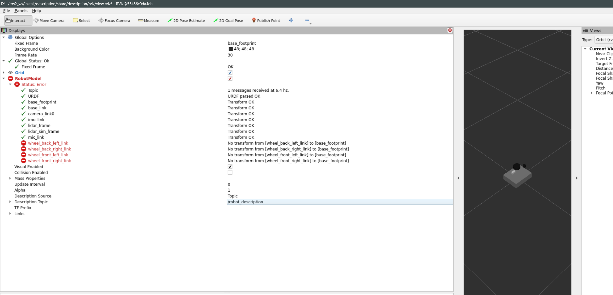
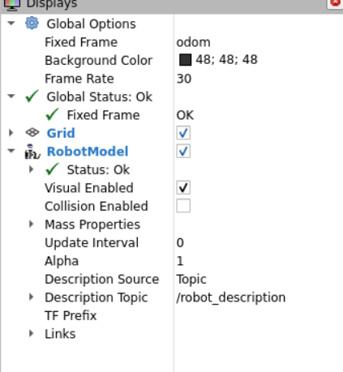
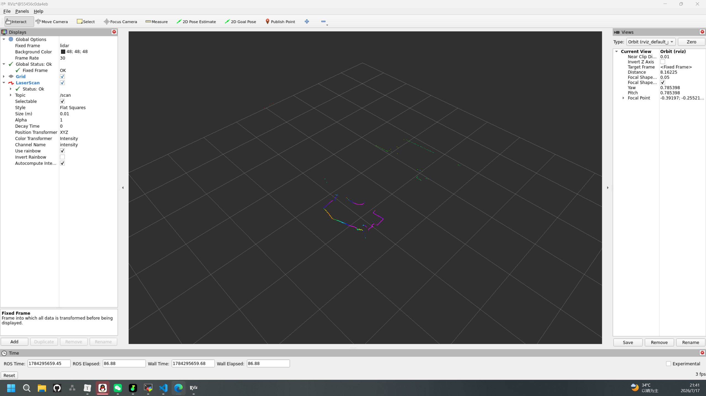
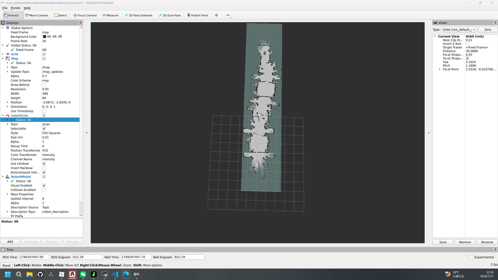

```
root@5b39de6f2376(brain):/ros2_ws$ hostname -I
172.17.0.3 10.10.0.3 
root@5b39de6f2376(brain):/ros2_ws$ ping 10.10.0.2
PING 10.10.0.2 (10.10.0.2) 56(84) bytes of data.
64 bytes from 10.10.0.2: icmp_seq=1 ttl=64 time=0.153 ms
64 bytes from 10.10.0.2: icmp_seq=2 ttl=64 time=0.104 ms
64 bytes from 10.10.0.2: icmp_seq=3 ttl=64 time=0.157 ms
^C
--- 10.10.0.2 ping statistics ---
3 packets transmitted, 3 received, 0% packet loss, time 2033ms
rtt min/avg/max/mdev = 0.104/0.138/0.157/0.024 ms
网络是通的
```

双方运行

```
export ROS_DOMAIN_ID=42
export ROS_IP=10.10.0.2
export ROS_HOSTNAME=10.10.0.2
export RMW_IMPLEMENTATION=rmw_fastrtps_cpp

echo 'export ROS_DOMAIN_ID=42' >> ~/.bashrc
echo 'export ROS_IP=10.10.0.2' >> ~/.bashrc
echo 'export ROS_HOSTNAME=10.10.0.2' >> ~/.bashrc
echo 'export RMW_IMPLEMENTATION=rmw_fastrtps_cpp' >> ~/.bashrc

source ~/.bashrc
```

大脑

```
root@5b39de6f2376(brain):/ros2_ws$ ros2 topic list
/bms/soc
/bms/voltage
/chassis/motor_cmd
/chassis/motor_states
/imu/data_raw
/parameter_events
/rosout

colcon build --symlink-install
source install/setup.bash
```

```
sudo docker rm brain

sudo docker run -itd --name brain \
  -v ~/robot/brain/ros2_ws:/ros2_ws \
  -v ~/.ssh:/root/.ssh:ro \
  --privileged \
  --env="DISPLAY" \
  --env="QT_X11_NO_MITSHM=1" \
  --volume="/tmp/.X11-unix:/tmp/.X11-unix:rw" \
  --volume /dev/bus/usb:/dev/bus/usb \
  brain:ros2-humble-full-ptp-brain
  
docker run -itd -v /tmp/.X11-unix:/tmp/.X11-unix -e DISPLAY=$DISPLAY --name test-demo ubuntu

sudo docker run -itd --name brain \
  -v ~/robot/brain/ros2_ws:/ros2_ws \
  -v ~/.ssh:/root/.ssh:ro \
  -v /tmp/.X11-unix:/tmp/.X11-unix \
  -e DISPLAY=$DISPLAY \
  --privileged \
  --volume /dev/bus/usb:/dev/bus/usb \
  brain:ros2-humble-full-ptp-brain
  

sudo docker network connect robot_net brain
hostname -I
ping 10.10.0.3

sudo docker start -ai brain

apt-get install -y openssh-client
```

```
激光雷达
/dev/ttyUSB0
深度相机
```

```
sudo docker run -itd --name brain \
  -v ~/robot/brain/ros2_ws:/ros2_ws \
  -v ~/.ssh:/root/.ssh:ro \
  -v /tmp/.X11-unix:/tmp/.X11-unix \
  -e DISPLAY=$DISPLAY \
  --privileged \
  --volume /dev/bus/usb:/dev/bus/usb \
  -p 50022:22 \
  brain:ros2-humble-full-ptp-brain
  
sudo docker network connect robot_net brain
hostname -I
ping 10.10.0.3
  
apt-get update
apt-get install -y openssh-server
passwd
vim /etc/ssh/sshd_config
X11Forwarding yes
X11UseLocalhost no
PermitRootLogin yes
service ssh start
netstat -tlnp | grep 22

创建一个新的SSH会话：
Remote host：10.87.112.240
Port：50022
Username：root
Password：1

rqt，成功

```

```
sudo docker run -itd --name brain \
  -v ~/robot/brain/ros2_ws:/ros2_ws \
  -v ~/.ssh:/root/.ssh:ro \
  -v /tmp/.X11-unix:/tmp/.X11-unix \
  -e DISPLAY=:0 \
  --privileged \
  --volume /dev/bus/usb:/dev/bus/usb \
  -p 50022:22 \
  brain:ros2-humble-full-ptp-brain
  
sudo docker network connect robot_net brain
hostname -I
ping 10.10.0.3

# 1. 更新软件源并安装SSH
apt-get update
apt-get install -y openssh-server

# 2. 设置root密码
passwd
# 输入: 1
# 确认: 1

# 3. 配置SSH（一次性永久配置）
cat > /etc/ssh/sshd_config << 'EOF'
Port 22
PermitRootLogin yes
PubkeyAuthentication yes
PasswordAuthentication yes
X11Forwarding yes
X11DisplayOffset 0
X11UseLocalhost no
PrintMotd no
AcceptEnv LANG LC_*
Subsystem sftp /usr/lib/openssh/sftp-server
EOF

# 4. 启动SSH
service ssh start

# 5. 验证
netstat -tlnp | grep 22

# 6. 退出容器
exit

在宿主机上创建 /home/gh/start_brain.sh：
#!/bin/bash
echo "🚀 启动 brain 容器..."
sudo docker start brain 2>/dev/null

echo "🔧 启动 SSH 服务..."
sudo docker exec -it brain service ssh start 2>/dev/null

echo "✅ 完成！"
echo ""
echo "📌 用 MobaXterm 连接:"
echo "   Remote host: 10.87.112.240"
echo "   Port:        50022"
echo "   Username:    root"
echo "   Password:    1"
echo ""
echo "📌 连接后直接运行 rqt 即可（无需export DISPLAY）"

chmod +x /home/gh/start_brain.sh

创建SSH会话：
Remote host：10.87.112.240
Port：50022
Username：root
Password：1

rqt

以后每天的使用流程
sudo docker start brain
sudo docker exec -it brain service ssh start
```

```
cd /ros2_ws/src
ros2 pkg create --build-type ament_cmake description --dependencies urdf xacro
apt install ros-humble-xacro
DEPTH_CAMERA_TYPE=AsCamera ros2 launch description display.launch.py

ros2 pkg create --build-type ament_cmake brain_hardware \
  --dependencies rclcpp hardware_interface pluginlib
  
cd /ros2_ws/src
ros2 pkg create --build-type ament_cmake bringup --dependencies description brain_hardware
```

```
[rviz2-4] Error:   TF_DENORMALIZED_QUATERNION: Ignoring transform for child_frame_id "wheel_back_right_link" from authority "Authority undetectable" because of an invalid quaternion in the transform (nan nan nan nan)
[rviz2-4]          at line 256 in ./src/buffer_core.cpp

ros2 run tf2_tools view_frames 可视化tf树

get_node是controller_interface的不是硬件组的，硬件组需要使用rclcpp::Node::make_shared，on_configure：创建订阅和发布器，on_activate：启动 spin 线程 

ros2_control 控制器管理器的写法https://blog.csdn.net/2401_86684687/article/details/162771410
```



```
[rviz2-4] Error:   TF_DENORMALIZED_QUATERNION: Ignoring transform for child_frame_id "wheel_front_left_link" from authority "Authority undetectable" because of an invalid quaternion in the transform (nan nan nan nan)
[rviz2-4]          at line 256 in ./src/buffer_core.cpp
[rviz2-4] Error:   TF_NAN_INPUT: Ignoring transform for child_frame_id "wheel_front_right_link" from authority "Authority undetectable" because of a nan value in the transform (nan nan nan) (nan nan nan nan)
[rviz2-4]          at line 237 in ./src/buffer_core.cpp
[rviz2-4] Error:   TF_DENORMALIZED_QUATERNION: Ignoring transform for child_frame_id "wheel_front_right_link" from authority "Authority undetectable" because of an invalid quaternion in the transform (nan nan nan nan)
[rviz2-4]          at line 256 in ./src/buffer_core.cpp
```

```
<command_interface name="velocity"/>
      <state_interface name="position"/>
      <state_interface name="velocity"/>
      
   urdf里少了个position，JointStateBroadcaster需要读取这个属性
```


```
sudo apt install ros-humble-teleop-twist-keyboard
source /ros2_ws/install/setup.bash
ros2 run teleop_twist_keyboard teleop_twist_keyboard
```

| 按键       | 功能   |
| :--------- | :----- |
| `i`        | 前进   |
| `,` (逗号) | 后退   |
| `j`        | 左转   |
| `l`        | 右转   |
| `u`        | 左前   |
| `o`        | 右前   |
| `m`        | 左后   |
| `.` (句号) | 右后   |
| `k`        | 停止   |
| `q`/`z`    | 加减速 |

1. 按 `i` 前进，小车应该直走
2. 按 `l` 右转，小车应该原地右转
3. 按 `j` 左转，小车应该原地左转
4. 按 `k` 停止



后续移植我只需要修改小脑的驱动接口、大脑的ik公式、urdf、yaml参数就行了


```
# 在脑中容器中执行
cd /ros2_ws/src
git clone https://github.com/beihuacao/Oradar_LiDAR.git oradar_lidar

rviz2
```



slam

```
sudo apt install ros-humble-slam-toolbox  2D
or
Cartographer 3D

/ros2_ws/src/description/config/slam_params.yaml
 /ros2_ws/src/bringup/launch/slam_launch.py
 
 cd /ros2_ws
colcon build --packages-select bringup
source install/setup.bash

# 终端1：启动 SLAM
ros2 launch bringup slam_launch.py

# 终端2：启动雷达
ros2 launch oradar_lidar ms200_scan.launch.py


rviz2
Fixed Frame 设为 map
Add → Map，Topic 为 /map
Add → LaserScan，Topic 为 /scan
Add → TF

移动建图
用键盘控制小车在环境中移动，rviz2 中应该会逐渐显示地图。

建图完成后保存：
ros2 run nav2_map_server map_saver_cli -f ~/maps/my_map
```

```
ros2 launch bringup brain_nav.launch.py
在 rviz2 中：

Add → Map，Topic 设为 /map（显示地图）

Add → LaserScan，Topic 设为 /MS200/scan（显示雷达点云）

Add → RobotModel（显示小车模型）

Add → TF（显示坐标轴）

Global Options → Fixed Frame 设为 map

ros2 run teleop_twist_keyboard teleop_twist_keyboard
控制移动，使用 i（前进）、j（左转）、l（右转）、,（后退）移动小车。

ros2 run nav2_map_server map_saver_cli -f ~/maps/my_map
```



能建图了，但是我明明转向了，回头了，他还是显示往前面建图

```
发现雷达urdf的坐标系id是link="lidar_frame"
<parent link="base_link"/>
<child link="lidar_frame"/>

而luanch里是{'frame_id': 'lidar'},
需要一致


[async_slam_toolbox_node-7] LaserRangeScan contains 502 range readings, expected 503
[async_slam_toolbox_node-7] LaserRangeScan contains 502 range readings, expected 503
[async_slam_toolbox_node-7] LaserRangeScan contains 504 range readings, expected 503
[async_slam_toolbox_node-7] LaserRangeScan contains 502 range readings, expected 503
[async_slam_toolbox_node-7] LaserRangeScan contains 501 range readings, expected 503

原来没有发布静态tf
# ============ 静态 TF：base_link → lidar_frame  ============
    static_tf_node = Node(
        package='tf2_ros',
        executable='static_transform_publisher',
        name='base_link_to_lidar_tf',
        arguments=['--x', '0', '--y', '0', '--z', '0.18', '--roll', '0', '--pitch', '0', '--yaw', '0', '--frame-id', 'base_link', '--child-frame-id', 'lidar_frame'],
        output='screen',
    )

```

问题，到了墙边之后，转向又向墙外走了

小车转向，以为自己没转向，里程计漂移太大了

转向，激光雷达的激光框用的是初始的激光雷达，没有跟着地图变化而变化，即使转向了，还是之前那个框，朝着前方大范围

```
ros2 run nav2_map_server map_saver_cli -f ./my_map --ros-args -p save_map_timeout:=10.0
```

```
my_map.yaml

image: /ros2_ws/my_map.pgm
mode: trinary
resolution: 0.05
origin: [-0.439, -2.07, 0]
negate: 0
occupied_thresh: 0.65
free_thresh: 0.25

nav2_bringup = IncludeLaunchDescription(
        PythonLaunchDescriptionSource(
            PathJoinSubstitution([
                FindPackageShare('nav2_bringup'),
                'launch',
                'navigation_launch.py'
            ])
        ),
        launch_arguments={
            'use_sim_time': 'False',
            'params_file': nav2_params_path,
            'map': '/ros2_ws/my_map.yaml',  
        }.items(),
    )
    
cd /ros2_ws
colcon build --packages-select bringup
source install/setup.bash

ros2 launch bringup brain_nav.launch.py

Fixed Frame 设为 map

Add → Map，Topic 设为 /map（应该显示地图）

点击 2D Pose Estimate，在小车实际位置设定初始位姿

点击 2D Goal Pose，在地图上设定目标点

小车应该开始自主导航

'map': '/ros2_ws/my_map.yaml',  # ★★★ 指定地图文件 ★★★
```


slam建图漂移

检查里程计

前进

```
ros2 run rqt_plot rqt_plot

/odom/pose/pose/position/x
/odom/pose/pose/position/y
/odom/twist/twist/linear/x
/odom/twist/twist/angular/z
```

- 前进时：`x` 直线上升，`y` 保持为0

- 转弯时：`angular.z` 有值，`x` 和 `y` 同时变

- 停止时：所有曲线变平

| 测试     | 命令         | 位置       | 姿态     | 速度    | 结果 |
| :------- | :----------- | :--------- | :------- | :------ | :--- |
| 直线前进 | v=0.334, ω=0 | x 线性增加 | 不变     | v=0.334 | ✅    |
| 原地左转 | v=0, ω=1.96  | 不变       | 线性变化 | ω=1.96  | ✅    |
| 停止     | v=0, ω=0     | 不变       | 不变     | 0       | ✅    |

```
root@55456c0da4eb(brain):/ros2_ws$ ros2 topic echo /tf --once --field transforms
[geometry_msgs.msg.TransformStamped(header=std_msgs.msg.Header(stamp=builtin_interfaces.msg.Time(sec=1784425801, nanosec=770093767), frame_id='odom'), child_frame_id='base_link', transform=geometry_msgs.msg.Transform(translation=geometry_msgs.msg.Vector3(x=nan, y=nan, z=nan), rotation=geometry_msgs.msg.Quaternion(x=nan, y=nan, z=nan, w=nan)))]
---
```

终于不漂移了，因为下面的四元数计算有问题，让ekf使用原始角速度自行进行积分

```
imu0_config: [false, false, false,
                  false, false, false,  
                  false, false, false,
                  false, false, true,    # 使用角速度积分
                  false, false, false]
```


```
ros2 run nav2_map_server map_saver_cli -f /ros2_ws/src/map/

# 使用保存的地图,slam为定位模式
ros2 launch bringup brain_nav2.launch.py map:=/ros2_ws/src/map/map.yaml

# 不指定 map 参数，自动进入 SLAM 建图模式
ros2 launch bringup brain_nav2.launch.py

ros2 launch bringup brain_nav2.launch.py auto_rviz:=false

ros2 launch bringup brain_nav2.launch.py nav2_params:=/path/to/your/nav2_params.yaml


brain_slam.launch.py建图模式
ros2 run teleop_twist_keyboard teleop_twist_keyboard
```

### 🗺️ 第一步：告诉机器人“我在哪”（设置初始位姿）

这是**最关键的一步**，让导航系统将机器人的真实位置与地图对齐。

1. 在 RViz 顶部的工具栏中，点击 **`2D Pose Estimate`** 按钮。
2. 在地图上找到机器人的**大致位置**，点击并**按住鼠标左键**不放。
3. 此时会出现一个绿色的箭头，**拖动鼠标**可以调整机器人的朝向。
4. 松开鼠标，初始位姿就设置好了。

**小提示**：定位成功后，RViz 中的激光雷达数据（红色点云）应该会与地图上的墙壁等障碍物轮廓大致对齐。如果没对齐，可以重复上述步骤微调。

### 🚀 第二步：告诉机器人“要去哪”（发送导航目标）

1. 在 RViz 顶部的工具栏中，点击 **`Nav2 Goal`** 按钮。
2. 在地图上的**目标位置**点击并按住鼠标左键。
3. 和设置位姿一样，**拖动鼠标**可以设置机器人到达目标点时的最终朝向。
4. 松开鼠标，导航任务就发送出去了。

### 👀 第三步：观察机器人的行动

发送目标后，你会看到：

- **一条红色或绿色的路径**会出现在地图上，这是导航系统规划出的全局路径。
- 机器人会开始按照规划的路径移动。
- 导航过程中可能会遇到障碍物，此时局部路径规划器会尝试避障，如果无法避障（比如卡住），系统可能会执行“原地旋转”或“后退”等恢复行为。

如果想让机器人中途停下来或去其他地方，用`Nav2 Goal`工具发送一个新目标即可。


```
# 终端1：启动所有节点（不启动 RViz）
ros2 launch bringup brain_nav2.launch.py map:=/ros2_ws/src/map/map.yaml auto_rviz:=false

# 终端2：使用软件渲染手动启动 RViz
export LIBGL_ALWAYS_SOFTWARE=1
rviz2 -d /ros2_ws/src/description/rviz/view.rviz
```


```
ros2 launch bringup brain_localization.launch.py map:=/ros2_ws/src/map/map_manual.yaml auto_rviz:=false

export LIBGL_ALWAYS_SOFTWARE=1
rviz2 -d /ros2_ws/src/description/rviz/view.rviz
```


最终

```
ros2 launch bringup brain_mapping.launch.py
ros2 launch bringup brain_localization.launch.py map:=/ros2_ws/src/map/map_manual.yaml
```

显示路径

```

```

