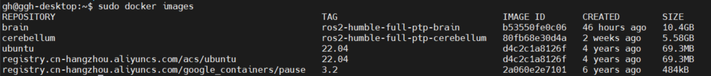
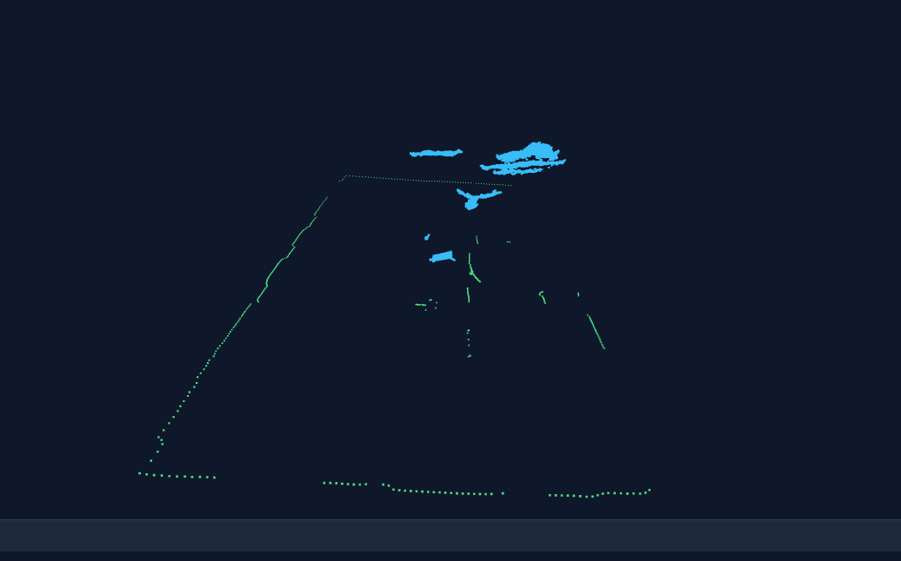
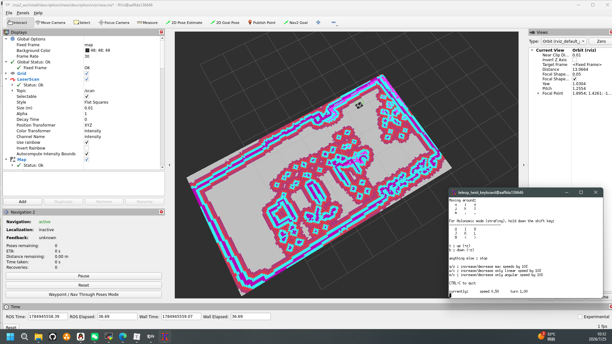
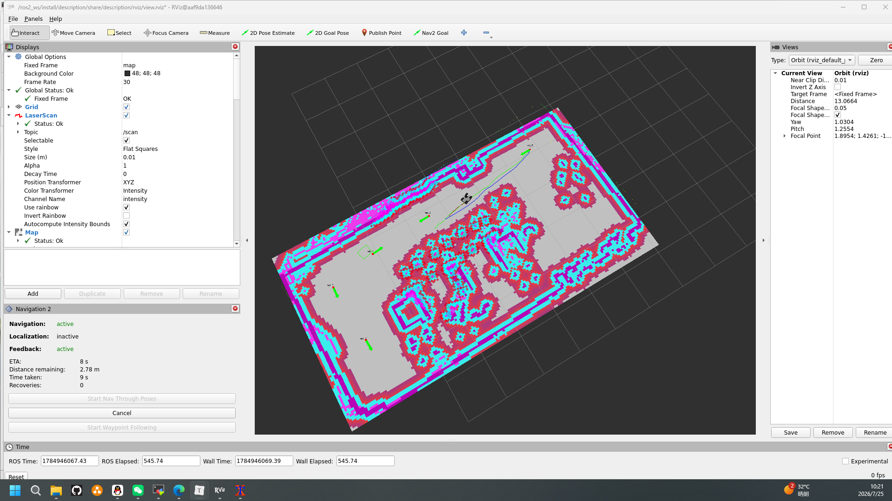
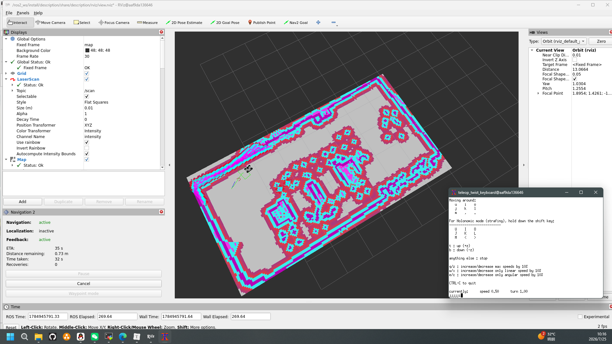

# 项目架构（按开发顺序描述）

购买现成ros2小车，清空数据，从0开始开发避免硬件周期。

分为大脑与小脑两部分，均采用docker部署分离环境。

## 开发环境

### 环境搭建

具体步骤可见Z:\E_data\Smart Inspection Robot\robot\log\log.md

### 初次连接

```
1.初次使用配网服务会开启，电脑连接机器的热点
SSID：Jetson_Setup
密码：12345678
2.浏览器打开http://10.42.0.1:8080
3.提交连接后在cmd运行ping -4 ggh-desktop.local可以看到ip
C:\Users\ahs> ping -4 ggh-desktop.local
正在 Ping ggh-desktop.local [192.168.1.30] 具有 32 字节的数据:
来自 192.168.1.30 的回复: 字节=32 时间=3ms TTL=64
来自 192.168.1.30 的回复: 字节=32 时间=12ms TTL=64
来自 192.168.1.30 的回复: 字节=32 时间=152ms TTL=64
来自 192.168.1.30 的回复: 字节=32 时间=165ms TTL=64
```

### 系统镜像

### 容器开启

```
sudo docker run -itd --name brain \
  -v ~/robot/brain/ros2_ws:/ros2_ws \
  -v ~/.ssh:/root/.ssh:ro \
  -v /tmp/.X11-unix:/tmp/.X11-unix \
  -e DISPLAY=:0 \
  --privileged \
  --volume /dev/bus/usb:/dev/bus/usb \
  -p 50022:22 \
  -p 9090:9090 \
  brain:ros2-humble-full-ptp-brain

sudo docker network connect robot_net brain
sudo docker exec -it brain service ssh start
sudo docker exec -it brain /bin/bash
hostname -I

sudo docker run -itd --name cerebellum \
  -v ~/robot/brain/ros2_ws:/ros2_ws \
  -v ~/.ssh:/root/.ssh:ro \
  --privileged \
  --volume /dev/bus/usb:/dev/bus/usb \
  cerebellum:ros2-humble-full-ptp-cerebellum
  
sudo docker network connect robot_net cerebellum
sudo docker exec -it cerebellum /bin/bash
hostname -I
```

### 启动方式

```
sudo docker start brain
sudo docker exec -it brain service ssh start
sudo docker start cerebellum

sudo docker exec -it brain /bin/bash
sudo docker exec -it cerebellum /bin/bash

ros2 launch bringup a_full.launch.py map:=/ros2_ws/src/map/map_manual.yaml
ros2 launch bringup cerebellum_bringup.launch.py
```

## 小脑

### 负责模块

- 底盘电机驱动：截止/控制/读取单个电机(id,speed)、截止/控制/读取多个电机(map<id,speed>)

- BMS电池管理：电压、soc获取

- ros2_control框架：一个通用的控制框架，进行实时控制与极高移植性的框架实现。

  最小control.urdf.xacro： base_link、四个轮子link+joint、ros2_control joint

  硬件资源管理器：自动处理，管理各类硬件组件，根据URDF的描述文件决定加载哪些硬件组件

  控制器管理器：配置joint_state_broadcaster、controller

  控制器：/cmd_vel_safe回调存到realtime_tools::RealtimeBuffer、attitude_compensator姿态补偿（订阅/odometry/filtered）、

  IK逆运动学、/odom里程计发布 坐标系odom（无tf广播）、update
  
  ```
  ros2_control的核心是一个实时控制循环（Real-time Loop），它以固定频率执行 controller_manager的 read() -> update() -> write() 过程。
  任何在update()中调用的代码，都必须满足实时性要求：
  - 无动态内存分配（allocation-free）
  - 无锁（lock-free）
  - 执行时间有界（bounded execution time）
  
  attitude_compensator：订阅ekf融合后的/odometry/filtered, 获取四元数运算pitch、roll角，进行坡道速度补偿到twist消息
      comp_x = std::sin(pitch) * gravity_compensation_ * speed_factor;//+pitch 上坡加速、-pitch 下坡减速
      comp_y = std::sin(roll) * gravity_compensation_ * speed_factor;//+roll 右倾向左移，-roll左倾向右移
IK:麦轮逆运动学，固定公式
  ```
  
  硬件组件：read、write接口实现
  
- 其他非ros2模块：公共配置加载器模块、日志模块

### 启动项

- ros2 launch bringup cerebellum_bringup.launch.py 综合启动

### 数据流

- /cmd_vel_safe+/odometry/filtered->attitude_compensator->IK->write->电机
- read->odom_updata->发布/odom(无tf变换)

### 踩坑点

- 硬件驱动：这部分不要多想，你能想到的上层基本都已经实现了，我们只需要读原始数据就行没必要重复造轮子，另外电机驱动可以设置超时看门狗，无指令等待超时自动发送0速度，虽然上层会实现，还是要加一层增加安全性，这里是在初始建项时写入的。

- urdf:ros2_control是使用关节名与各个组件通信的,具体接口是每个关节定义的command_interface、state_interface,所以关节名一定要保持一致。

- 控制器管理器：官方预设的控制器很麻烦，远没有自定义控制方便，特别是yaml文件参数那一块，和官方网站上一模一样也报错。

- 控制器管理器：joint_state_broadcaster关节状态发布器，会读取所有关节的state_interface，因此每个state_interface都要读，不然会发布nan，rviz2模型疯狂报错。

- 控制器/cmd_vel_safe：/cmd_vel_safe回调一定要保存到realtime_tools::RealtimeBuffer，在update里处理，两个线程可能同时对命令接口参数写入（概率非常大），数据直接乱码了底盘就会乱抽。回调在 update 执行期间触发，更是会直接导致数据竞争，产生未定义行为。

  为什么要用 RealtimeBuffer？

  1. 隔离异步事件：将非实时的订阅回调与实时的控制循环隔离开来，互不干扰。

  2. 保证数据一致性：readFromRT()总是读到一个完整的、原子性的指令快照，不存在半写入状态。

  3. 满足实时性约束：update()中从 RealtimeBuffer读取是 O(1)、无锁、无动态内存分配的，符合 ros2_control的硬实时要求。

  4. realtime_tools::RealtimeBuffer是一个变量，只会保存最新数据，在updata不清0会重复读取最新变量

     ```
     不置0：控制会更连续，导航更平滑，但是上层必须需要写0逻辑
     置0：无人下发指令时，机器人自动停止更安全，但是控制可能会一卡一卡的，需要配置上层发布频率>updata轮询频率，但是上层任务繁重再增大频率的话cpu容易吃不消，会触发轮询超时警告，会导致卡顿更加严重。
     ```

- 控制器attitude_compensator：四元数转欧拉角时不要相信网上给的公式，标准不一样，旋转顺序也不一样，最好使用tf2函数计算

  tf2::Matrix3x3(q).getRPY(roll, pitch, yaw);

- 控制器node：控制器作为作为一个节点，需要订阅和发布时，需要auto node = get_node();来创建，而不是常规的在类中定义。因此也不需要单独一个线程来做事件循环。

  ```c++
  auto node = get_node();
  
  cmd_vel_sub_ = node->create_subscription<geometry_msgs::msg::Twist>(cmd_vel_topic_, 1,
  
  std::bind(&BrainController::cmdVelCallback, this, std::placeholders::_1));
  
  odometry_publisher_ = node->create_publisher<nav_msgs::msg::Odometry>("/odom", 1);
  ```

- 控制器/odom发布：这里只需要发布话题就行，不需要进行odom->base_link的坐标静态变换，因为上层交给ekf发布滤波后的数据，你要是再发就重复了，上层不知道选哪个就会发生base_link未定义错误

- 控制器生命周期与接口导出：生命周期与命令状态接口还有update是纯虚函数，需要实现。

  1. on_init：进行yaml参数读取
  2. on_configure：进行订阅与发布器的初始化和一些配置
  3. on_activate：置位为初始状态
  4. on_deactivate：销毁清理工作
  5. command_interface_configuration：命令接口，关节名/命令类型，每一个都需要导出
  6. state_interface_configuration：状态接口，关节名/状态类型，每一个都需要导出
  7. update：核心逻辑，由控制器管理器配置文件update_rate: 50参数决定轮询周期

- 硬件组件：关于右轮速度有些需要*-1（我的轮子负速度代表反转），因为上层计算前向速度和转向速度时需要的都是正值。


## 大脑

### 负责模块

#### 描述模块

- 完整urdf文件：描述硬件之间的坐标关系以及仿真参数，base_footprint、base_link、imu、lidar、mic、camera、四个轮子

#### 驱动模块

- IMU发布/imu/data_raw 坐标系imu_link

- 激光雷达发布/scan 坐标系lidar_frame

- 摄像头发布如下，坐标系depth_camera_link_1、rgb_camera_link_1

| 话题                      | 说明                                 |
| :------------------------ | :----------------------------------- |
| /aurora/rgb/image_raw     | RGB 彩色图                           |
| /aurora/ir/image_raw      | IR 红外图                            |
| /aurora/depth/image_raw   | 深度图                               |
| /aurora/points2           | 点云                                 |
| /aurora/depth/camera_info | 深度相机标定信息                     |
| /aurora/ir/camera_info    | IR 相机标定信息                      |
| aurora/rgb/camera_info    | 相机内参、畸变系数、分辨率等标定信息 |

#### ekf模块

输入：map 全局参考坐标系、/odom（来自 ros2_control 的原始里程计）、/imu/data_raw、.......

输出：/odometry/filtered、odom->base_link坐标变换

robot_localization包，ekf扩展卡尔曼滤波，核心在于odom->base_link的坐标变换，作用是一个“智能融合器”，能把多个不完美的传感器数据，融合成一个比任何单一传感器都更准确、更平滑、更可靠的机器人运动状态估计。

ekf.yaml：高频动态转弯时更信任 IMU，稳态直行时更信任 Odom，目前使用2D模式

```
2d平面模式
/tf广播开启(odom->base_link)
发布/odometry/filtered

坐标系配置
map_frame: map
odom_frame: odom
base_link_frame: base_link
world_frame: odom

# ============================================================
# 里程计输入配置
# ============================================================
# ============ 位姿（Pose）：滤波器估计的最终最优值 ============
# x, y, z         : 三维空间中的位置坐标（单位：m）绝对姿态
# roll, pitch, yaw: 绕 X, Y, Z 轴的旋转角度（单位：rad）绝对姿态

# ============ 速度（Twist）：当前时刻的瞬时速率，用于预测下一帧位姿 ============
# vx, vy, vz      : 沿 X, Y, Z 方向的瞬时线速度（单位：m/s）瞬时速度
# vroll, vpitch, vyaw: 绕 X, Y, Z 轴的瞬时角速度（单位：rad/s）瞬时角速度

# ============ 加速度（Acceleration）：当前时刻的瞬时加速度 ============
# ax, ay, az      : 沿 X, Y, Z 方向的瞬时加速度（单位：m/s²）瞬时加速度

odom0: /odom
odom0_config: [false, false, false,	
               false, false, false,
               true, true, false,
               false, false, true,
               false, false, false]
odom0_queue_size: 10 #缓存队列
odom0_differential: false #表示接收的数据是绝对测量值，而非增量
odom0_relative: false #每次测量都是全局坐标系下的绝对速度，而非增量
odom0_pose_use_child_frame: false #使用父坐标odom，而非子坐标base_link

# ============================================================
# IMU 输入配置
# ============================================================
imu0: /imu/data_raw
#[x, y, z, roll, pitch, yaw, vx, vy, vz, vroll, vpitch, vyaw, ax, ay, az]
imu0_config: [false, false, false,
              false, false, false,  
              false, false, false,
              false, false, true,    #仅使用vyaw增量，ekf自行积分推算yaw
              false, false, false]
imu0_nodelay: false#无延迟
imu0_differential: false #必须为false，而非true，EKF 会对这个角速度再做一次差分（变成角加速度），滤波器将收到完全错误的物理量，导致姿态剧烈震荡甚至直接崩溃。
imu0_relative: false#绝对值
imu0_queue_size: 10#队列大小

# ============================================================
# 前馈预测配置
# ============================================================
use_control: false#关，时间戳不同步、打滑模型缺失

协方差矩阵，含义是越小越信任。[x, y, z, roll, pitch, yaw, vx, vy, vz, vroll, vpitch, vyaw, ax, ay, az]
```

ekf_3d.yaml：3D模式的刚体运动，暂不使用，带不动

```
输入：
1.传统轮式odom0
2.3D里程计odom_n
传感器			算法方案			推荐ROS工具
深度相机	RTAB-Map / VO	rtabmap_ros / ccny_rgbd
3D激光雷达	LOAM / ICP		loam_velodyne / rtabmap_ros icp_odometry
2D激光雷达	Range Flow		rf2o_laser_odometry
2D激光雷达	PL-ICP			laser_scan_matcher
3.imu0
4.imu_n
用于无人机、水下机器人
jetson nano带不动如此庞大的计算量，暂时关，不做使用。
```

局部ekf与全局ekf：未实现，仅作了解

```
一种推荐的工程实践是采用双EKF架构，将“连续定位”和“全局定位”分开处理。

本地EKF (Local EKF):
只融合连续的传感器数据，如2D ekf/ 3D ekf
其world_frame设置为odom。
这个滤波器负责提供高频、平滑的局部轨迹。

全局EKF (Global EKF):
1.robot_localization 包 navsat_transform_node节点进行翻译为odom
/odometry/local、/gps/fix、/imu/data->navsat_transform_node->/odometry/navsat
2.ekf
/odometry/navsat、/odometry/local->全局ekf->/odometry/filtered
其world_frame设置为map。
这个滤波器负责提供全局无漂移的定位。

注意：如果系统不复杂，也可以只用一个EKF节点
```

#### slam模块

SLAM Toolbox，一个2Dslam的常用方案

输入/scan话题、odom->base_link坐标变换（EKF 的优化里程计）

输出/map话题、map->odom坐标变换

slam_params.yaml

```
# ============================================================
# ROS 坐标系配置
# ============================================================
# 里程计坐标系（机器人短期定位基准，会漂移）
odom_frame: odom	#这里的odom坐标系是由ekf发布，解决了轮式odom的建图漂移问题
# 地图坐标系（全局固定，用于建图和长期定位）
map_frame: map
# 机器人本体坐标系（必须与 URDF 中的 base_frame 一致）
base_frame: base_link

# ============================================================
# 话题与模式配置
# ============================================================
# 激光雷达扫描数据话题
scan_topic: /scan
# 是否启用地图保存功能
use_map_saver: true
# 运行模式：mapping（建图）或 localization（定位）
mode: mapping  # 可选: localization
```

#### nav2模块

导航算法的标准实现，map → odom（AMCL/SLAM 提供）→ base_link（EKF 提供） → lidar_frame（URDF 提供）

nav2_params.yaml，通用nav2配置，2D避障

```
AMCL 自适应蒙特卡洛定位定位模块，通过激光雷达和地图匹配，估计机器人在 map 中的位姿
bt_navigator 行为树导航器，进行在某种情况应该怎么做的规则定义
controller_server 控制器服务器（局部路径跟踪），根据全局路径，实时计算速度指令控制机器人移动
local_costmap 局部代价地图，机器人周围动态障碍物地图，用于实时避障
global_costmap 全局代价地图，基于地图的全局障碍物地图，用于全局路径规划
map_server 地图服务器，加载并发布保存的地图
planner_server 规划器服务器（全局路径规划），根据地图和当前位置，规划从起点到目标点的全局路径
smoother_server 平滑器服务器，对全局路径进行平滑处理，使运动更流畅
behavior_server 行为服务器，当机器人卡住或无法前进时，执行恢复行为
waypoint_follower 航点跟随器，按顺序执行多个导航目标点
velocity_smoother 速度平滑器，平滑速度指令，防止急停急转
```

nav2_params_pointcloud.yaml，多观测点nav2配置，用于3D避障，已实现，加入3D点云太卡了。

```
local_costmap
 observation_sources: scan pointcloud   #观测点只支持点云，使用2D激光雷达+深度相机3D点云
        scan:
          topic: /scan
          max_obstacle_height: 2.0
          clearing: True
          marking: True
          data_type: "LaserScan"
          raytrace_max_range: 3.0
          raytrace_min_range: 0.0
          obstacle_max_range: 2.5
          obstacle_min_range: 0.0
        pointcloud:
          topic: /aurora/points2
          max_obstacle_height: 1.5
          clearing: True
          marking: True
          data_type: "PointCloud2"
          obstacle_max_range: 2.5
          obstacle_min_range: 0.0
```

| 模块                  | 输入话题                | 输出话题                        | 输出 TF            |
| :-------------------- | :---------------------- | :------------------------------ | :----------------- |
| **map_server**        | 地图文件                | `/map`                          | —                  |
| **AMCL**              | `/scan`, `/map`, `/tf`  | `/amcl_pose`, `/particle_cloud` | **`map → odom`** ✅ |
| **planner_server**    | `/map`, `/tf`           | `/plan`                         | —                  |
| **controller_server** | `/plan`, `/tf`, `/scan` | `/cmd_vel`, `/local_plan`       | —                  |
| **bt_navigator**      | `/tf`                   | `/bt_navigator/status`          | —                  |
| **behavior_server**   | `/tf`, 代价地图         | `/cmd_vel`                      | —                  |
| **waypoint_follower** | —                       | 调用导航动作                    | —                  |

#### 视觉模块

```
rgb：用于yolo识别 、视觉巡线、人机交互、原画监控
ir：弱光环境感知、夜间目标检测 
depth：nav2 代价地图，增强避障 、距离测量 
point：3D 建图、点云避障  
rgb+depth：用于ekf融合视觉里程计增强定位
```

points2 Nav2 代价地图（增强避障）：已实现，见上方

YOLO 目标检测：输入/aurora/rgb/image_raw，加载模型yolov8n.onnx与cuda，输出/aurora/rgb/image_yolo，这部分太卡了不能综合使用。

#### 控制流仲裁器模块

为什么不用cmd_vel_mux，或者twist_mux？因为一直找不到包，再加上比较简单就自己实现了一个易用版本的。

可自定义配置话题、优先级、是否开启防撞。很明显这是个结构体列表，对应话题名有优先级与防撞开关配置。

[

{"/manual_cmd_vel", 100, true},

{"/cmd_vel", 50, false}

]

初始化：每个速度源创建一个订阅，使用lambda表达式作为回调

```c++
for (const auto& source : cmd_vel_sources_) {
    auto sub = create_subscription<geometry_msgs::msg::Twist>(
      source.topic, 10,
      [this, source](const geometry_msgs::msg::Twist::SharedPtr msg) {
        cmdVelCallback(msg, source.topic, source.collision_enabled, source.priority);
      });
    cmd_vel_subs_.push_back(sub);
  }
```

回调实现：每个到来的速度指令，进行检查优先级并更新到唯一活动指令中

```c++
void SimpleCollisionMonitor::cmdVelCallback(
    const geometry_msgs::msg::Twist::SharedPtr msg,
    const std::string& topic,
    bool collision_enabled,
    int priority) {
  
  // 检查当前是否有更高优先级的有效指令
  if (active_cmd_.valid && active_cmd_.priority > priority) {
    return;  // 忽略较低优先级的指令
  }

  // 检查当前指令是否超时
  bool current_expired = false;
  if (active_cmd_.valid) {
    current_expired = (now() - active_cmd_.timestamp).seconds() > cmd_timeout_;
  }

  // 更新激活指令（条件：无有效指令 || 超时 || 更高优先级）
  if (!active_cmd_.valid || current_expired || priority > active_cmd_.priority) {
    active_cmd_.cmd = *msg;
    active_cmd_.source_topic = topic;
    active_cmd_.collision_enabled = collision_enabled;
    active_cmd_.priority = priority;
    active_cmd_.timestamp = now();
    active_cmd_.valid = true;
  }
}
```

#### base_link空气墙模块 

为什么不用nav2_collision_monitor包的collision_monitor？主要原因是因为效果没有达到预期，和我预想的相差太大。

把小车放到空旷的地方，然后运行我发现有两个问题
1.小车按一下向前，向墙壁前进，collision_monitor没有给我刹车或减速
2.如果小车在墙壁手动停下来时，按键任何操作都会输出0，向后退都没有效果

根据原理自己实现collision_avoidance,核心原理是配置四个方向的多边形，雷达点云如果有落在多边形，该方向对应操作就执行对应动作

动作类型："direction"限制运动方向, "stop"刹车禁止操作, "slowdown"减速, "limit_angular"限制角速度，目前仅实现了限制运动方向也是最常用的。（初始方案只有一个多边形，设置了减速区和停止区，顾名思义，减速和刹车的逻辑很好，表现力也是非常有冲击力，但是发现无法进行恢复行为，初始方案和现有方案逻辑上产生了逻辑冲突，因此重构为当前方案）

输入控制流仲裁器模块输出的活动指令/cmd_vel

输出/cmd_vel_safe

collision_avoidance.yaml

```
simple_collision_monitor:
  ros__parameters:
	# 机器人本体坐标系（TF 树的根坐标）
    # 所有多边形点都在此坐标系下定义
    # 坐标系：x 正方向为前，y 正方向为左
    base_frame: "base_link"

    # 激光雷达扫描数据话题
    scan_topic: "/scan"

    # 修正后的安全速度输出话题
    # brain_controller 订阅此话题执行运动
    cmd_vel_out_topic: "/cmd_vel_safe"

    # 指令超时时间（秒）
    # 超过此时间未收到新指令，自动发布零速度
    cmd_timeout: 1.0

    # 多边形可视化发布话题
    # 在 Rviz 中添加此话题（PolygonStamped）可查看多边形区域
    polygon_pub_topic: "polygon_visualization"

    # 是否发布多边形可视化
    # true=发布（调试用），false=不发布（生产环境可关闭）
    visualize_polygons: true

    # ============================================================
    # 方向感知多边形
    # ============================================================
    #
    # 工作原理：
    #   1. 将激光雷达点云转换到 base_frame 坐标系
    #   2. 统计落入每个多边形内的点数
    #   3. 若点数 >= min_points，触发该方向限制
    #   4. 同时触发多个方向时，叠加限制（各方向独立）
    #
    # 点顺序（逆时针）：前左 → 前右 → 后右 → 后左
    # 示例：points: [P1.x, P1.y, P2.x, P2.y, P3.x, P3.y, P4.x, P4.y]
    # ============================================================

    # 多边形名称列表（必须与下面的配置一一对应）
    polygon_names:
      - "Front"   # 前方
      - "Back"    # 后方
      - "Left"    # 左方
      - "Right"   # 右方

    # ============================================================
    # 多边形详细配置
    # ============================================================

    polygons:

      # ---------- 前方区域 ----------
      # 检测到障碍物时限制前进（linear.x 正方向清零）
      Front:
        # 多边形顶点（单位：米）
        # 矩形范围：x: 0.035~0.28, y: -0.21~0.21
        points:
          [0.28, 0.21,     # P1: 前左角 (x: 0.28, y: 0.21)
           0.28, -0.21,    # P2: 前右角 (x: 0.28, y: -0.21)
           0.035, -0.21,   # P3: 后右角 (x: 0.035, y: -0.21) 靠近车身
           0.035, 0.21]    # P4: 后左角 (x: 0.035, y: 0.21)
        # 动作类型：direction 表示方向限制
        action: "direction"
        # 触发阈值：至少需要多少个激光点落入多边形
        # 建议 3~5，过滤噪声，真实障碍物通常会有多个点
        min_points: 4
        # 限制的方向：
        #   forward   → 限制前进
        #   backward  → 限制后退
        #   left      → 限制左转和左移
        #   right     → 限制右转和右移
        direction: "forward"

      # ---------- 后方区域 ----------
      # 检测到障碍物时限制后退（linear.x 负方向清零）+ 禁止旋转
      Back:
        # 矩形范围：x: -0.28~-0.035, y: -0.21~0.21
        points:
          [-0.28, 0.21,    # P1: 前左角 (x: -0.28, y: 0.21)
           -0.28, -0.21,   # P2: 前右角 (x: -0.28, y: -0.21)
           -0.035, -0.21,  # P3: 后右角 (x: -0.035, y: -0.21) 靠近车身
           -0.035, 0.21]   # P4: 后左角 (x: -0.035, y: 0.21)
        action: "direction"
        min_points: 4
        direction: "backward"

      # ---------- 左侧区域 ----------
      # 检测到障碍物时限制左转（angular.z 正方向清零）+ 左移（linear.y 正方向清零）
      Left:
        # 矩形范围：x: -0.14~0.14, y: 0.035~0.28
        points:
          [0.14, 0.28,     # P1: 前左角 (x: 0.14, y: 0.28)
           0.14, 0.035,    # P2: 前右角 (x: 0.14, y: 0.035)
           -0.14, 0.035,   # P3: 后右角 (x: -0.14, y: 0.035) 靠近车身
           -0.14, 0.28]    # P4: 后左角 (x: -0.14, y: 0.28)
        action: "direction"
        min_points: 4
        direction: "left"

      # ---------- 右侧区域 ----------
      # 检测到障碍物时限制右转（angular.z 负方向清零）+ 右移（linear.y 负方向清零）
      Right:
        # 矩形范围：x: -0.14~0.14, y: -0.28~-0.035
        points:
          [0.14, -0.035,   # P1: 前左角 (x: 0.14, y: -0.035)
           0.14, -0.28,    # P2: 前右角 (x: 0.14, y: -0.28)
           -0.14, -0.28,   # P3: 后右角 (x: -0.14, y: -0.28) 靠近车身
           -0.14, -0.035]  # P4: 后左角 (x: -0.14, y: -0.035)
        action: "direction"
        min_points: 4
        direction: "right"
```

初始化阶段：加载参数、加载多边形、订阅/scan话题、监听tf、发布/polygon_visualization、发布/cmd_vel_safe

/scan回调：

```
1. 检查是否有有效的速度指令
2. 如果该指令禁用了避障，直接透传
3. 可视化多边形（统一发布到 /polygon_visualization）
4. 获取 TF 变换（lidar_frame → base_link）
5. 转换激光点到 base_frame
6. 检测多边形，判断是否有多个点云在某个多边形内部，若有将动作提取压入vector中
7. 容器为空直接跳过修正。容器有动作，对当前速度进行对应动作修正。
8. 发布/cmd_vel_safe
```

#### 系统服务模块

存放位置**bringup/scripts**，进行一些系统服务的脚本功能

- imu_calibrator.py：IMU零漂校准服务

  ```
  采样200个静止时的数据点计算xyz三轴零点漂移值，填入配置文件由驱动模块减去零漂以获取更高精度的IMU角速度。
  ```

- wifi_manager.py（宿主机）：配网服务，开机自启动，主要使用python执行nmcli命令行+Flask Web 界面服务

  ```
  开机等待10秒 → 检测Wi-Fi连接 → 未连接则开启AP → 网页配网 → 连接成功后自动保存，方便下次自动连接 → 连接失败回到第三步
  ```

- ros_to_rtmp.py：用于ros2图像消息通过cv_bridge转换为bgr8字节流，将数据写入 FFmpeg 管道进行RTMP推流

  ```
  登录获取JWT->用JWT换取推流 Token->开启Token刷新循环（当Token过期时重启FFmpeg）->启动 FFmpeg 推流到rtmp://124.222.135.234:1935/live/demo-01?token={xxx}
  图像回调：ros2图像消息通过cv_bridge转换为bgr8字节流，将数据写入 FFmpeg 管道。
  ```

- setup_frpc.sh（宿主机）：用于内网穿透服务安装脚本
  frps（服务端）：部署在有公网 IP 的服务器上（比如云服务器 124.222.135.234）。
  frpc（客户端）：部署在内网机器上（比如你的机器人）。
  frpc 就像你机器人的一个“通信兵”，它会主动连接云服务器上的 frps，并告诉它：“我这边有一个服务在 9090 端口，如果有人来找你，请转给我”。

- uninstall_frpc.sh（宿主机）：用于frp服务卸载脚本

- rosbridge.launch.py：基于WebSocket的ROS2消息桥接服务，使得外部网络可以发现机器的ROS2话题并进行通信，端口9090

#### 通信模块

- 基于WebSocket的rosbridge方案：

  ros与非ros双方使用WebSocket+JSON通信，上层可以非常方便的对话题进行通信，目前已经实现图像、控制、点云等数据的传输显示，rosbridge.launch.py一键运行即可。实际效果：2D点云、控制没有问题，但是视频延迟很高。

  ```
  接口方案位于Z:\E_data\Smart Inspection Robot\通信接口\rosbridge接口文档\interface.md
  ```

- MQTT+WebRTC+WebSocket服务器中心方案：

  视频流：ROS2 Topic-ffmpeg rtmp推流-SRS服务器 WebRTC-前端

  话题流：设备WebSocket rosbridge - frpc内网穿透 - frps服务 Nginx代理 -  前端（一开始只是为了点云流）

  控制流：前端 - .NET - EMQX - MQTT设备 / 话题流

  ```
  接口方案位于Z:\E_data\Smart Inspection Robot\通信接口\MQTT+WebRTC+WebSocket服务器中心方案\机器人端MQTT+Websocket+RTMP.md
  ```

  分流通路方案，各走各的路线，延迟都低，非常流程。
  
  **图像传输测试**
  
  
  
  
  
  **点云传输测试**
  
  
  
  **控制指令传输测试**
  
  
  
  **综合调试界面**
  
  手动控制
  
  
  
  导航控制
  
  
  
  导航+手动介入->优先级仲裁->导航恢复控制
  
  
  
  

### 功能项

#### bringup/launch启动项

- ros2 launch bringup a_full.launch.py map:=/ros2_ws/src/map/map_manual.yaml

  全功能启动项（地图导航）（无调试）

- ros2 launch bringup brain_full_debug_rosbridge.launch.py map:=/ros2_ws/src/map/map_manual.yaml

  全功能启动项（地图导航）

- brain_mapping.launch.py ：建图启动项

- a_localization.launch.py地图导航启动项（带控制路由与空气墙模块）（无RVIZ调试界面）

- teleop_collision_avoidance.launch.py：手动控制启动项（带空气墙模块）

- aurora_include.launch.py ：深度相机启动项                         

- brain_localization_pointcloud.launch.py ：地图导航启动项（带深度相机3D点云避障）

- image_compressor.launch.py：图像压缩启动项                 

- rosbridge.launch.py：ros桥接通信启动项

- brain_localization_collision_avoidance.launch.py：地图导航启动项（带控制路由与空气墙模块）  

- brain_slam_nav.launch.py ：边建图边导航启动项                

- brain_localization.launch.py ：地图导航启动项                     

- brain_slam_nav_pointcloud.launch.py：边建图边导航启动项 （带深度相机3D点云避障）   

- teleop_collision_monitor.launch.py：手动控制启动项（官方nav2_collision_monitor模块，效果比较差）

#### description/config配置项

- collision_avoidance.yaml：仲裁器与空气墙模块配置
- ekf_3d.yaml：3D ekf模块配置，实验性
- nav2_params_pointcloud.yaml：nav2导航模块配置，带激光雷达2D点云+深度相机3D点云观测点
- slam_params.yaml：slam模块配置
- collision_monitor.yaml ：官方nav2_collision_monitor模块配置，实验性
- ekf.yaml ：2D ekf模块配置
- nav2_params.yaml：nav2导航模块配置，带激光雷达2D点云
- behavior_trees/navigate_to_pose_without_backup.xml：每秒刷新一次路线、走不动就清地图、清完还不行就原地转圈/等待，且死活不倒车的稳健自动导航策略。 
- behavior_trees/navigate_without_backup.xml：一个“走点巡航”专用的行为树——每隔 3 秒刷新一次路线，边走边自动划掉已走过的点，卡住了就转圈/等待，但绝不倒车。适合场景：园区无人配送、仓库货架巡检、商场清洁等低速、固定路线、多停靠点的任务。

#### description/rviz配置项

- view_collisionMonitor.rviz：综合调试界面配置项（带nav2_collision_monitor墙体），实验性
- view_pointcloud.rviz：综合调试界面配置项（带3D点云）
- view.rviz 综合调试界面配置项（带空气墙）

#### description/urdf配置项

与描述模块是同一个东西

#### map地图项

保存地图的地方

### 数据流

#### TF树


map → odom（AMCL/SLAM 提供）→ base_link（EKF 提供） → lidar_frame（URDF 提供）

map → odom（AMCL/SLAM 提供）

odom→ base_link（EKF 提供）

base_link → lidar_frame/xxx（URDF 提供）

#### 话题

```
┌─────────────────────────────────────────────────────────────────────────────────┐
│                              大脑                                                │
├─────────────────────────────────────────────────────────────────────────────────┤
│                                                                                 │
│  ┌──────────────┐      ┌──────────────┐      ┌──────────────┐                 │
│  │  IMU 驱动    │      │  激光雷达驱动 │      │  相机驱动    │                 │
│  │              │      │  (oradar)    │      │  (Aurora)    │                 │
│  └──────┬───────┘      └──────┬───────┘      └──────┬───────┘                 │
│         │                     │                     │                          │
│         ▼                     ▼                     ▼                          │
│  /imu/data_raw        	/scan              /aurora/rgb/image_raw             │
│                                              /aurora/ir/image_raw              │
│                                              /aurora/depth/image_raw           │
│                                              /aurora/points2                   │
│											   /aurora/rgb/camera_info			 │
│											   /aurora/depth/camera_info         │
│											   /aurora/ir/camera_info            │
│         │                     │                     │                          │
│         └──────────┬──────────┴──────────┬──────────┘                          │
│                    ▼                    ▼                                      │
│           ┌──────────────────────────────────────────────────────┐             │
│           │              robot_state_publisher                   │             │
│           │        (发布 TF 树: /tf, /tf_static)                  │             │
│           └──────────────────────────────────────────────────────┘             │
│                    │                    │                                      │
│                    ▼                    ▼                                      │
│           ┌──────────────────────────────────────────────────────┐             │
│           │            ekf_filter_node (robot_localization)      │             │
│           │    输入: /imu/data_raw, /odom                         │             │
│           │    输出: /odometry/filtered                           │             │
│           └──────────────────────────────────────────────────────┘             │
│                    │                    │                                      │
│                    ▼                    ▼                                      │
│  ┌─────────────────────────────────────────────────────────────────────────┐   │
│  │            建图模式SLAM or 导航模式AMCL (定位) + Nav2 (导航)                │   │
│  │  输入: /scan, /map, /odometry/filtered, /goal_pose                        │  │
│  │  输出: /amcl_pose, /plan, /cmd_vel (→ /nav_cmd_vel)                       │  │
│  └─────────────────────────────────────────────────────────────────────────┘  │
│                    │                                                           │
│                    ▼                                                           │
│           ┌──────────────────────────────────────────────────────┐             │
│           │         cmd_vel_mux (优先级仲裁)                       │             │
│           │  输入: /nav_cmd_vel (Nav2)                            │             │
│           │        /teleop_cmd_vel (键盘)                         │             │
│           │        /manual_cmd_vel (外部控制)                      │             │
│           │  输出: /cmd_vel_muxed                                  │             │
│           └──────────────────────────────────────────────────────┘             │
│                    │                                                           │
│                    ▼                                                           │
│           ┌──────────────────────────────────────────────────────┐             │
│           │    simple_collision_monitor (空气墙)                  │             │
│           │  输入: /cmd_vel_muxed, /scan                         │             │
│           │  输出: /cmd_vel_safe, /polygon_visualization         │             │
│           └──────────────────────────────────────────────────────┘             │
│                    │                                                           │
│                    ▼                                                           │
┌─────────────────────────────────────────────────────────────────────────────────┐
│                              小脑                                                │
├─────────────────────────────────────────────────────────────────────────────────┤
│           ┌──────────────────────────────────────────────────────┐             │
│           │         小脑controller                                │             │
│           │  输入: /cmd_vel_safe，/odometry/filtered              │             │
│           └──────────────────────────────────────────────────────┘             │
│                    │                                                           │
│                    ▼                                                           │
│           attitude_compensator->IK->write->电机                                  │
│                                                                                 │
│  ┌─────────────────────────────────────────────────────────────────────────┐  │
│  │    [rosbridge_websocket-> frpc] ->frps -> Nginx代理 -> Web          		 │  │
│  │  端口 9090，供外部 Web/客户端 订阅/发布                               		 │  │
│  └─────────────────────────────────────────────────────────────────────────┘  │
│           ┌──────────────────────────────────────────────────────┐             │
│			│			ros_to_rtmp (RTMP 推流)					  │				│
│           │ [image_raw->ffmpeg->rtmp推流]->SRS服务器->WebRTC->Web  │             │             
│           │  输入: /aurora/rgb/image_raw                          │             │
│           │  输出: rtmp://服务器/live/demo-01                      │             │
│           └──────────────────────────────────────────────────────┘             │
└─────────────────────────────────────────────────────────────────────────────────┘
```

### 踩坑点

#### 1. IMU坐标变换的曲折历程

**问题现象**：IMU数据在 EKF 中融合后姿态方向错误，`yaw` 角度符号相反，或者 `base_link` → `imu_link` 的 TF 找不到。

**错误做法**：

- 一开始不知道 `robot_state_publisher` 会根据 URDF 自动发布 `base_link` → `imu_link` 的静态 TF。
- 自己在驱动层硬编码了一套坐标系转换逻辑（SM 矩阵变换 + 零点四元数校准），将原始 IMU 数据强行映射到 ROS 标准坐标系。
- 结果：加速度、角速度转换正确了，但四元数还原回原本 IMU 安装位置后，`yaw` 符号始终相反。用静态 TF 修正后能工作，但逻辑极其复杂，代码耦合严重。

**正确做法**：

- 在 URDF 中准确描述 IMU 的安装位置和朝向（`<origin xyz="..." rpy="0 0 1.57"/>`），`robot_state_publisher` 会自动发布 `base_link` → `imu_link` 的 TF。
- EKF 订阅 `/imu/data_raw` 时，会通过 TF 自动将数据转换到 `base_link` 坐标系。
- 驱动层只做零漂校准，直接发布原始加速度、角速度和由互补滤波计算的绝对四元数，`frame_id` 设为 `imu_link`。
- 最终删除了所有硬编码的坐标变换逻辑，代码量减少约 70%，可维护性大幅提升。

**教训**：URDF 的 TF 体系是整个 ROS 坐标变换的核心，不要绕过它去手动干框架已经做了的事。利用 `tf2_echo` 验证 TF 树是否完整比写代码映射更高效。

#### 2. ros2_control：从“瞎搞”到理解架构

**问题现象**：尝试使用官方的 `mecanum_drive_controller`，配置文件一直报错，找不到 `ki`、`kd` 等 PID 参数，折腾数天无法解决。

**错误做法**：跟着 AI 的建议直接使用官方控制器，不清楚其内部需要哪些 URDF 元素和参数结构，盲目复制网上的配置，导致配置文件错误无法排查。

**正确做法**：先理解 `ros2_control` 的四层架构：

- URDF 中的 `<ros2_control>` 描述硬件和关节接口
- 硬件插件（`SystemInterface`）负责与物理硬件通信
- 控制器（`ControllerInterface`）负责控制逻辑
- 控制器管理器（`controller_manager`）统一加载和管理

自主实现控制器后，关键发现：

- **关节名是唯一纽带**：控制器和硬件组件通过关节名匹配接口，必须一致。
- **`joint_state_broadcaster` 必须读取 `position` 状态接口**：否则 Rviz2 显示 TF 为 `nan`。
- **生命周期与接口导出**：`on_init` → `on_configure` → `on_activate` → `on_deactivate` 每个阶段职责不同，`command_interface_configuration` 和 `state_interface_configuration` 必须导出所有需要的接口。
- **`update()` 实时约束**：无动态内存分配、无锁、执行时间有界。`/cmd_vel` 回调必须通过 `realtime_tools::RealtimeBuffer` 缓存，在 `update()` 中处理，否则两个线程同时对同一变量操作会导致数据竞争，底盘乱抽。

**教训**：官方控制器固然通用，但 URDF 和参数要求严格，文档晦涩。自主实现虽然初期投入大，但可完全掌控，日后扩展和移植都更方便。

#### 3. EKF 集成：yaw 回正问题

**问题现象**：建图时旋转角度无法累积，地图一直回正，无法建出闭合环路。

**错误做法**：IMU 驱动直接发布互补滤波计算的绝对四元数，且将 `imu0_config` 中 `yaw` 开启（设为 `true`），导致 EKF 同时收到绝对姿态和角速度，滤波器直接采用绝对姿态，无视角速度积分，导致旋转被限制在 ±30°。

**正确做法**：

- EKF 中只用角速度积分，不用绝对姿态：

  ```
  imu0_config: [false, false, false, false, false, false,
                false, false, false, false, true, false,
                false, false, false, false, false]
                # 只启用 vyaw（角速度），关闭 yaw（绝对姿态）
  ```

- 关闭 `imu0_differential`：必须为 `false`，如果设为 `true`，EKF 会对角速度再做一次差分，变成角加速度，导致姿态剧烈震荡甚至崩溃。

- `use_control: false`：关闭前馈预测，因为时间戳不同步且没有打滑模型，开环预测会引入更多误差。

**教训**：EKF 的配置需要理解每一个 `config` 数组位的含义——它定义的是“滤波器测量什么”，而不是“传感器有什么”。绝对姿态和角速度只能二选一。

#### 4. TF 树断裂导致 Nav2 启动失败

**问题现象**：`planner_server` 启动时报错 `timed out waiting for transform from base_link to map`。

**错误做法**：直接用 `ros2 launch` 启动所有 Nav2 节点，没有控制启动顺序，导致 `amcl` 和 `map_server` 的 lifecycle 未正确激活。

**正确做法**：

- 通过 `nav2_lifecycle_manager` 管理启动顺序：`map_server` → `amcl` → `planner_server` → `controller_server` → `behavior_server` → `bt_navigator` → `waypoint_follower`
- 使用 `tf2_echo map odom` 验证 AMCL 是否发布 `map→odom` 变换
- EKF 发布 `odom→base_link`，两者结合形成完整 TF 链：`map→odom→base_link→lidar_frame`

**教训**：Nav2 依赖完整的 TF 树，缺少任何一环节点就会启动失败或超时。使用 `view_frames` 工具生成 TF 树 PDF，可以快速定位缺失的坐标帧。

#### 5. 激光雷达坐标系必须与 URDF 一致

**问题现象**：Rviz2 中激光雷达点云无法显示，或者显示的 `/scan` 数据与机器人位置错位。

**错误做法**：忽略激光雷达驱动参数中的 `frame_id` 配置，默认值可能与 URDF 中定义的 `lidar_frame` 不一致，或者将 `lidar_frame` 写成其他名称。

**正确做法**：

- 在雷达驱动的 launch 文件中显式设置 `frame_id: "lidar_frame"`，与 URDF 完全一致。
- 通过 `tf2_echo base_link lidar_frame` 验证变换是否存在，且数值与 URDF 中 `<origin>` 一致。
- 确认 `/scan` 话题的 `header.frame_id` 与 `lidar_frame` 一致。

**教训**：所有传感器数据都在 `base_link` 坐标系下做 TF 变换，所以每个传感器的 `frame_id` 必须在 URDF 中有对应的 link，并且完全一致（大小写敏感）。

#### 6. SLAM 与 Nav2 的地图冲突

**问题现象**：边建图边导航模式下，地图出现两个 /map 话题叠加，定位失败。

**错误做法**：同时启动 `slam_toolbox` 和 `map_server`，两者都发布 `/map` 话题，导致导航系统混乱。

**正确做法**：

- 建图模式（`brain_mapping.launch.py`）：只启动 `slam_toolbox`，不启动 `map_server`
- 导航模式（`brain_localization.launch.py`）：只启动 `map_server` + `AMCL`，不启动 `slam_toolbox`
- 边建图边导航模式（`brain_slam_nav.launch.py`）：只启动 `slam_toolbox`，不启动 `AMCL` 和 `map_server`，Nav2 直接使用 SLAM 发布的地图

**教训**：`/map` 话题只能有一个发布者，多个发布者会导致 TF 和代价地图混乱。不同模式通过不同的 launch 文件切换。

#### 7. 四元数转欧拉角必须用 tf2 库

**问题现象**：网上找的四元数转欧拉角公式计算出的 `roll/pitch/yaw` 符号不稳定，或者万向锁时出现 `nan`。

**错误做法**：直接复制网上的 `atan2`/`asin` 公式，没有考虑旋转顺序和万向锁边界。

**正确做法**：

```
#include <tf2/LinearMath/Quaternion.h>
#include <tf2/LinearMath/Matrix3x3.h>

tf2::Quaternion q;
q.setX(x); q.setY(y); q.setZ(z); q.setW(w);

double roll, pitch, yaw;
tf2::Matrix3x3(q).getRPY(roll, pitch, yaw);
```

`tf2::Matrix3x3::getRPY()` 使用 RPY (Roll-Pitch-Yaw) 顺序，与 ROS 坐标系标准一致，且内部处理了万向锁边界情况。

**教训**：不要相信网上随手抄的公式，不同库的旋转顺序和四元数定义可能不同。ROS 官方提供的 `tf2` 库是最可靠的。

#### 8. 调试工具链的使用心得

**问题现象**：遇到问题时不知道从哪下手，盲目改代码反复试错。

**经验总结**：

| 工具          | 用途                   | 典型场景                                                     |
| :------------ | :--------------------- | :----------------------------------------------------------- |
| `rqt_graph`   | 查看节点和话题拓扑     | 确认数据流是否按预期连接，某个话题是否有发布者/订阅者        |
| `rqt_plot`    | 绘制话题数据曲线       | 快速判断速度指令是否下发、里程计是否累积、IMU 数据是否正常   |
| `rqt_console` | 查看各节点日志         | 定位错误来源，尤其是 `tf2` 超时、`controller_manager` 加载失败等 |
| `tf2_echo`    | 实时查看两坐标系变换   | 验证 TF 树是否完整，如 `map→odom`、`odom→base_link`          |
| `view_frames` | 生成 PDF 图形化 TF 树  | 快速定位缺失坐标帧，比 `tf2_echo` 更直观                     |
| `tf2_monitor` | 监控 TF 发布频率和延迟 | 排查 TF 超时问题，检查发布频率是否过低                       |

**教训**：遇到问题先跑 `rqt_graph` 看节点是否都在，再用 `tf2_echo` 验证 TF 链，最后看 `rqt_console` 的错误日志。这个三板斧能解决 80% 的问题。

#### 9. Nav2 行为树调参

**问题现象**：导航时机器人遇到障碍物就停死，或者转圈很久才恢复。

**经验总结**：

`bt_navigator` 的行为树决定了导航的“性格”：

- `navigate_to_pose_without_backup.xml`：每秒刷新一次路线，走不动就清地图，清完还不行就原地转圈/等待，**死活不倒车**。适合单点导航，安全保守。
- `navigate_without_backup.xml`：每隔 3 秒刷新一次路线，边走边自动划掉已走过的点，卡住了就转圈/等待，**绝不倒车**。适合巡航任务（园区配送、仓库巡检）。

**教训**：行为树决定了导航的“性格”，不是调 PID 就能解决的。选对行为树比调参数更关键。

#### 10. 传感器融合的取舍：不要什么都要

**问题现象**：深度相机发布的 `points2` 点云数据加入 Nav2 代价地图后，CPU 占用飙升，导航卡顿。

**经验总结**：

| 传感器             | 数据量       | 用途               | 是否启用           |
| :----------------- | :----------- | :----------------- | :----------------- |
| 激光雷达 `/scan`   | ~600 点/帧   | 2D 避障、建图      | **✅ 必须**         |
| 深度相机 `points2` | 约 3 万点/帧 | 3D 避障            | **❌ 太卡，已关闭** |
| 深度相机 `depth`   | 320×200 图像 | 避障增强           | **❌ 太卡，已关闭** |
| 深度相机 `ir`      | 320×200 图像 | 夜间感知           | **❌ 已关闭**       |
| RGB 图像           | 320×200 图像 | 原画监控、视觉任务 | **✅ 启用**         |

**教训**：Jetson Nano 算力有限，不能所有传感器都启用。只保留当前任务必需的，其他全部关闭。`points2` 点云虽然避障效果好，但在 Jetson Nano 上跑 Nav2 代价地图更新会卡死。

#### 11. Docker 环境一致性

**问题现象**：大脑和小脑分属两个 Docker 容器，依赖包版本不一致导致编译或运行时行为异常。

**经验总结**：

- 大脑和小脑使用不同镜像，但 ROS 2 版本必须一致（都是 Humble）。
- 自定义消息包 `interfaces` 必须在两边都编译，且版本一致。
- 使用 `colcon build` 时，两边都要 `source install/setup.bash`，否则找不到自定义消息。
- 通过虚拟以太网（10.10.0.0/16）实现容器间通信，ROS_DOMAIN_ID 必须一致。

**教训**：分布式架构中，两端的环境一致性至关重要。建议将 `interfaces` 包单独提取，两端使用相同的源码版本编译。

#### 12. 启动文件组织原则

**问题现象**：启动文件越来越多，`bringup/launch/` 目录下十几个文件，容易混淆。

**经验总结**：

| 层级         | 文件                                               | 作用                 |
| :----------- | :------------------------------------------------- | :------------------- |
| **原子启动** | `aurora_include.launch.py`、`rosbridge.launch.py`  | 单一功能，可独立运行 |
| **模块组合** | `brain_localization_collision_avoidance.launch.py` | 组合多个原子启动     |
| **综合启动** | `brain_full_debug_rosbridge.launch.py`             | 一键启动所有功能     |

**命名规范**：

- `brain_*`：大脑相关
- `*_collision_avoidance`：带空气墙模块
- `*_pointcloud`：带 3D 点云（实验性）
- `teleop_*`：手动控制模式
- `rosbridge`：外部通信桥接

**教训**：启动文件要有清晰的层级和命名规范，不然时间长了自己都不知道哪个是干什么的。

#### 13. colcon build的一些坑

**问题现象**：修改了 `.py` 或 `.yaml` 文件后，重新 `colcon build` 发现改动没有生效。

**经验总结**：

- 使用 `--symlink-install` 可以让 `install` 目录中的文件软链接到 `src`，修改后无需重新编译即可生效（适用于 Python 脚本和 YAML）。

- 修改了 C++ 源码后必须重新编译对应的包：

  ```
  colcon build --packages-select brain_controller --symlink-install
  ```

- 修改了自定义消息（`interfaces` 包）后，所有依赖它的包都需要重新编译，顺序是：`interfaces` → `brain_hardware` → `brain_controller` → `bringup`。

- 如果编译报错找不到自定义消息，先检查是否 `source install/setup.bash`。

**教训**：`colcon build` 的增量编译并不总是可靠的，遇到奇怪的错误时，删除 `build`、`install`、`log` 目录，清空缓存，完整重新编译一次。

#### 14. EKF 发布 TF 与控制器发布 TF 冲突导致 base_link 未定义

**问题现象**：

- 启动后，`tf2_echo map odom` 正常，`tf2_echo odom base_link` 正常，但 Rviz2 中 `base_link` 显示为红色，`TF` 面板报错 `No transform from [base_link] to [odom]`。
- Nav2 的 `planner_server` 或 `controller_server` 报错 `timed out waiting for transform from base_link to odom`。
- 用 `view_frames` 生成的 PDF 中，`odom → base_link` 的发布者显示为多个（`default_authority` 重复），且 `Buffer length` 异常。

**错误做法**：

- 在 `brain_controller` 中，`on_configure()` 创建了 `tf_broadcaster_`，在 `publishOdometry()` 中发布了 `odom → base_link` 的 TF。
- 同时 `robot_localization` 的 `ekf_node` 也在发布 `odom → base_link` 的 TF（因为 `publish_tf: true`）。
- 两个节点同时发布同一个坐标变换，TF 树出现竞争，导致 `tf2` 缓冲区混乱，`base_link` 无法被正确定义。

**正确做法**：

- 明确 **TF 的发布职责分离**：

  - `brain_controller`（小脑）只发布 `/odom` 话题（里程计数据），**不发布 TF**。
  - `robot_localization`（EKF）负责发布 `odom → base_link` 的 TF（融合后的优化位姿）。
  - `robot_state_publisher`（大脑）负责发布 `base_link → 各传感器` 的静态 TF（来自 URDF）。

- 在 `brain_controller` 中注释掉 `tf_broadcaster_` 的创建和 `sendTransform` 调用：

  cpp

  ```
  // on_configure 中
  // tf_broadcaster_ = std::make_shared<tf2_ros::TransformBroadcaster>(node);
  
  // publishOdometry 中
  // tf_broadcaster_->sendTransform(tf_msg);
  ```

  

- 在 `ekf.yaml` 中保持 `publish_tf: true`，让 EKF 发布优化的 `odom → base_link` TF。

- 用 `tf2_echo odom base_link` 验证发布者是否只有一个（应该只有 `ekf_filter_node`）。

**教训**：

- 同一个坐标变换只能有一个发布者，多个发布者会导致 TF 树混乱，`base_link` 出现未定义错误。
- 职责分离的原则：**控制器只发数据，EKF 发 TF**，不重复发布。
- 如果自定义控制器需要发布 TF，确保关闭 EKF 的 `publish_tf`，或使用不同的 `child_frame_id`，但标准做法是让 EKF 统一负责 `odom → base_link` 的 TF。

#### 15. EKF 输出坐标的 world_frame选择

**问题现象**：`ekf.yaml` 中 `world_frame: odom` 还是 `world_frame: map` 的区别不清楚，导致坐标系混乱。

**正确理解**：

- `world_frame: odom`：EKF 工作在 `odom` 坐标系下，输出相对位姿（连续，无漂移修正）。适合局部导航，与 `slam_toolbox` 配合建图。
- `world_frame: map`：EKF 工作在 `map` 坐标系下，输出全局位姿（有漂移修正）。需要 GPS 或全局定位输入，适合室外导航。

**经验总结**：

- 纯室内 SLAM 导航：`world_frame: odom`，让 AMCL/SLAM 提供 `map → odom` 的变换即可。
- 无需在 EKF 中直接输出 `map` 坐标系，否则会与 AMCL 冲突。

#### 16. 静态 TF 的发布频率问题

**问题现象**：`view_frames` 中 `base_link → lidar_frame` 的 `Average rate` 显示 `10000.0`，`Buffer length` 显示 `0.0`，且 `Most recent transform: 0.0`。

**正确理解**：

- 静态 TF（来自 URDF 的固定 joint）由 `robot_state_publisher` 发布一次，频率为 `10000.0` 是因为它是静态变换，在 TF 缓冲区中永久存在。
- `Buffer length: 0.0` 和 `Most recent transform: 0.0` 是正常现象，不代表错误。
- 静态 TF 的发布者不是 `default_authority`，而是 `robot_state_publisher`。

**教训**：`view_frames` 中静态 TF 显示 `0.0` 是正常的，不要误以为缺失。真正需要关注的是动态 TF（如 `odom → base_link`、`map → odom`）是否持续更新。

#### 17. 控制器 update()中发布时间戳与系统时间不一致

**问题现象**：`/odom` 话题的时间戳与系统时间不同步，导致 EKF 报错 `timestamp in the future` 或 `message dropped due to timestamp`。

**错误做法**：`update()` 中直接使用 `time` 参数发布 `/odom`，但 `time` 可能不是实时时间。

**正确做法**：

- `update()` 中的 `time` 参数是控制器管理器传入的当前时间，应直接使用。
- 如果使用 `get_node()->now()`，确保在实时上下文中不会引入延迟。
- 确保 `use_sim_time` 在所有节点中一致（真实机器人设为 `false`，Gazebo 仿真设为 `true`）。

**教训**：时间戳不一致会导致 EKF 丢弃消息，必须确保 `/odom` 的时间戳与系统时间一致，且 `use_sim_time` 全局统一。

