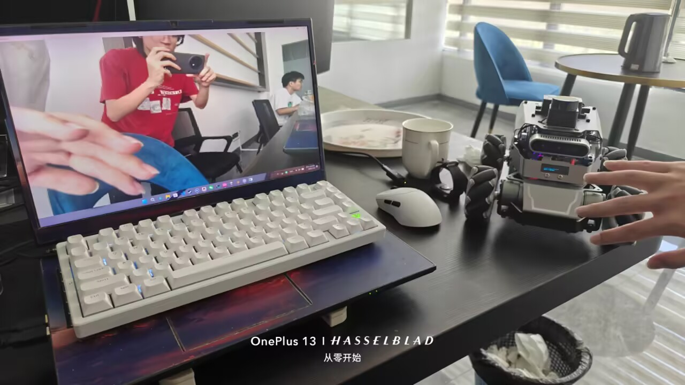

# WebSocket-rosbridge通信

## 一、什么是 Rosbridge？

Rosbridge 是一套**协议和工具集**，为 ROS（机器人操作系统）提供了一个 **JSON API**，让非 ROS 程序——如 Web 应用、移动 App 或云端系统——能够通过标准 Web 技术（WebSocket 和 JSON）与 ROS 系统交互。简单说，它是一座连接 ROS 内部世界和外部世界的“桥梁”。

**核心价值**：开发者不需要在外部程序中运行 ROS 本地环境，也不用写 C++ 或 Python 的 ROS 节点，就能发布/订阅话题、调用服务、获取系统状态。

## 二、为什么需要 Rosbridge？

ROS 节点之间通过 TCP/UDP 通信，而**浏览器无法直接使用这些协议**。Rosbridge 通过 **WebSocket** 填补了这个空白——WebSocket 被所有现代浏览器原生支持，让 Web 前端直接与机器人通信成为可能。

**典型场景**：

- **远程监控与遥操作**：通过浏览器监控机器人状态、发送控制指令
- **跨平台应用**：用 JavaScript 开发控制界面，在手机、平板、Web 仪表盘上运行
- **云端集成**：将机器人数据流式传输到云端应用
- **数据可视化**：在浏览器中实时查看相机、激光雷达、IMU 等传感器数据

## 三、架构与组件

Rosbridge 主要包含两个部分：

### 1. Rosbridge Protocol（协议）

规定了通信的**具体格式规范**——即外部程序和 ROS 通信时，发布、订阅、调用服务等操作应该使用什么样的 JSON 格式。

**核心规则**：所有消息都是 JSON 对象，唯一必须的字段是 `"op"`，用于指定操作类型。例如订阅话题的格式：

json

```
{
  "op": "subscribe",
  "topic": "/cmd_vel",
  "type": "geometry_msgs/Twist"
}
```


### 2. Rosbridge Implementation（实现）

**具体功能实现**，核心是 `rosbridge_server`——一个 WebSocket 服务器，负责将 JSON 消息翻译成 ROS 命令，反之亦然。它以 `rosbridge_suite` 软件包的形式提供。

### 3. 客户端库

- **`roslibjs`**：JavaScript 客户端库，用于 Web 前端
- **`roslibpy`**：Python 客户端库
- 其他语言（Dart、C# 等）也有社区实现

## 四、核心协议操作（op 类型）

Rosbridge v2.0 协议定义了多种操作：

| 操作类型     | op 值              | 说明                    |
| :----------- | :----------------- | :---------------------- |
| **发布**     | `publish`          | 发布一个 ROS 消息到话题 |
| **订阅**     | `subscribe`        | 订阅一个 ROS 话题       |
| **取消订阅** | `unsubscribe`      | 取消订阅                |
| **广播话题** | `advertise`        | 声明要发布某个话题      |
| **停止广播** | `unadvertise`      | 停止声明                |
| **调用服务** | `call_service`     | 调用 ROS 服务           |
| **服务响应** | `service_response` | 服务返回的响应          |
| **认证**     | `auth`             | 客户端认证              |

v2.0 还新增了**消息分片（fragmentation）**、**压缩（compression）**和**日志（logging）**功能。

## 五、在 ROS 2 中的使用方法

### 1. 安装

bash

```
sudo apt install ros-humble-rosbridge-server
```


### 2. 启动服务器

bash

```
ros2 launch rosbridge_server rosbridge_websocket_launch.xml
```


默认监听 `ws://localhost:9090`。

### 3. 客户端连接示例（JavaScript + roslibjs）

javascript

```
// 连接 Rosbridge
var ros = new ROSLIB.Ros({
  url: 'ws://localhost:9090'
});

ros.on('connection', function() {
  console.log('Connected to Rosbridge');
});

// 订阅话题
var listener = new ROSLIB.Topic({
  ros: ros,
  name: '/cmd_vel_safe',
  messageType: 'geometry_msgs/Twist'
});

listener.subscribe(function(message) {
  console.log('Received:', message);
});

// 发布指令
var cmd = new ROSLIB.Topic({
  ros: ros,
  name: '/manual_cmd_vel',
  messageType: 'geometry_msgs/Twist'
});

var twist = new ROSLIB.Message({
  linear: { x: 0.2, y: 0, z: 0 },
  angular: { x: 0, y: 0, z: 0 }
});
cmd.publish(twist);
```


## 六、性能与局限性

### ✅ 适合的场景

- **控制指令**（如 `/cmd_vel`）：延迟通常在 **20-700ms** 之间
- **低频状态数据**（如电池电量、机器人状态）
- **服务调用**：轻量级请求/响应

### ⚠️ 不适合的场景

- **高带宽数据**（视频流、高频点云）：传输高带宽数据（如相机流）会产生**显著延迟**
- **大规模二进制数据**：发布大规模二进制数组**非常慢**
- **对实时性要求极高的场景**

### 📌 重要提示

Foxglove 官方已**不再推荐使用 rosbridge**，转而推荐 `foxglove_bridge`。但对于你的场景——**控制指令传输**，rosbridge 依然是一个成熟、简单、够用的选择。

## 七、与你架构的关系

你即将对接的服务器方案是：

| 数据类型     | 协议                | Rosbridge 的角色                 |
| :----------- | :------------------ | :------------------------------- |
| **控制指令** | SignalR + MQTT      | 替代方案，rosbridge 不再使用     |
| **视频流**   | RTMP → SRS → WebRTC | 视频不走 rosbridge（性能原因）   |
| **点云数据** | WebSocket (Binary)  | 不走 rosbridge（二进制效率更高） |

虽然新方案中控制指令改用 MQTT，但 rosbridge 仍然是 ROS 生态中 Web 通信的事实标准，理解它能帮你更好地把握 ROS 与外部系统通信的设计思路。


```
sudo docker stop brain cerebellum

sudo docker images
gh@ggh-desktop:~$ sudo docker images
REPOSITORY                                                  TAG                               IMAGE ID       CREATED       SIZE
cerebellum                                                  ros2-humble-full-ptp-cerebellum   80fb68e30d4a   2 weeks ago   5.58GB
brain                                                       ros2-humble-full-ptp-brain        c434d455121f   2 weeks ago   3.58GB
registry.cn-hangzhou.aliyuncs.com/acs/ubuntu                22.04                             d4c2c1a8126f   4 years ago   69.3MB
ubuntu                                                      22.04                             d4c2c1a8126f   4 years ago   69.3MB
registry.cn-hangzhou.aliyuncs.com/google_containers/pause   3.2                               2a060e2e7101   6 years ago   484kB

gh@ggh-desktop:~$ sudo docker commit brain brain:ros2-humble-full-ptp-brain
sha256:b53550fe0c06792d9204e43183aab62015ffb5127a8753eddea0f4629550859c
gh@ggh-desktop:~$ sudo docker images
REPOSITORY                                                  TAG                               IMAGE ID       CREATED              SIZE
brain                                                       ros2-humble-full-ptp-brain        b53550fe0c06   About a minute ago   10.4GB
cerebellum                                                  ros2-humble-full-ptp-cerebellum   80fb68e30d4a   2 weeks ago          5.58GB
ubuntu                                                      22.04                             d4c2c1a8126f   4 years ago          69.3MB
registry.cn-hangzhou.aliyuncs.com/acs/ubuntu                22.04                             d4c2c1a8126f   4 years ago          69.3MB
registry.cn-hangzhou.aliyuncs.com/google_containers/pause   3.2                               2a060e2e7101   6 years ago          484kB


sudo docker run -itd --name brain \
  -v ~/robot/brain/ros2_ws:/ros2_ws \
  -v ~/.ssh:/root/.ssh:ro \
  -v /tmp/.X11-unix:/tmp/.X11-unix \
  -e DISPLAY=:0 \
  --privileged \
  --volume /dev/bus/usb:/dev/bus/usb \
  -p 50022:22 \
  -p 9090:9090 \
  brain:ros2-humble-full-ptp-brain

sudo docker network connect robot_net brain
sudo docker exec -it brain service ssh start
sudo docker start cerebellum

MobaXterm连接大脑
rqt测试
hostname -I
ping 10.10.0.3

colcon build
source ./install/setup.bash
ros2 launch bringup brain_localization_collision_avoidance.launch.py map:=/ros2_ws/src/map/map_manual.yaml

sudo apt update
sudo apt install ros-humble-rosbridge-suite

ros2 launch bringup rosbridge.launch.py

宿主机
curl -i -N -H "Connection: Upgrade" -H "Upgrade: websocket" \
     -H "Sec-WebSocket-Version: 13" \
     -H "Sec-WebSocket-Key: test" \
     http://localhost:9090
     
外部windows powershell连接测试
Test-NetConnection 192.168.1.30 -Port 9090

ros2 launch bringup rosbridge.launch.py
ros2 launch bringup aurora_include.launch.py
ros2 launch bringup brain_localization_collision_avoidance.launch.py map:=/ros2_ws/src/map/map_manual.yaml

控制指令测试
#!/usr/bin/env python3
"""
键盘控制脚本 - 通过 rosbridge 发送速度指令
按键映射：
  W / ↑    : 前进
  S / ↓    : 后退
  A / ←    : 左转
  D / →    : 右转
  空格键   : 紧急停止
  Q / Esc  : 退出程序

按住 Shift 可加速（速度 x 2）
"""

import asyncio
import json
import sys
from pynput import keyboard
from pynput.keyboard import Key, KeyCode
import websockets

# ============================================================
# 配置
# ============================================================
ROSBRIDGE_URI = "ws://192.168.1.30:9090"   # 修改为你的 rosbridge 地址
CMD_TOPIC = "/manual_cmd_vel"              # 控制话题
MAX_LINEAR = 0.5                           # 最大线速度 (m/s)
MAX_ANGULAR = 1.0                          # 最大角速度 (rad/s)
SPEED_STEP = 0.1                           # 每次按键变化量

# ============================================================
# 状态
# ============================================================
linear = 0.0
angular = 0.0
running = True

async def send_velocity(websocket):
    """发布当前速度指令"""
    twist = {
        "op": "publish",
        "topic": CMD_TOPIC,
        "msg": {
            "linear": {"x": linear, "y": 0.0, "z": 0.0},
            "angular": {"x": 0.0, "y": 0.0, "z": angular}
        }
    }
    await websocket.send(json.dumps(twist))
    # 打印当前速度
    print(f"\r线速度: {linear:.2f}  角速度: {angular:.2f}  ", end="")

def on_press(key):
    global linear, angular, running
    try:
        # 检测修饰键
        shift_pressed = keyboard.Controller().shift_pressed
        speed_scale = 2.0 if shift_pressed else 1.0

        if key == Key.up or key == KeyCode.from_char('w'):
            linear = min(linear + SPEED_STEP * speed_scale, MAX_LINEAR)
        elif key == Key.down or key == KeyCode.from_char('s'):
            linear = max(linear - SPEED_STEP * speed_scale, -MAX_LINEAR)
        elif key == Key.left or key == KeyCode.from_char('a'):
            angular = min(angular + SPEED_STEP * speed_scale, MAX_ANGULAR)
        elif key == Key.right or key == KeyCode.from_char('d'):
            angular = max(angular - SPEED_STEP * speed_scale, -MAX_ANGULAR)
        elif key == Key.space:
            linear = 0.0
            angular = 0.0
            print("\n🛑 紧急停止")
        elif key == Key.esc or key == KeyCode.from_char('q'):
            running = False
            return False  # 停止监听
    except Exception as e:
        print(f"按键错误: {e}")

async def main():
    global linear, angular, running
    try:
        async with websockets.connect(ROSBRIDGE_URI) as websocket:
            print(f"✅ 已连接到 rosbridge: {ROSBRIDGE_URI}")
            print("📤 控制话题: " + CMD_TOPIC)
            print("\n按键控制:")
            print("  W/↑ 前进   S/↓ 后退")
            print("  A/← 左转   D/→ 右转")
            print("  空格 急停  Q/Esc 退出")
            print("  按住 Shift 加速\n")

            # 启动键盘监听（非阻塞）
            listener = keyboard.Listener(on_press=on_press)
            listener.start()

            # 循环发送速度指令
            while running:
                await send_velocity(websocket)
                await asyncio.sleep(0.05)  # 20Hz

            # 退出前发送停止指令
            linear = 0.0
            angular = 0.0
            await send_velocity(websocket)
            print("\n👋 已退出")

    except websockets.exceptions.ConnectionClosedError:
        print("❌ 连接断开")
    except Exception as e:
        print(f"❌ 错误: {e}")

if __name__ == "__main__":
    asyncio.run(main())
    
    
图像测试
import asyncio
import websockets
import json
import cv2
import numpy as np
import base64  # 新增导入

async def show_raw_image():
    uri = "ws://192.168.1.30:9090"
    try:
        async with websockets.connect(uri) as ws:
            print("✅ 已连接到 rosbridge")

            subscribe_msg = {
                "op": "subscribe",
                "topic": "/aurora/rgb/image_raw"
            }
            await ws.send(json.dumps(subscribe_msg))
            print("📥 已订阅 /aurora/rgb/image_raw")

            cv2.namedWindow("Camera", cv2.WINDOW_NORMAL)
            cv2.resizeWindow("Camera", 640, 480)

            while True:
                try:
                    response = await asyncio.wait_for(ws.recv(), timeout=5.0)
                    data = json.loads(response)
                    
                    if data.get("op") == "publish" and "msg" in data:
                        msg = data["msg"]
                        
                        if "data" in msg and "height" in msg and "width" in msg:
                            height = msg["height"]
                            width = msg["width"]
                            
                            # data 可能是 base64 字符串，需要先解码
                            raw_data = msg["data"]
                            if isinstance(raw_data, str):
                                img_data = base64.b64decode(raw_data)
                            else:
                                img_data = bytes(raw_data)
                                
                            img_data = np.frombuffer(img_data, dtype=np.uint8)
                            
                            # 根据编码 reshape
                            encoding = msg.get("encoding", "rgb8")
                            if encoding == "rgb8":
                                img = img_data.reshape((height, width, 3))
                                img = cv2.cvtColor(img, cv2.COLOR_RGB2BGR)
                            elif encoding == "bgr8":
                                img = img_data.reshape((height, width, 3))
                            else:
                                print(f"⚠️ 未知编码: {encoding}")
                                continue
                            
                            cv2.imshow("Camera", img)
                            if cv2.waitKey(1) & 0xFF == ord('q'):
                                break
                            
                except asyncio.TimeoutError:
                    print("⏰ 等待图像超时，继续...")
                except websockets.exceptions.ConnectionClosed:
                    print("❌ 连接断开")
                    break

            cv2.destroyAllWindows()

    except Exception as e:
        print(f"❌ 错误: {e}")

if __name__ == "__main__":
    asyncio.run(show_raw_image())
```

ros2 launch bringup rosbridge.launch.py
ros2 launch bringup aurora_include.launch.py
ros2 launch bringup brain_localization_collision_avoidance.launch.py map:=/ros2_ws/src/map/map_manual.yaml

=

ros2 launch bringup brain_full_debug_rosbridge.launch.py map:=/ros2_ws/src/map/map_manual.yaml

windows测试结果





